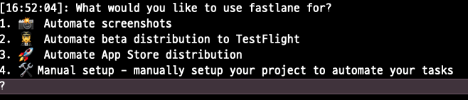

+++

author = "오깅중"

title = "iOS Fastlane을 적용해보자"

date = "2022-03-03"

description = "Fastlane 적용으로 원시인 탈출하기!"

categories = [  

 "Swift"

]

tags = [

 "Fastlane"

]

+++

### 도입이유

친구랑 얘기하다 원시인 소리를 들었다...😀

##### 현 배포 절차

- 클린 -> Product -> Archive -> 완료 콜백 올때까지 대기 -> 업로드 ~~(대략 30분...?)~~

##### 도입 후 절차

- fastlane 'lane명' 끗!

자동배포라는 말만 들을때는 실수하면 어쩌지..? 세팅이 어려우면 어쩌지?? 이러한 고민이 있었지만 막상 도입 마음을 먹고 차분한 마음을 가지고 차근차근 따라하다 보니 나도 원시인 탈출을 할 수 있었다

## 설치 & 업로드

Homebrew를 이용해 Fastlane을 설치 할건데 Homebrew가 설치되어 있지 않으면 설치를 하고 오자. -> [바로가기](https://brew.sh/index_ko)

``` bash
brew install fastlane
```

를 터미널에 입력해 주면 알아서 설치가 진행이 된다.

만약 설치가 안된다면 명령어 추천이 있을경우 따라하면 되고 안돼면.... 구글링을 통해 해결해보자. (화이팅)


그 다음 이제 fastlane을 적용할 프로젝트에 가서

```bash
fastlane init
```

명령어로 fastlane 초기화를 진행해줍니다.



저는 여기서 2번으로 진행했는데 일단 테스트 플라이트에 올려보는게 목적이라 2번으로 진행했습니다.

무엇을 선택해도 크게 상관없이 나중에 직접 추가할 수 있으니까 맘 편하게 선택해주세요.

번호 선택후 엔터를 누르면 막 뭐라고 설명이 나오고 엔터를 몇번 치다보면 설정이 완료 된다.

설정이 완료 되면 fastlane 이라는 디렉토리가 생성되고 디렉토리 들어가면 다음과 같은 파일이 생성되어있다.

```bash
Appfile
Fastfile
```

이제 이 두가지 설정을 통해 우리가 사용할 명령어를 설정해 주면 된다. (거의 다 됐습니다.)

이제 해당 프로젝트를 협업하며 작업할 경우를 대비 작업도 따로 해주었다

우선 fastlane/.env파일을 만들어 

###### fastlane폴더에서 들어가서 만들경우 -> vi /.env

###### fastlane폴더 밖에서 만들경우 -> vi fastlane/.env


```bash
APP_IDENTIFIER="앱 Identifier ex)com.test.test"
APPLE_ID="자신의 계정"
```

를 추가해주고 저장한다.

나중에 push 할때 해당 파일만 .gitignore에 추가해주고 push를 해주는게 충돌이 나지 않고 편안한다.


AppFile을 열어 이제 다음과 같이 변경해주자

```text
app_identifier(ENV["APP_IDENTIFIER"]) # The bundle identifier of your app
apple_id(ENV["APPLE_ID"]) # Your Apple email address
```

이제 env파일을 통해 App identifire, Apple id를 가져오게 된다. 정말 편리하다

이제 마지막으로 Fastfile에 들어가 다음과 같이 세팅을 해주면 됩니다

아마 기본적으로 세팅이 되어 있으니 크게 바꾸지 않아도 되는데

추가로 필요한 Action에 대한 정보는 [여기](https://docs.fastlane.tools/actions/)에서 확인 가능!!

```text
default_platform(:ios)

platform :ios do
  desc "lane에 대한 설명"
  lane : 사용할 lane명 do
	get_certificates 
	get_provisioning_profile
	increment_build_number(build_number: latest_testflight_build_number + 1)
	build_app(configuration: "Debug")
	upload_to_testflight

  end
end
```

> platform :ios do -> 플랫폼
>
> desc "lane에 대한 설명"
>
> lane : 사용할 lane명 do -> 배포시 fastlane 레인명 으로 사용된다. do는 지우지 말기!
>
> get_certificates -> certificates 가져오는 action
>
> get_provisioning_profile -> 프로필 가져오는 action
>
> increment_build_number(build_number: latest_testflight_build_number + 1) -> 이게 이제 빌드 번호를 올려주는 action
>
> ~~(분명 테플에 안올라가 있는데 배포를 하고 나니 빌드 버전이 2가 되버렸다.. 처음 올리는 빌드버전일때는 0을 넣고 진행을 해야하는건가..?)~~
>
> build_app(configuration : "Debug" ) -> 앱 빌드 action입니다. configuration은 맞게 설정해 주시면 되요!! 테플에 올라갈꺼라 Debug로 해줬습니다.
>
> upload_to_testflight -> 테플에 올리는 명령어!!!

추가적으로 action들을 더 넣어줄수 있는데 사용자들이 입맛에 맞게 사용하면 될꺼 같다.


설정이 끝나면 이제

```text
fastlane "lane명"
```

입력하면 알아서 쭉 돌아간다!!!

이게 어떤 설정을 해주면 테플에 올라가는 거를 기다리지 않고 다른 작업도 할 수 있다고 하는데 

차분히 기다렸다. 

fastlane결과를 찍어둔게 사라졌는데 암튼 **17분**을 절약했다고 써있어서 뿌듯


### 인증 관련

굉장히 까다로운 인증절차를 따라야 하는데 일단 Sigh, Cert를 이용한 인증 방법을 이용하였고, 좀더 다양한 큰 규모로 넘어가면 Match를 이용한 인증을 시도해야 한다.

하지만 굉장히 까다로운 세팅이 있다고 들었...

일단 Cert를 이용할때 


처음 하면 분명 이런 에러를 마주치게 되는데 여기서 정확히 32번 정도를 애플 로그인 비밀번호를 입력했는데... 그게 아니었다..

계속 오타가 나는줄 알고 한글자씩 쳐보기도 했다... ~~해킹 당한줄~~

로그인 비번이 아니라 앱 비번을 입력해줘야 하는데 아마 이거 설정이 안되어 있어서 나는 에러니까

[이쪽](https://appleid.apple.com/)에서 설정을 해주도록 하자


로그인을 하게 되면 다음과 같은 화면을 보게 되는데 분홍색 박스의 앱 암호를 눌러 설정해 준 암호로 로그인을 하면 정상적으로 된다.!!


