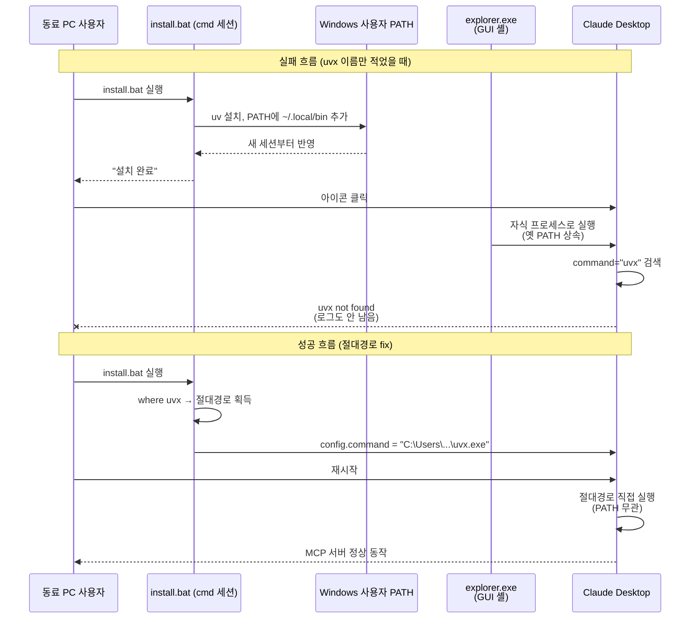
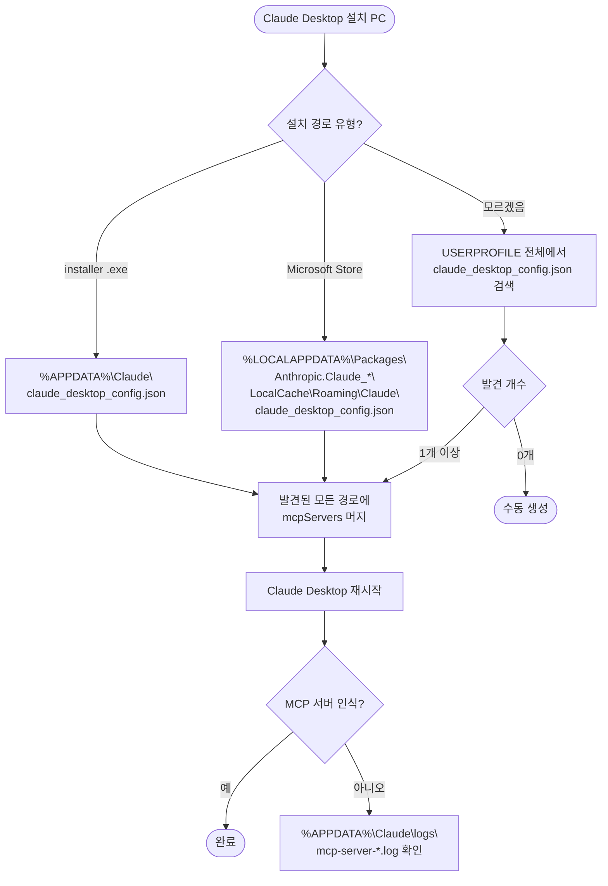

+++
author = "오깅중"
title = "MCP 서버 비개발자 동료에게 배포하다 Windows에서 6번 죽었다"
date = "2026-05-19T10:00:00+09:00"
description = "macOS에선 한 줄로 끝나는데 Windows만 함정 6개. Claude Desktop MCP 서버 배포 삽질 기록."
categories = ["mcp", "windows"]
tags = ["MCP", "Claude Desktop", "Windows", "PowerShell", "PyPI", "uv", "FastMCP", "kakao-moment-mcp", "cp949", "오픈소스"]
slug = "mcp-windows-deploy-6-traps"
+++

직접 만든 MCP 서버(`kakao-moment-mcp`)를 비개발자 동료에게 배포하는 작업이었다. macOS에서는 `uvx` 한 줄로 끝나는데 Windows에서 갈렸다. 내 PC도 아니라 동료 PC로 원격 디버깅을 돌리면서 6번쯤 죽었다 살아났다. 같은 길 갈 사람이 시간 덜 쓰라고 기록해둔다.

## 0. 전제

- 패키지: PyPI `kakao-moment-mcp` (Python, FastMCP)
- 배포 수단: `uvx --from kakao-moment-mcp ...` 한 줄, 또는 더블클릭 `install-windows.bat`
- 타깃: Claude Desktop / Cursor / Cline / Claude Code

## 1. `.bat` 인코딩 = cp949 ≠ UTF-8

macOS에서 작성한 `.bat`을 GitHub에 올려 Windows 동료에게 받게 했더니:

```
'배치파일이 아닙니다.'
```

뜨고 한글이 다 깨졌다.

원인:
- 한국어 Windows cmd의 기본 codepage는 **cp949**
- macOS가 만든 `.bat`은 **UTF-8 + LF**
- cmd는 **CRLF** 줄바꿈 필수

### 교훈 — UTF-8 + CRLF + chcp 조합

Windows `.bat`은 UTF-8 (no BOM) + CRLF + `chcp 65001` 첫 줄 조합이 가장 호환된다. 그리고 git에 line-ending 변환이 자동으로 망치지 않도록 `installers/*.bat`을 binary로 지정해둬야 한다.

```gitattributes
* text=auto eol=lf
installers/*.bat binary
```

## 2. Windows GUI 앱은 사용자 PATH 못 본다

`.bat`에서 `uvx` 설치 → 같은 cmd 세션에서는 잡힘 → setup 끝남 → Claude Desktop 띄움 → **`uvx not found`**. MCP 서버 spawn 실패. 로그조차 안 남는다.

원인: Claude Desktop 같은 GUI 앱은 explorer.exe의 자식 프로세스다. 새 cmd가 갱신된 PATH를 받는 것과 달리 GUI 앱은 셸 재시작 / 로그아웃 전엔 옛 PATH를 들고 다닌다.



`uvx` 이름만 적으면 explorer.exe가 상속한 옛 PATH 때문에 못 찾는다. 절대경로로 지정해두면 PATH와 무관해진다.

### 교훈 — config의 command는 절대경로

```jsonc
{
  "command": "C:\\Users\\xxx\\.local\\bin\\uvx.exe",  // 절대경로 + \\ escape
  "args": ["kakao-moment-mcp"]
}
```

## 3. PowerShell 5.1 = `ConvertFrom-Json -AsHashtable` 없음

`.bat` 안에서 PowerShell로 config JSON 머지를 자동화하려고 이렇게 짰다.

```powershell
$json = Get-Content $cfg -Raw | ConvertFrom-Json -AsHashtable
```

Windows 기본 PS 5.1에서:

```
A parameter cannot be found that matches parameter name 'AsHashtable'.
```

`-AsHashtable`은 PS 6.0+ 전용이다.

### 교훈 — PS 5.1 호환은 PSCustomObject + Add-Member

```powershell
$obj = Get-Content $cfg -Raw | ConvertFrom-Json
if (-not $obj.PSObject.Properties.Match('mcpServers').Count) {
    Add-Member -InputObject $obj -NotePropertyName mcpServers -NotePropertyValue ([pscustomobject]@{})
}
```

## 4. cmd 한 줄에 PowerShell = 따옴표 헬

```cmd
powershell -NoProfile -Command "$cfg='%APPDATA%\..\config.json'; ..."
```

이렇게 짜면 cmd의 `^` 라인 continuation 처리 + PowerShell의 `"` 이스케이프 + JSON 안의 `\\` … 세 단계 escape가 뒤엉켜 어느 한 줄만 길어져도 깨진다.

### 교훈 — .ps1 따로

cmd 안에 PowerShell을 길게 넣지 말자. 별도 `.ps1` 파일에 분리하고 cmd는 그것만 호출한다.

```cmd
powershell -NoProfile -ExecutionPolicy Bypass -Command ^
    "irm https://raw.githubusercontent.com/.../_fix.ps1 | iex"
```

## 5. Microsoft Store 버전 Claude = 샌드박스 config 경로

진짜 마지막에 발견한 함정이었다. Claude Desktop을 **Microsoft Store**에서 설치하면 일반 config 경로:

```
%APPDATA%\Claude\claude_desktop_config.json
```

가 **무효**다. 진짜 config는 샌드박스 안에 따로 있다.

```
%LOCALAPPDATA%\Packages\Anthropic.Claude_*\LocalCache\Roaming\Claude\claude_desktop_config.json
```

config를 잘 수정해서 저장하고 Claude를 재시작해도 다른 파일을 보고 있어서 무반응. 로그 디렉토리(`mcp-server-*.log`)를 봤더니 다른 MCP는 다 떴는데 우리 것만 시작 흔적이 0인 게 결정적 단서였다.



설치 유형에 따라 갈리는 Claude Desktop config 경로. MS Store 버전은 샌드박스 안쪽에 따로 산다.

### 교훈 — 후보 경로 다중 탐색

자동 등록 스크립트는 후보 경로를 **여러 개** 시도해야 한다.

```powershell
$cfgCandidates = @(
    Join-Path $env:APPDATA 'Claude\claude_desktop_config.json'
)
if ($env:LOCALAPPDATA) {
    $packages = Join-Path $env:LOCALAPPDATA 'Packages'
    Get-ChildItem $packages -Filter 'Claude*' -ErrorAction SilentlyContinue | ForEach-Object {
        $cfgCandidates += Join-Path $_.FullName 'LocalCache\Roaming\Claude\claude_desktop_config.json'
    }
}
```

진짜 찾고 싶으면 한 줄로:

```cmd
powershell -Command "Get-ChildItem $env:USERPROFILE -Recurse -Filter 'claude_desktop_config.json' -ErrorAction SilentlyContinue"
```

## 6. PyPI = 같은 버전 재업로드 금지, yank ≠ delete

배포 자동화 만들어놓고 신나서 0.1.1 게시 → 메타데이터에 옛 식별자가 남아 있는 걸 발견 → 수정 → 다시 게시 → `400 File already exists`.

### 교훈 — 재게시 불가, yank의 의미, dryrun

1. **재게시 불가** — 같은 버전 번호 + 같은 파일 = PyPI가 영구 거부 (보안상)
2. **버전 bump** 후 다시
3. 옛 버전을 숨기려면 **Yank** (`pip install pkg==old`만 가능, 일반 install에선 무시) — 한국어 UI에서는 **"제거된 릴리즈"**라고 번역됨
4. **Delete**는 위험 — 다운스트림 의존성 깨짐, 같은 버전 영구 재사용 불가

오픈소스 첫 게시 전엔 dryrun + 작은 0.0.x로 메타데이터 검증을 충분히 돌리자.

## 7. (보너스) 자격증명 노출 → 즉시 재발급

디버깅 중에 동료가 config 파일 전체를 채팅에 그대로 붙여 넣었다. 거기에 **Google Ads developer token + Naver API key**가 그대로 들어 있었다. AI 채팅이 비공개라도 노출은 노출이다.

### 교훈 — 자격증명 다루기

- 자격증명 요청 전에 본인 화면 한 번 검열
- 노출 시 **즉시** 발급처에서 revoke + 재발급
- README에 "config 공유 시 시크릿 제거" 경고 필수

---

## 종합 — 비개발자용 MCP 패키지 배포 체크리스트

- `.bat`: UTF-8 + CRLF + `chcp 65001` + `.gitattributes binary`
- config의 `command`는 절대경로 (Windows 한정)
- PowerShell 5.1 호환 (`-AsHashtable` 금지)
- 인라인 PS 대신 `.ps1` 파일 호스팅 + `irm | iex`
- Claude Desktop config 경로 후보 다중 탐색 (MS Store 샌드박스 포함)
- PyPI: 메타데이터 검증 → 작은 버전 시리즈로 게시 → 운영 버전 게시
- 시크릿 노출 가이드 + 자동 진단(`doctor` CLI) 제공

`uvx --from <pkg> <pkg>-setup` 한 줄로 비개발자에게 줄 수 있게 만드는 건 **실제로 안 쉽다**. macOS / Linux는 거의 공짜로 동작하지만 Windows만 함정이 6개. 이 글이 같은 길 갈 사람의 시간을 줄여주길.

---

## 참고

- 프로젝트: [github.com/jun7680/kakao-moment-mcp](https://github.com/jun7680/kakao-moment-mcp)
- PyPI: [pypi.org/project/kakao-moment-mcp/](https://pypi.org/project/kakao-moment-mcp/)
- 사용한 도구: Claude Code (Anthropic)

---

> 결론: Windows 배포만큼은 진짜 빡세다.
