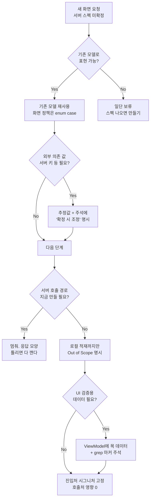

+++
author = "오깅중"
title = "서버 스펙 안 나왔을 때 클라 먼저 작업하는 법"
date = "2026-05-14"
description = "백엔드 기다리느라 일정 밀리는 게 싫어서 만든 나름의 체크리스트. 나중에 뜯어고칠 비용을 0에 가깝게."
slug = "client-work-before-server-spec"
categories = [
    "Swift"
]
tags = [
    "Swift",
    "iOS",
    "Architecture",
    "Coordinator",
    "Workflow"
]
image = "thumbnail.png"
+++

## 도입

기획에서 새 화면에 첨부 파일을 붙이라고 했다. 백엔드 쪽은 "API는 다음 스프린트에"라는 답. 클라 입장에선 기다리거나, 일단 만들거나 둘 중 하나다.

기다리면 일정 밀리고, 일단 만들면 서버 응답 모양이 바뀌었을 때 다 갈아엎어야 한다. 어떻게 시작하느냐가 나중에 얼마나 고쳐야 하는지를 결정한다. 이번 작업에서 정리된 5가지가 꽤 깔끔하게 먹혀서 기록해둔다.



## 1. 모델 재사용

첨부 파일 모델 `UploadModel`은 다른 화면에서 이미 잘 굴러가던 거였다. 화면이 다르다고 새 모델을 만들 이유가 딱히 없다. 같은 모델 그대로 들고 가면, 나중에 서버 응답이 어떻게 오든 매핑 한 줄만 추가하면 끝.

```swift
// 기존
struct UploadModel {
    let id: UUID
    let fileName: String
    let fileSize: Int
    let fileURL: URL?
    ...
}
```

화면별 미세한 차이는 정책 enum case로 분기한다.

```swift
enum UploadEntryType {
    case screenA
    case screenB
    case screenC  // 신규
}
```

이 enum의 `maxCount`, 용량 정책 같은 게 화면별 정책을 담는다. 새 화면이 또 들어와도 case만 하나 더 추가하면 됨.

## 2. 외부 의존 키는 추정값으로 두되 명시

서비스 용량 드라이브 식별자가 enum으로 정의돼 있었다.

```swift
public enum CapacityServiceType: String {
    case typeA
    case typeB
    case typeC
    case typeD  // 서버 키 확정 시 rawValue 조정 필요
}
```

서버가 어떤 문자열 내려줄지 모른다. 그래서 `"typeD"`로 추정해서 두되, **주석에 "서버 키 확정 시 조정"을 명시**해둔다. 나중에 스펙 나왔을 때 이 한 줄짜리 string literal만 바꾸면 끝나니까.

추정값으로 시작하는 게 무서운 게 아니다. **추정값임을 표시 안 하는 게** 무섭다. 6개월 후에 이게 임시값인 줄 모르는 사람이 와서 다른 코드를 거기 맞춰 작성하기 시작하면, 그때는 진짜 답이 없다.

## 3. 서버 호출 경로는 보류

가장 큰 함정이 이거다. "서버 응답을 추측해서 디코딩까지 미리 만드는 것." DTO를 만들었는데 실제 응답이 다르면 매핑 전부 깨고 다시 짜야 한다. 진짜로.

이번엔 첨부 파일 업로드 호출은 아예 안 만들었다. 사진/파일 선택 → 로컬 `UploadModel` 적재 → 화면에 표시까지만. 사용자가 "제출" 버튼을 눌렀을 때 어떻게 서버로 보낼지는 서버 스펙 오면 그때 결정.

```swift
// UploadUseCase.upload(...)  ← 호출 안 함
viewModel.uploadItems.append(model)  // 로컬에만 적재
```

플랜에는 "Out of Scope"로 적어둔다.

```text
- 서버 첨부 업로드 호출 (스펙 미확정)
- SubmitProtocol에 첨부 필드 추가 — 서버 API 변경되면 그때 추가
- 폼 제출에 첨부 파라미터 포함
```

이거 안 적어두면 리뷰어가 "왜 업로드 호출 없어요?"라고 물어보고, 답하느라 시간이 또 간다.

## 4. UI 검증용 목 데이터는 따로

상세 화면에서 서버 응답에 첨부 필드가 없는데도 첨부 섹션을 UI로 보여줘야 했다. 이럴 땐 ViewModel/Store 단에서 임시로 목 데이터를 주입한다.

```swift
// 서버 응답에 uploads 필드가 없어 UI 검증용 목 데이터 주입 (스펙 확정 시 제거)
state.uploads = [
    UploadModel(fileName: "Test1.png", fileSize: 1_900_000, ...),
    UploadModel(fileName: "Test2.png", fileSize: 2_600_000, ...),
]
```

코드 안에 `// 스펙 확정 시 제거` 같은 마커를 꼭 같이 적어둔다. 작업 끝나갈 때쯤 grep으로 한 번에 찾아낼 수 있어서. 마커 안 남기면 이 코드가 영영 살아남는다. 진짜 영영.

## 5. 진입처 시그니처 유지

화면 새로 짤 때 진입점(Coordinator의 init/start 메서드 시그니처)을 그대로 유지하면, 호출처는 수정할 게 없다. 서버 스펙 와서 진짜로 갈아낄 때도 진입처는 안 건드린다.

```swift
// 호출처에서는 변경 없음
detailCoordinator.start(documentId: id)
```

내부가 UIKit이든 SwiftUI든 호출처는 모른다. 이게 깨지면 리팩토링 비용이 폭증한다. 화면 하나 바꾸려고 했는데 호출처 30군데를 다 손봐야 하는 상황이 생긴다.

## 회고

정리하면 이렇다.

- 모델은 미리 만들지 말기. 있는 거 재사용하고, 안 되면 그때 만들기.
- 추정한 외부 의존 값(서버 키, 엔드포인트 경로 등)은 반드시 주석에 "추정값"이라고 표시.
- 서버 호출 경로는 스펙 확정 전엔 만들지 않기. 만들면 다 깨야 함.
- UI 검증용 목 데이터는 반드시 `// 스펙 확정 시 제거` 같은 grep 가능한 마커.
- 진입처 시그니처 유지하면 내부 구현 자유롭게 갈아낄 수 있음. 시그니처 깨지면 작업 범위 폭발.

이 5가지만 지키면 서버 스펙이 늦어도 클라 작업은 일정대로 굴러간다. 나중에 진짜 스펙 왔을 때 고칠 양도 진짜 적다.
