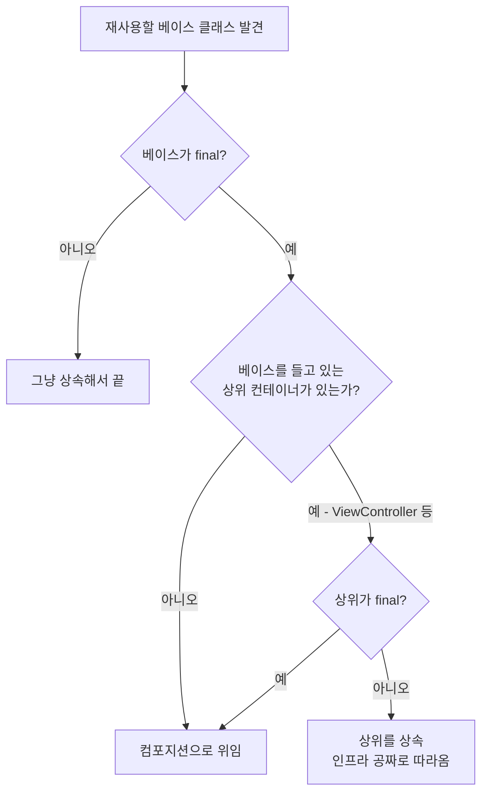

+++
author = "오깅중"
title = "`final class` 상속 막혔을 때 컴포지션 써본 후기"
date = "2026-05-14"
description = "final 막힌 클래스를 만났을 때, 격언만 외우다 놓친 진짜 답."
slug = "final-class-inheritance-vs-composition"
categories = [
    "Swift"
]
tags = [
    "Swift",
    "iOS",
    "UIKit",
    "OOP",
    "Inheritance"
]
image = "thumbnail.png"
+++

## 도입

한 화면에 첨부 파일 기능을 새로 붙여야 했다. 다른 화면들에서 이미 잘 굴러가던 `BaseUploadViewModel`이 있었다. 정책 검증, 사진/파일 선택, 중복 체크 전부 들어 있는 친구.

첫 본능은 이거였다. "상속해서 화면별 로직만 오버라이드하면 끝."

그런데 막상 헤더를 열어보니…

```swift
final class BaseUploadViewModel { ... }
```

`final`. 상속이 막혀 있었다. 그래서 두 번째 본능이 바로 튀어나왔다. "그럼 컴포지션이지." OOP 격언 그대로.

```swift
final class MyViewModel {
    private let uploadVM = BaseUploadViewModel(entryType: .myType)
    ...
}
```

이대로 만들기 시작했는데, 코드를 짜다가 멈췄다.

## 잠깐, 부모 클래스가 이미 다 해줌

`BaseUploadViewModel`은 final이지만, 그 ViewModel을 들고 있는 `BaseUploadViewController`는 final이 아니었다.

```swift
class BaseUploadViewController: BaseViewController {
    let uploadViewModel: BaseUploadViewModelEvents

    init(entryType: UploadEntryType) {
        self.uploadViewModel = BaseUploadViewModel(entryType: entryType)
        super.init(nibName: nil, bundle: nil)
    }

    func showUploadActionSheet(...) { ... }
}

extension BaseUploadViewController: ImagePickerControllerDelegate { ... }
extension BaseUploadViewController: UIDocumentPickerDelegate { ... }
```

PHPicker 호출, UIDocumentPicker 호출, delegate 메서드까지 전부 부모 ViewController가 들고 있는 상황. 내 ViewController가 이 부모를 상속만 하면 `uploadViewModel` 주입은 자동, picker도 그냥 쓰면 되는 거였다.

## 컴포지션으로 갔을 때의 모양

내가 만들려던 컴포지션 구조는 대충 이런 모양.

```swift
final class EditorViewController: BaseViewController {
    private let viewModel: EditorViewModel

    private func showImagePicker() { ... }
    private func showFile() { ... }

    func imagePicker(_ p: ImagePickerController, didFinishWithAssets assets: [PHAsset]) {
        viewModel.uploadVM.didSelectAlbum(assets: assets)
    }
}
```

picker 호출 코드 + delegate 메서드 + bridging 함수가 새 ViewController에 전부 복붙. 부모 ViewController에 이미 다 있는데도. 이게 다음 화면, 그 다음 화면마다 반복된다 생각하니까 좀 아찔했다.

## 결정 — ViewController는 상속, ViewModel은 그대로

머릿속 결정 흐름은 이렇게 됐다.



ViewModel은 final이라 어차피 손댈 수 없으니 그대로 두고, ViewController만 부모를 갈아끼웠다.

```swift
final class EditorViewController: BaseUploadViewController {
    private let viewModel: EditorEvents

    init(viewModel: EditorViewModel) {
        self.viewModel = viewModel
        super.init(entryType: .editor)
    }
}
```

이걸로 picker 호출, delegate, uploadViewModel 주입, capacity prepare 호출이 전부 공짜로 따라온다. 화면별 ViewModel은 그대로 두고, ViewController만 부모를 갈아끼운 셈.

실제 코드 변경량은? 클래스 선언 한 줄, init 한 줄. 끝.

## "Composition over inheritance"의 함정

격언 자체는 맞다. 상속 사슬이 깊어지고 부모 변경이 자식을 전부 깨는 패턴은 피해야 한다. 그런데 격언만 외우다 보면 진짜 상속이 정답인 경우를 놓친다.

이번 케이스는 이런 조건이 다 맞아떨어진 상황이었다.

- **부모가 자식에게 필수적인 인프라만 제공** (delegate, picker 호출 등)
- **자식이 부모의 동작을 오버라이드할 필요가 없음**
- **부모 변경이 자식의 핵심 로직을 깨지 않음**

이럴 땐 상속이 훨씬 간결하다. 컴포지션을 굳이 강제하면 boilerplate만 늘어난다.

## 교훈

- `final` 막힌 클래스를 만나면, 그걸 들고 있는 **상위 클래스가 final이 아닐 가능성**을 먼저 확인하기. 상위에서 상속받으면 컴포지션이 필요 없는 경우가 의외로 많다.
- 컴포지션의 장점은 자식이 부모의 모든 인터페이스를 노출할 필요가 없다는 것. 반대로 부모 인터페이스를 **그대로 다 쓰고 싶으면 상속이 맞다**.
- "Composition over inheritance"는 default 선택지를 제안하는 격언이지 금지 규칙이 아니다. 맥락 보고 결정.
- iOS의 UIViewController 계층은 상속이 자연스러운 구조다. delegate, lifecycle, presentation API가 전부 클래스에 묶여 있으니까. SwiftUI라면 다르겠지만 UIKit에서는 상속을 너무 두려워할 필요 없다.
