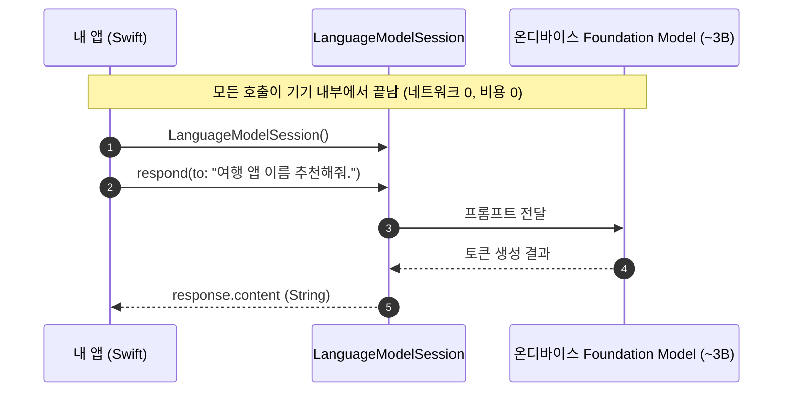

+++
author = "오깅중"
title = "Foundation Models, Swift 3줄로 온디바이스 LLM 호출하기"
date = "2026-05-18T08:10:00+09:00"
description = "iOS 26 Foundation Models 프레임워크 덕분에 OpenAI API 키도, 비용 청구서도 없이 Swift 3줄로 온디바이스 LLM을 호출할 수 있다. 첫인상을 정리해본다."
categories = ["iOS", "AI"]
tags = ["Foundation Models", "Apple Intelligence", "온디바이스 LLM", "iOS 26", "Swift", "@Generable", "LLM"]
slug = "foundation-models-3lines-on-device-llm"
+++

OpenAI API 키 발급받고, 사용량 청구서 도착할 때마다 가슴이 쿵 떨어지고, 키가 깃허브에 노출됐을까봐 git history를 뒤지던 시절을 잠깐 떠올려본다. iOS 26부터는 그 모든 게 한 번에 사라진다. **앱에서 LLM 한 번 부르는 데 진짜로 세 줄이면 끝난다.** 그것도 비용 0원, 네트워크 0번으로.

이번 글은 iOS 26과 함께 공개된 **Foundation Models 프레임워크** 첫인상이다. Apple Intelligence가 쓰는 약 3B짜리 온디바이스 모델을 Swift에서 바로 호출할 수 있는 SDK인데, 너무 가볍게 끝나서 한 편 정리해두지 않으면 아까울 정도다.

## Foundation Models 한 줄 정의

2025년 9월에 Apple이 공개한 프레임워크다. 이름 그대로 Apple Intelligence가 내부에서 쓰는 파운데이션 모델을 일반 앱에서도 호출할 수 있게 열어준다. 핵심 특징을 한 줄씩 정리하면 이렇다.

- **온디바이스 실행** — 약 3B 파라미터 모델이 기기 안에서 돈다. 네트워크 호출 0.
- **비용 0원** — 토큰 단가, 월 정액제, 그런 거 없다. 사용량 제한도 없다.
- **프라이버시 OK** — 프롬프트가 서버로 안 나간다. 의료·금융처럼 민감한 도메인에서도 부담이 적다.
- **한국어 지원** — Apple Intelligence 한국어 지원 언어에 포함돼 있어서 한국어 프롬프트·응답이 자연스럽게 된다.

환경은 **Xcode 26 / iOS 26** 이상이고, Apple Intelligence 호환 기기(iPhone 15 Pro 이상, 이후 라인업) + 설정에서 Apple Intelligence가 켜져 있어야 한다.

## 진짜 3줄로 끝나는 호출

말이 길었는데 코드부터 보자.

```swift
import FoundationModels

let session = LanguageModelSession()
let response = try await session.respond(to: "여행 앱에 어울리는 이름 추천해줘.")
print(response.content)
```

`import` 한 줄, 세션 만드는 한 줄, `respond(to:)` 호출 한 줄. 응답은 `response.content`로 꺼낸다. URLSession도 안 보이고, API 키 입력란도 없다. 처음 봤을 때 "이게 다라고?" 싶었다.

내부에서 어떻게 흐르는지를 한 장으로 정리하면 이렇다.



화살표가 전부 기기 내부에서 끝난다는 게 포인트다. 외부 서버를 거치는 화살표가 단 한 개도 없다.

## 타자기처럼 보여주고 싶다면 — 스트리밍

ChatGPT처럼 토큰이 또르륵 찍히는 UX를 원하면 `streamResponse(to:)`를 쓰면 된다.

```swift
for try await chunk in session.streamResponse(to: prompt) {
    text += chunk
}
```

`AsyncSequence`라서 `for try await`로 받아 누적만 하면 된다. SwiftUI의 `@State` 문자열에 그대로 누적시키면 타자기 효과가 공짜로 나온다.

## JSON 파싱 노가다는 그만 — `@Generable`

개인적으로 가장 인상 깊었던 부분이다. 보통 LLM에서 구조화된 데이터를 받으려면 "JSON으로만 답해줘"라고 프롬프트를 사정사정하고, 돌아온 문자열에서 코드 펜스 자르고, `JSONDecoder`로 디코딩하고, 키 하나 어긋나면 처음부터 다시 하는 흐름이었다. Foundation Models는 이걸 매크로 하나로 정리해버린다.

```swift
@Generable
struct Recipe {
    let title: String
    let ingredients: [String]
    let steps: [String]
}

let session = LanguageModelSession()
let recipe = try await session.respond(to: "김치찌개 레시피 줘.", generating: Recipe.self)
// recipe.ingredients 바로 사용 가능, JSON 파싱 단계가 통째로 사라진다
```

구조체에 `@Generable`을 붙이고 `generating: Recipe.self`만 넘기면 타입 안전한 객체로 돌아온다. `JSONDecoder` 줄이 사라진 것만으로도 잔잔한 감동이 있다.

## 호출 전 체크 — 사용 가능 조건

모든 기기에서 되는 게 아니라서, 호출 전에 사용 가능 여부를 확인하는 가드가 필요하다.

```swift
import FoundationModels

if SystemLanguageModel.default.availability == .available {
    // 호출 OK
}
```

조건을 정리하면 이렇다.

- iOS / iPadOS / macOS 26 이상
- Apple Intelligence 호환 기기 (iPhone 15 Pro 이상 라인업)
- 설정 → Apple Intelligence가 켜져 있을 것
- 모델이 기기에 다운로드 완료된 상태일 것

만약 `.unavailable` 케이스라면 사용자에게 "기기 미지원" / "설정에서 Apple Intelligence 켜기" / "모델 다운로드 대기 중" 같은 안내로 자연스럽게 우회시키면 된다. 분기 흐름은 이렇게 그려진다.

```mermaid
flowchart TD
    Start([호출 직전]) --> Check{availability}
    Check -->|.available| Call[session.respond 호출 OK]
    Check -->|.unavailable&#40;기기 미지원&#41;| Fallback1[iPhone 15 Pro 미만 안내]
    Check -->|.unavailable&#40;AI 비활성&#41;| Fallback2[설정에서 Apple Intelligence 켜기 유도]
    Check -->|.unavailable&#40;모델 미준비&#41;| Fallback3[다운로드 대기 안내]
    Call --> Done([응답 사용])
    Fallback1 --> Done
    Fallback2 --> Done
    Fallback3 --> Done
```



> `.unavailable` reason의 정확한 case 이름은 공식 doc 기준으로 조금씩 다를 수 있으니, 실제 구현 시에는 doc을 한 번 확인하자.

## 한계 — 3B 모델은 3B 모델

여기까지 보면 "이제 모든 LLM 호출을 Foundation Models로 옮기면 되겠다" 싶지만, 솔직히 **만능은 아니다.** 3B 모델은 3B 모델이다. GPT-4o나 Claude 4.7급의 복잡한 추론을 기대하면 실망한다.

| 잘하는 일 | 무리한 일 |
|---|---|
| 짧은 텍스트 분류·태깅 | 복잡한 다단계 추론·증명 |
| 요약·재작성·번역 보조 | 긴 컨텍스트(수만 토큰) 분석 |
| 구조화된 데이터 추출 (`@Generable`) | 최신 지식 기반 QA |
| UI 카피·추천 문구 생성 | 코드 대규모 리팩터링 제안 |

체감상 **"가볍게 분류·요약·구조화"** 정도에서 강하다. 무거운 추론이 필요한 기능은 여전히 클라우드 LLM과 조합하는 게 현실적이다. 다만 그 "가벼운" 작업이 앱 안에서 의외로 많다는 게 핵심이다. 추천 문구, 태그 자동 분류, 간단한 입력 정제 같은 건 이제 그냥 온디바이스로 돌리면 된다.

## 마무리

OpenAI API 키 걱정에서 한 발짝 멀어진 하루다. 일단 가벼운 기능 하나부터 Foundation Models로 옮겨보고, 무거운 건 클라우드에 남겨두는 식의 하이브리드가 당분간 정답일 것 같다. iOS 26 SDK 깔린 김에 `LanguageModelSession()` 한 줄만 적어봐도 감이 확 온다. 화이팅!

### 참고

- [Apple Newsroom — Foundation Models framework (2025-09)](https://www.apple.com/newsroom/2025/09/apples-foundation-models-framework-unlocks-new-intelligent-app-experiences/)
- [Apple Developer Documentation — FoundationModels](https://developer.apple.com/documentation/foundationmodels)
- [AppCoda — Foundation Models 입문](https://www.appcoda.com/foundation-models/)
