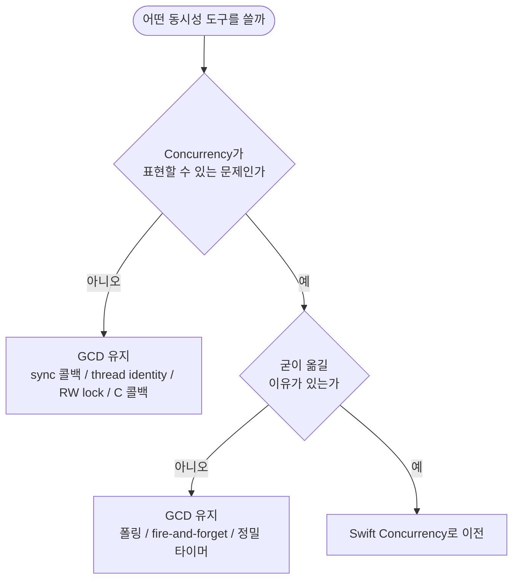
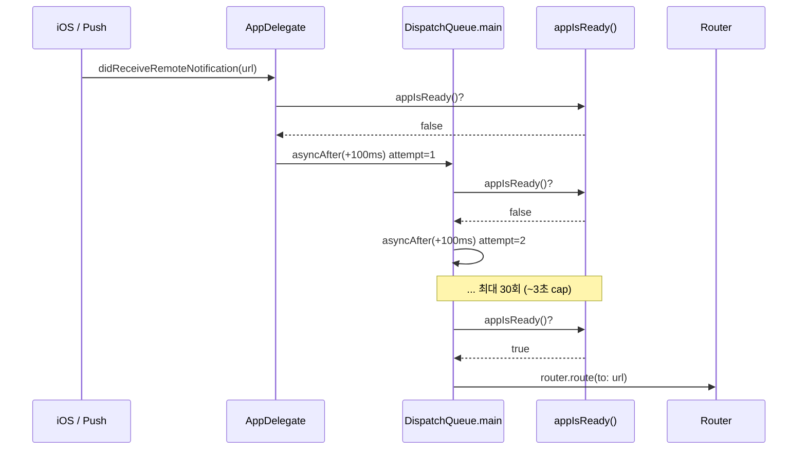

+++
author = "오깅중"
title = "Swift Concurrency 프로젝트에서 GCD가 여전히 답인 자리들"
slug = "gcd-still-needed-with-swift-concurrency"
date = "2026-05-20"
description = "Concurrency로 통일 중이지만 GCD를 일부러 남긴 자리들 — 폴링, fire-and-forget, RW lock, 그리고 sync 콜백"
categories = ["Swift"]
tags = ["Swift", "Concurrency", "GCD", "DispatchQueue", "Architecture"]
+++

요즘 프로젝트를 Swift Concurrency(async/await, actor)로 통일해가고 있다. 그런데 코드 곳곳에 GCD를 일부러 남겨둔 자리들이 보인다. "다 옮기면 깔끔하지 않을까?" 싶어서 한 번씩 시도해봤는데, 그때마다 코드가 더 길어지거나 의미가 더 흐려지는 자리가 있더라. 그래서 이 글에서는 "Concurrency 시대에도 GCD가 답인 자리들"을 카탈로그로 정리해본다. GCD 기본기와 async/await 마이그레이션 입문은 예전에 쓴 [동시성 정리 글](/post/concurrency/)에 둬뒀으니 그쪽을 먼저 봐도 좋다.

판단 기준은 두 축으로 좁힐 수 있다. 하나는 **"Concurrency가 표현할 수 있는 문제인가"**, 다른 하나는 **"굳이 옮길 이유가 있는가"**. 두 질문에 모두 "예"라고 답할 수 있을 때만 옮긴다. 하나라도 "아니오"면 GCD를 남겨둔다.



## 사례 1. 디퍼드 딥링크와 푸시 폴링

가장 길게 적고 싶은 자리다. 푸시가 도착했는데 앱은 아직 준비가 안 된 상태인 경우가 종종 있다. rootVC가 아직 안 만들어졌거나, 로그인이 안 끝났거나, 유저 데이터를 로딩 중이거나. 딥링크도 같은 결이다. AppDelegate/SceneDelegate에서 URL은 받았는데 띄울 컨텍스트가 없다. 그래서 "준비될 때까지 기다렸다가 라우팅"이 필요하다.

내가 쓰는 패턴은 이렇다.

```swift
func deliverDeepLink(_ url: URL, attempt: Int = 0) {
    guard attempt < 30 else { return }  // ~3초 cap

    if appIsReady() {
        router.route(to: url)
    } else {
        DispatchQueue.main.asyncAfter(deadline: .now() + 0.1) {
            self.deliverDeepLink(url, attempt: attempt + 1)
        }
    }
}
```

`DispatchQueue.main.asyncAfter` 재귀로 100ms마다 ready 여부를 확인하고, 준비되면 라우팅, 아니면 다시 enqueue. 30회 cap으로 무한 루프를 막아둔다. (이 글에서는 cap 도달 시 silently drop이지만, 운영에서는 에러 화면이나 안내 토스트로 보강해두는 편이 좋다.)

흐름을 그림으로 보면 이렇다.



같은 일을 Concurrency로 풀면 대충 이런 모양이 된다.

```swift
func deliverDeepLink(_ url: URL) {
    Task { @MainActor in
        for _ in 0..<30 {
            if appIsReady() {
                router.route(to: url)
                return
            }
            try? await Task.sleep(nanoseconds: 100_000_000)
        }
    }
}
```

언뜻 보면 비슷한데, 실제로 들여다보면 네 가지가 어색하다.

1. **호출 컨텍스트가 sync다** — `application(_:didReceiveRemoteNotification:)`이나 `scene(_:openURLContexts:)` 같은 콜백은 sync로 들어온다. async 폴링을 하려면 안에서 결국 `Task { ... }`를 띄워야 한다. GCD 버전은 그냥 `asyncAfter`로 끝난다.
2. **lifecycle/cancellation이 비어 있다** — 띄운 Task를 누가 cancel할 것인가. URL 핸들러는 fire-and-forget 성격인데 Task는 handle을 retain하지 않으면 cancel 통로가 사라진다. 들고 다닐 자리가 없어서 결국 cancellation은 무방비.
3. **종료 조건이 외부 상태 변화다** — `appIsReady()`는 다른 모듈의 상태다. 이걸 AsyncStream으로 깔끔하게 표현하려면 ready 시점에 yield하는 NotificationCenter/Combine 브릿지를 따로 만들어야 한다. 그 변환 작업이 폴링 한 줄보다 훨씬 크다.
4. **Task 스폰 비용이 굳이다** — 푸시·딥링크 자체가 자주 들어오는 이벤트는 아니라 부담이 큰 건 아니지만, "단순한 일을 단순하게" 원칙으로 봐도 `asyncAfter` 쪽이 코드량이 더 적다. Apple도 Swift Concurrency의 thread pool 부담을 [별도 WWDC 세션](https://developer.apple.com/videos/play/wwdc2022/110350/)에서 다루고 있을 정도라 굳이 모든 일을 Task로 끌어올릴 이유는 없다.

요약하면 이건 "Concurrency가 못 표현하는 문제"라기보다 "옮길 이유가 별로 없는 문제"다.

## 사례 2. Thread-confined 자료 접근

actor는 mutual exclusion은 보장하지만 thread identity는 보장하지 않는다. 그래서 Realm 인스턴스처럼 "만든 스레드에서만 동작"하는 객체를 actor로 감싸면 런타임에서 깨질 수 있다. 이런 자리는 GCD serial queue로 묶는 편이 안전하다. 이 패턴은 따로 [GCD serial queue를 actor 대신 쓰는 이야기](/post/gcd-serial-queue-over-actor-for-thread-confined/)에 정리해뒀으니 자세한 흐름은 그쪽을 보면 된다.

## 사례 3. Fire-and-forget hot path

로그·메트릭·이벤트 sink처럼 호출처가 수백 곳인 경로가 있다. 매 호출마다 `Task { await ... }`를 띄우면 어떤 일이 벌어질까.

```swift
// 안티패턴: 호출처가 수백 곳일 때 Task 스폰이 누적
func track(_ event: Event) {
    Task { await sink.write(event) }
}
```

각각의 Task는 가볍지만, 폭주하는 호출처를 그대로 두면 cooperative thread pool과 actor contention이 같이 쌓인다. 같은 일을 GCD로 풀면 이렇게 끝난다.

```swift
private let eventQueue = DispatchQueue(label: "event.sink")

func track(_ event: Event) {
    eventQueue.async { sink.write(event) }
}
```

serial queue 하나에 enqueue 하면 순서도 자연스럽게 보장되고, 호출처에서 보이는 코드 모양도 단순하다. Apple도 cooperative thread pool 부담을 [WWDC 세션](https://developer.apple.com/videos/play/wwdc2022/110350/)에서 별도로 다루는 만큼, 호출 빈도가 높은 경로에는 Task 스폰을 디폴트로 두지 않는 편이 마음이 편하다.

## 사례 4. C/Obj-C 콜백 브릿지

CoreBluetooth, IOKit, CFRunLoop 같이 콜백을 async로 끌어올리기 어려운 API들이 있다. CoreBluetooth는 아예 [`CBCentralManager(delegate:queue:)`](https://developer.apple.com/documentation/corebluetooth/cbcentralmanager/1518695-init)처럼 생성자에서 콜백 큐 자체를 받는다. 즉 `DispatchQueue`가 이 API에선 1급 시민이다.

```swift
let bluetoothQueue = DispatchQueue(label: "bt.callbacks")
let central = CBCentralManager(delegate: self, queue: bluetoothQueue)

// 델리게이트 안에서, 필요한 곳만 main으로 hop
func centralManagerDidUpdateState(_ central: CBCentralManager) {
    Task { @MainActor in
        statusView.update(central.state)
    }
}
```

continuation으로 일부 콜백은 감쌀 수 있지만, 다회 호출되는 델리게이트를 AsyncStream wrapper로 바꾸기 시작하면 오히려 코드가 무거워진다. 콜백 큐는 GCD에 맡기고, 필요한 hop만 Task로 끌어올리는 정도가 자연스럽다.

## 사례 5. Reader-writer barrier

actor는 read도 write도 모두 직렬화한다. [SE-0306](https://github.com/apple/swift-evolution/blob/main/proposals/0306-actors.md)이 말한 "single-threaded illusion" 그대로다. 그런데 캐시·인덱스처럼 read가 압도적으로 많고 write는 가끔인 자료구조가 있다. 이걸 actor로 감싸면 reader끼리도 줄을 서야 한다.

이때는 GCD concurrent queue에 `.barrier` flag가 여전히 명료하다.

```swift
private let rw = DispatchQueue(label: "cache.rw", attributes: .concurrent)
private var store: [String: Value] = [:]

func read(_ key: String) -> Value? {
    rw.sync { store[key] }
}

func write(_ key: String, _ value: Value) {
    rw.async(flags: .barrier) { self.store[key] = value }
}
```

다중 reader가 동시에 진행되고 writer만 배타 락을 잡는다. Swift 쪽 락으로는 [`OSAllocatedUnfairLock`](https://developer.apple.com/documentation/os/osallocatedunfairlock)이 깔끔한 선택이지만, 이건 어디까지나 mutual exclusion 락이지 reader-writer 락이 아니다. RW 시맨틱 자체는 GCD barrier 쪽이 1급으로 표현된다.

## 사례 6. 정밀 leeway 타이머 (옵션)

`Task.sleep`은 cooperative cancellation 측면에서 매끄럽다. 다만 시스템에게 허용 지연 폭을 알려주고 전력 최적화 여지를 주는 leeway 개념은 [`DispatchSourceTimer`](https://developer.apple.com/documentation/dispatch/dispatchsourcetimer)에 1급으로 들어있고, `Task.sleep`에는 그 결이 직접 노출되지 않는다. 백그라운드 주기 작업처럼 "조금 늦어도 되니 묶어서 깨워달라"는 쪽은 여전히 GCD가 더 자연스럽다.

## 마무리

다 옮기고 보니 두 줄로 묶인다.

- **Concurrency가 못/안 하는 일** — sync 콜백 컨텍스트, thread identity, reader-writer 락, C 콜백 큐. 사례 1·2·4·5가 여기.
- **굳이 옮길 이유가 없는 일** — 폴링, fire-and-forget hot path, 정밀 leeway 타이머. 사례 1·3·6이 여기.

옮기지 않은 것이 보수적인 선택이라서가 아니라, 그 자리에 더 잘 맞는 도구가 GCD라서 남겨뒀다. 환경은 Xcode 26.4 / iOS 17+에서 굴리고 있는데, 그래도 GCD는 여전히 자리를 차지하고 있다. async/await가 정답이라는 말은 절반만 맞다는 게 결국 이 카탈로그의 한 줄 요약인 것 같다.
