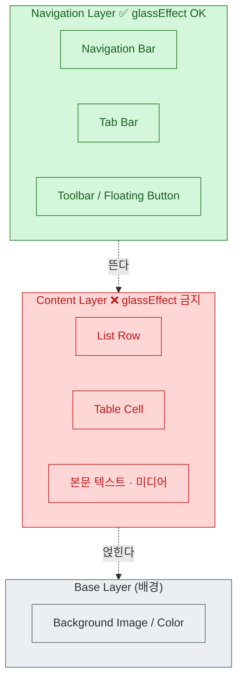
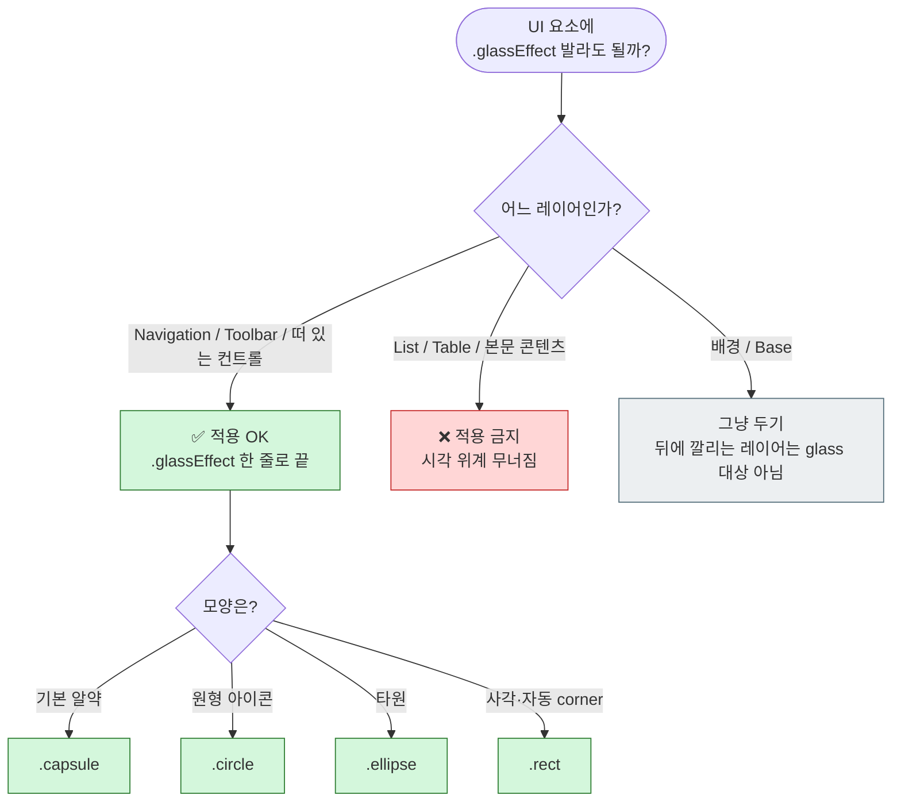

+++
author = "오깅중"
title = "iOS 26 .glassEffect() 실전 가이드 — content엔 절대 바르지 말 것"
date = "2026-05-18T08:00:00+09:00"
description = "iOS 26 Liquid Glass는 한 줄짜리 modifier지만, 핵심은 '어디에 바르냐'다. .glassEffect() 사용법과 절대 바르면 안 되는 곳까지 한 번에 정리한다."
categories = ["iOS", "SwiftUI"]
tags = ["iOS 26", "Liquid Glass", "SwiftUI", "WWDC25", "디자인"]
slug = "ios-26-liquid-glass-glasseffect-guide"
+++

WWDC25 보고 제일 먼저 만져본 게 Liquid Glass다. 처음엔 그냥 블러 modifier 하나 추가된 줄 알았는데, 막상 이것저것 발라보니 "한 줄 API"보다 "어디에 바르냐"가 훨씬 중요한 기능이었다. iOS 7 이래 가장 큰 디자인 변화라는 말이 괜히 나온 게 아니다.

한국어 자료가 아직 거의 없어서, 직접 만져보며 정리한 내용을 남긴다. 환경은 **Xcode 26 / iOS 26**이다.

## 공짜로 얻는 부분

Xcode 26으로 빌드하고 iOS 26을 타겟으로 잡으면, navigation bar와 tab bar는 코드 한 줄 손대지 않아도 자동으로 Liquid Glass가 입혀진다. 기존 SwiftUI 프로젝트라면 리컴파일만 해도 분위기가 확 바뀐다.

> 단, 커스텀 nav/tab bar를 직접 만들어 쓰고 있다면 자동 적용 대상이 아닐 수 있다. 시뮬레이터에서 한 번 확인해 보길 권한다.

## `.glassEffect()` 한 줄 소개

가장 단순한 사용법은 이렇다.

```swift
import SwiftUI

Button("저장") { save() }
    .padding()
    .glassEffect()  // .regular + .capsule 기본값
```

`.glassEffect()`만 붙이면 기본값으로 `.regular` 변형 + `.capsule` 형태가 적용된다. 진짜 한 줄이다.

## 형태(shape) 옵션

`in:` 파라미터로 모양을 바꿀 수 있다. 선택지는 네 가지다.

- `.capsule` — 기본값. 알약 모양
- `.circle` — 원형 아이콘 버튼에 적합
- `.ellipse` — 타원
- `.rect` — 사각형. adaptive corner radii라 컨텍스트에 맞춰 코너가 자연스럽게 잡힌다

```swift
Image(systemName: "heart.fill")
    .padding()
    .glassEffect(.regular, in: .circle)
```

## 변형(variant) 옵션

분위기 조정용 변형은 세 종류다.

- `.regular` — 기본. 무난하게 두루 어울린다
- `.clear` — 더 투명한 느낌. 뒤가 잘 비친다
- `.identity` — 식별성 강조 변형

> [작가 주: `.identity`의 정확한 동작·용도는 직접 사용해 본 케이스가 적어 단정하지 않는다. 정확한 차이가 궁금하면 Apple 공식 문서를 참고하길 권한다.]

## Interactive 효과

`.interactive()`를 체이닝하면 터치에 반응하는 효과(scaling, bounce, shimmer 등)가 같이 붙는다.

```swift
Button("좋아요") { like() }
    .padding()
    .glassEffect(.clear.interactive())
```

버튼이나 토글처럼 사용자가 직접 누르는 컨트롤에 잘 어울린다. Semantic tinting까지 곁들이면 의미 기반 색조도 입힐 수 있는데, 이 부분은 아직 API 시그니처를 충분히 검증하지 못해 본 글에서는 키워드 소개만 한다.

## 적용 위치 가이드라인 — 이 글에서 제일 중요한 부분

여기서부터가 진짜다. Liquid Glass는 "어디에 바르냐"로 디자인 성패가 갈린다. 레이어 개념부터 한 컷에 정리해 보자.



Liquid Glass는 **navigation layer 전용**이다. 뒤에 뭔가가 있어야 멋있게 보이는 레이어, 즉 "떠 있는" 컨트롤에만 어울린다. base layer(배경)도 아니고, content layer(본문)도 아니다.

### ❌ 절대 하지 말 것 — content에 적용

```swift
List(items) { item in
    Text(item.name)
        .glassEffect()  // ❌ content layer에 적용하면 시각 위계가 무너진다
}
```

List row나 Table cell, 본문 텍스트·미디어에 발라버리면 그 자체가 "떠 있는 무언가"처럼 보이게 된다. 결과적으로 화면 전체가 다 떠 있는 것처럼 보이고, 정작 사용자가 주목해야 할 navigation 컨트롤이 묻혀버린다. 시각 위계가 통째로 무너지는 셈이다.

내가 처음에 했던 실수가 정확히 이거였다. "예쁘니까 다 발라보자" 하고 List row에 추가했다가, 시뮬레이터를 켜보고 바로 다시 지웠다. 본문이 다 떠 있으면 어디를 봐야 할지 알 수 없다.

## 의사결정 플로우

매번 헷갈리면 이 흐름 하나만 기억하면 된다.



## UIKit 브릿징은 이제 안녕

iOS 25 시절까지는 비슷한 느낌을 내려고 `UIVisualEffectView`를 `UIViewRepresentable`로 감싸서 SwiftUI에 가져다 쓰는 코드를 종종 작성했다. iOS 26부터는 이 브릿징이 사실상 필요 없어진다. `.glassEffect()` 한 줄이 그 자리를 대신한다.

## iOS 25 이하 호환은 어쩌나

`.glassEffect()`는 iOS 26 전용이다. 하위 버전을 같이 지원해야 한다면 `if #available(iOS 26, *)`로 분기해 두고, 그 외 버전에서는 `.background(.regularMaterial)` 같은 기존 머티리얼 효과로 폴백하는 방향이 자연스럽다.

> [작가 주: 정확한 `#available` 분기 코드 예시는 추가 검증 후 다음 글에서 정리해 보려고 한다.]

## 정리

- Liquid Glass는 **navigation layer 전용**이다. content/base에는 바르지 않는다
- 기본 사용은 `.glassEffect()` 한 줄. 형태는 `.capsule`/`.circle`/`.ellipse`/`.rect`, 변형은 `.regular`/`.clear`/`.identity`
- 사용자가 누르는 컨트롤에는 `.interactive()`까지 같이 체이닝
- Xcode 26 + iOS 26 타겟이면 nav/tab bar는 리컴파일만으로 자동 적용
- 하위 호환은 `#available` 분기 + 기존 머티리얼 폴백으로

한 줄짜리 API라도 "어디에 바르냐"는 룰만 지키면 디자인 위계는 알아서 살아난다. 반대로 룰을 무시하고 다 발라버리면 iOS 7급 변화도 그냥 어수선한 화면이 된다. 맘 편하게 navigation 쪽에만 발라 보자.

## 참고 출처

- [Apple — Applying Liquid Glass to custom views](https://developer.apple.com/documentation/SwiftUI/Applying-Liquid-Glass-to-custom-views)
- [Hacking with Swift — What's new in SwiftUI for iOS 26](https://www.hackingwithswift.com/articles/278/whats-new-in-swiftui-for-ios-26)
- [Donny Wals — Designing custom UI with Liquid Glass on iOS 26](https://www.donnywals.com/designing-custom-ui-with-liquid-glass-on-ios-26/)
