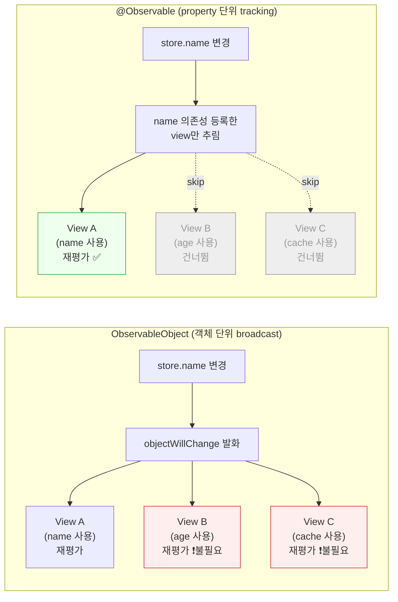
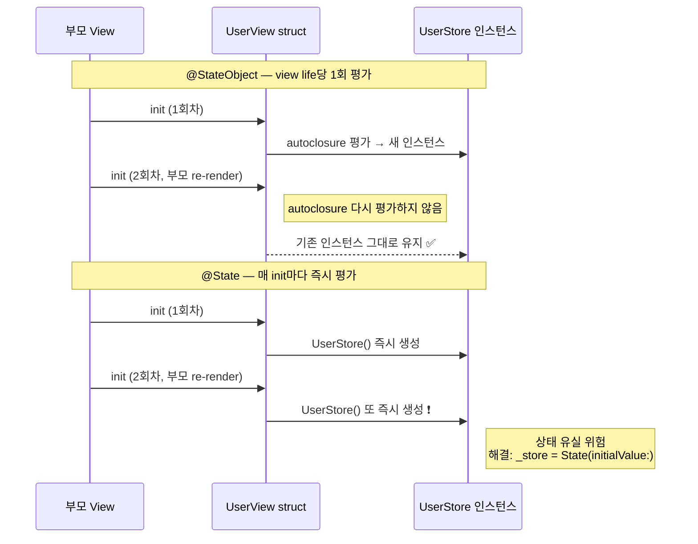

+++
author = "오깅중"
title = "@Observable 마이그레이션, 모르고 가면 발 헛디딘다 — 함정 5가지"
date = "2026-05-18T08:20:00+09:00"
description = "ObservableObject에서 @Observable로 갈아탈 때 드롭인 교체인 줄 알고 갔다가 view가 안 그려지거나 너무 자주 그려지는, 헛디디기 좋은 다섯 지점 정리."
categories = ["iOS", "SwiftUI"]
tags = ["SwiftUI", "@Observable", "Observation", "마이그레이션", "iOS 17", "ObservableObject", "Combine"]
slug = "observable-migration-traps"
+++

iOS 17부터 들어온 Observation 프레임워크와 `@Observable` 매크로, 이제 슬슬 마이그레이션해도 되겠다 싶어서 손대다 보면 묘하게 헛디디는 지점이 있다. 드롭인 교체인 줄 알고 갔다가 view가 안 그려지거나 반대로 너무 자주 그려지는 걸 보고 식겁한 적이 한 번쯤 있을 거다. 비슷한 일을 두 번 겪지 않으려고 자주 만나는 함정 다섯 가지를 정리해둔다.

미리 한 줄씩 깔아두면 이런 흐름이다.

1. `@StateObject` → `@State` 교체 시 초기화 시점이 달라진다
2. `@ObservationIgnored` 누락으로 의도치 않은 재평가가 일어난다
3. `objectWillChange`, `$property` publisher가 사라져서 Combine 파이프라인이 깨진다
4. property 단위 추적이 좋은 줄로만 알다가 computed property에서 의존성이 자동 등록된다
5. 한 번에 전체를 갈아엎으면 회귀 폭탄이 된다

환경은 Xcode 26.4 / iOS 17+ 기준. Observation 프레임워크 자체가 iOS 17부터라 그 아래로는 해당 없다.

## 잠깐, 왜 @Observable인가

기존 `ObservableObject`는 객체 단위로 변경을 broadcast한다. `@Published` property 하나만 바뀌어도 `objectWillChange`가 발화하고, 그 객체를 구독하던 view는 자신이 그 property를 읽었는지 여부와 무관하게 전부 재평가 대상이 된다.

`@Observable`은 그 결을 바꾼다. property를 실제로 읽은 view만 의존성으로 등록되고, 그 property가 바뀔 때만 해당 view가 재평가된다. 자동으로 view 업데이트가 좁혀지는 셈이다. 그림으로 보면 차이가 더 잘 드러난다.



이 전제가 함정 1과 4를 이해하는 데 깔린다.

## 함정 1 — @StateObject → @State 교체, 초기화 시점이 다르다

가장 먼저 만나는 함정. 보통은 이런 식으로 옮긴다.

```swift
// Before
@StateObject private var store = UserStore()

// After
@State private var store = UserStore()
```

**증상.** 화면이 다시 그려질 때마다 store가 새로 만들어진 것처럼 동작한다. 안에 캐싱해둔 값이 사라지거나, 한 번 받아온 데이터가 또 다시 fetch된다.

**원인.** `@StateObject`는 lazy autoclosure를 받아 view life당 1회만 평가한다. 반면 `@State`의 초기값 표현식은 view struct가 init될 때마다 즉시 평가된다. 부모가 re-render되며 자식 view가 다시 init되는 상황에서, body 안에서 `UserStore()`를 호출하는 식으로 무거운 객체를 그대로 넘기면 매번 새로 생성된다.

겉으로는 SwiftUI가 첫 인스턴스를 보존해주므로 운 좋게 멀쩡해 보일 때도 있다. 그래서 더 위험하다.

**해결.** body 안이나 property 초기값 자리에서 직접 `UserStore()`를 부르지 말고, init 안에서 `_store = State(initialValue: ...)` 패턴을 쓰거나, 외부에서 의존성을 주입한다.

```swift
struct UserView: View {
    @State private var store: UserStore
    init(userID: String) {
        _store = State(initialValue: UserStore(userID: userID))  // 한 번만 평가됨
    }
    var body: some View { ... }
}
```

흐름을 시퀀스로 정리하면 이렇다.



## 함정 2 — @ObservationIgnored 누락

**증상.** 마이그레이션 후 view가 이전보다 더 자주 재평가된다. 캐시를 갱신했을 뿐인데 화면이 깜빡인다.

**원인.** `@Observable` 클래스의 모든 stored property는 기본적으로 추적 대상이다. `@Published`로 명시했던 시절과 달리, 캐시·임시 버퍼·로깅용 변수까지 자동으로 의존성 그래프에 들어간다.

**해결.** 관찰이 필요 없는 property에 `@ObservationIgnored`를 붙여 명시적으로 제외한다.

```swift
@Observable
final class UserStore {
    var name = ""
    var age = 0
    @ObservationIgnored var cache: [String: Data] = [:]  // 함정 2 방지
}
```

마이그레이션할 때 `@Published`가 없던 property들을 모두 한 번씩 훑어보고, 화면에 노출되지 않는 내부 상태에는 다 붙여준다고 생각하면 안전하다.

## 함정 3 — Combine publisher 직접 접근 불가

**증상.** `store.objectWillChange.sink { ... }`나 `store.$name.sink { ... }` 같은 코드가 컴파일조차 되지 않는다.

**원인.** `@Observable`은 `ObservableObject` 프로토콜을 채택하지 않는다. 그래서 `objectWillChange`도, `@Published`가 만들어주던 `$property` projected publisher도 더 이상 존재하지 않는다. Combine 파이프라인을 통해 모델 변경을 흘려보내던 코드는 전부 다시 짜야 한다.

**해결.** 두 가지 길이 있다.

하나는 Observation이 제공하는 `withObservationTracking`으로 수동 추적하는 방식.

```swift
withObservationTracking {
    _ = store.name  // 읽어서 의존성 등록
} onChange: {
    // name 바뀌면 한 번 호출됨
}
```

여기서 한 가지 주의할 점이 있다. `withObservationTracking`은 등록된 의존성이 변경될 때 `onChange`가 **딱 한 번** 호출되고 끝난다. 계속 관찰하고 싶으면 `onChange` 안에서 다시 `withObservationTracking`을 호출해 재구독하는 패턴이 필요하다.

다른 하나는 정말 Combine 스트림이 필요한 일부 property만 별도로 `CurrentValueSubject`를 노출해 옛 코드와의 경계로 쓰는 방식이다. 점진 마이그레이션 단계에서는 후자가 쓸 만하다.

## 함정 4 — property-level 추적의 명과 암

**증상.** "property 단위라 자동 최적화된다며?"라고 믿었는데, 어떤 view는 오히려 마이그레이션 전보다 더 자주 재평가된다.

**원인.** property-level 추적은 view가 **실제로 읽은** property에만 의존성을 건다는 뜻이다. 문제는 computed property다. computed property를 view에서 읽으면, 그 computed property가 내부에서 읽는 다른 property들이 전부 의존성으로 자동 등록된다.

예를 들면 이런 코드.

```swift
@Observable
final class UserStore {
    var firstName = ""
    var lastName = ""
    var age = 0

    var displayName: String { "\(firstName) \(lastName)" }
}
```

view에서 `store.displayName`만 읽었다고 해서 `firstName`/`lastName`만 의존성에 들어가는 게 아니라, 두 property 모두 자동으로 잡힌다. 만약 `displayName` 안에서 무심코 `age`까지 참조했다면 `age`가 바뀔 때도 view가 재평가된다.

**해결.** computed property가 내부에서 어떤 stored property를 읽는지 의식하고 관리한다. 의존성이 의도와 어긋난다면 함수로 분리하거나, 미리 계산해서 다른 stored property에 저장해두는 식으로 끊는다.

## 함정 5 — 한 번에 전체 리팩토링 X

**증상.** 의욕이 차서 전체 모델 레이어를 한 번에 `@Observable`로 갈아엎었더니, 회귀 버그가 화면 곳곳에서 터진다. 함정 1·3·4가 동시에 터지면 어느 화면이 어떤 이유로 깨졌는지 추적하기도 어렵다.

**원인.** Observation은 라이프사이클·관찰 범위·Combine 호환성 등 여러 결을 동시에 바꾼다. 화면 수가 많을수록 한꺼번에 갈아엎을 때 위험면적이 곱셈으로 늘어난다.

**해결.** 새 feature나 잘 격리된 화면부터 점진적으로 옮긴다. 모델은 `@Observable`로 새로 만들고, 옛 화면이 아직 Combine을 요구하면 함정 3의 두 번째 길(`CurrentValueSubject` 노출)을 경계 어댑터로 둔다. Boy Scout Rule처럼 손이 가는 화면부터 하나씩 정리해도 충분하다.

## 정리

다섯 가지를 한 줄씩.

1. `@StateObject` → `@State`로 갈 때 초기값 표현식이 매 init마다 평가된다는 점 의식. 무거우면 `_store = State(initialValue:)`.
2. 관찰 필요 없는 property에는 `@ObservationIgnored`. 깜빡임 방지.
3. `objectWillChange`/`$property` 없음. `withObservationTracking` 또는 경계용 `CurrentValueSubject`.
4. computed property 안에서 읽히는 property가 다 의존성. 자동 최적화의 이면이다.
5. 한 번에 갈아엎지 말고 잘 격리된 화면부터.

다시 한 번, `ObservableObject` → `@Observable`은 드롭인 교체가 아니다. 다섯 지점만 미리 알고 가도 식겁할 일이 절반은 줄어든다.

## 참고

- [Apple — Migrating from the Observable Object protocol to the Observable macro](https://developer.apple.com/documentation/swiftui/migrating-from-the-observable-object-protocol-to-the-observable-macro)
- [Jesse Squires — The new Observable macro in Swift](https://www.jessesquires.com/blog/2024/09/09/swift-observable-macro/)
- [Use Your Loaf — Migrating to Observable](https://useyourloaf.com/blog/migrating-to-observable/)
