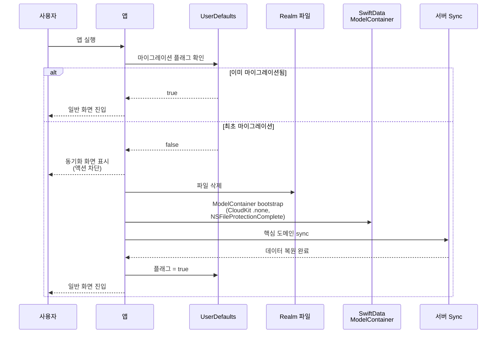

+++
author = "오깅중"
title = "Realm에서 SwiftData로: 42개 모델을 옮기는 전략과 함정 (Part 1 — 전략편)"
slug = "realm-to-swiftdata-migration-part-1-strategy"
date = "2026-05-11T10:00:00+09:00"
description = "iOS 17 최소 지원, 일괄 마이그레이션, 데이터는 다음 sync에서 자연 복원. Realm 의존성을 떼어내는 첫 단추를 정리한다."
categories = [
    "Swift"
]
tags = [
    "SwiftData",
    "Realm",
    "iOS17",
    "Migration",
    "ModelContainer",
    "Swift6",
    "Concurrency"
]
+++

> **TL;DR** — iOS 앱(데이터 모델 42개, 수만~십만 단위 row 운영) Realm을 SwiftData로 옮기기로 했다. **iOS 17 최소 지원 + 일괄 마이그레이션 + 사용자 데이터는 다음 sync에서 자연 복원** 전략. 이 글은 그 결정의 배경과, 마이그레이션 도는 동안 UX를 어떻게 처리했는지를 정리한다. 총 6편 시리즈의 **1편(전략편)**.

---

## 시작하며

운영 중인 iOS 앱이 한 덩치 한다. 어느 정도냐면:

- **데이터 모델 42개** — 검색 히스토리, 설정, 로그, 그리고 핵심 도메인 몇 개
- **데이터 규모** — 단일 컨테이너 하나가 100k row를 우습게 넘긴다. 캐시까지 더하면 더 커진다
- **클라이언트 동기화** — 서버 sync로 대부분 데이터가 복원 가능하다. 즉 일부 캐시는 "잃어버려도 되는" 데이터다
- **빌드·실행 환경** — Swift 6.x+, Tuist + mise

이 친구한테서 Realm을 떼어내고 SwiftData로 갈아끼우는 작업을 시작했다. 시리즈 1편인 이 글에서는 코드 얘기는 거의 안 한다. 그보다 먼저 **뭘 결정해야 했는지**를 다룬다. 마이그레이션은 코드보다 결정이 어렵다는 걸 이번에 또 배웠다. ~~(매번 배움)~~

다음 편들에서 다룰 함정들(Primary Key, DAO 패턴, Combine, async/await race, View 다중 mount)은 전부 이 결정들 위에서 굴러간다.

---

## 결정 1 — 왜 Realm을 떠나는가

여러 이유가 겹쳤지만, **가장 무게 있었던 건 Swift 6 Strict Concurrency였다.** Realm Object는 thread-confined 제약이 강해서 Sendable/actor 모델과 깨끗하게 안 어울린다. concurrency 도입을 진지하게 밀기 시작하니, Realm 객체를 어떻게 actor 경계 너머로 안전하게 넘길지 우회 코드가 도메인마다 늘어났다. 단순한 빌드 워닝이면 참고 살겠는데, 새 코드가 들어올 때마다 "여기서 Realm 만지면 안 되는데" 라는 멘탈 오버헤드가 매번 붙는다. 이게 누적되면 못 견딘다.

나머지는 부수적인 이유.

- **iOS 17+ 환경에서 SwiftData가 First-party** — Apple 공식 프레임워크라 OS와 함께 진화한다
- **빌드 시간** — Realm을 SwiftPM으로 통합하면 dependency tree가 한 덩어리 커진다
- **모델 정의 단순성** — `@Model` 매크로 기반이라 보일러플레이트가 적다. CoreData보다 같은 결과를 짧게 적을 수 있다
- **CloudKit 통합 기본 제공** — 우리는 로컬 전용으로 쓰기 때문에 명시적으로 끄고 쓴다 (뒤에서 다시 다룬다)

정리하면 "더 좋은 게 나와서 갈아탄다"보다는 "지금 코드 베이스 방향(Swift 6 + actor 모델)과 정면 충돌하는 친구를 떠나보낸다"에 가깝다.

---

## 결정 2 — iOS 17 최소 지원으로 올린다

SwiftData는 iOS 17부터. 기존 앱의 최소 지원 OS가 iOS 16 이하였다면 큰 결정이다.

**우리 결정**: iOS 17 최소 지원으로 올린다.

근거는 두 가지.

1. 대다수 사용자가 이미 iOS 17+ 분포에 들어와 있다고 판단했다. 정확한 수치는 공개 어렵지만, "iOS 17 미만은 별도 호환 빌드를 운영하는 게 차라리 깨끗하다"는 결론이 나오는 수준이었다.
2. 더 중요한 건 **듀얼 DAO 분기를 피하는 것**이었다. iOS 16을 그대로 끌고 가면 거의 모든 도메인 DAO에 "iOS 17이면 SwiftData, 아니면 Realm" 분기가 박힌다. 이 분기는 한 번 박히면 사라지지 않는다. 진짜다.

이 결정 없이 Realm/SwiftData 듀얼 운영을 깔면 마이그레이션 자체가 어려워진다. **iOS 17 최소 지원은 SwiftData 도입의 전제 조건이지 결과가 아니다.**

---

## 결정 3 — 일괄 vs 점진 마이그레이션

**우리 결정**: 일괄 마이그레이션.

이유 두 가지.

- **도메인 간 데이터 의존성이 깊다.** 예를 들면 `Container` → `Summary` → `Attachment` 처럼 한 도메인 안에서도 참조가 줄줄이 엮인다. 일부만 SwiftData로 옮기면 cross-DB join이 안 된다. join을 우회하려면 메모리에서 수동 매칭하는 코드가 들어가는데, 그게 한 번 들어가면 마이그레이션이 끝나도 안 빠진다.
- **듀얼 운영 시 publisher/observer 패턴이 양쪽에 모두 있어야 한다.** Realm의 `Results` 자동 알림과 SwiftData의 변경 감지를 동시에 굴려야 하면 도메인마다 알림 코드가 두 벌. 끔찍.

대신 **PR 단위로는 도메인별 점진 머지**다. 코드 단위로는 점진, 런타임은 일괄. 한 도메인이 새 DAO 패턴(enum + static)으로 완전히 전환되면 다음 도메인을 시작한다.

도메인 전환 순서 로드맵은 이렇게 굴렸다.


`SearchHistory` 같은 단순한 도메인을 가장 먼저 잡아 패턴을 굳히고, 그 패턴을 들고 핵심 도메인으로 진입했다. `Log` 도메인을 맨 마지막에 둔 건 의도적이다. 로그는 크래시 대응 동선에 직접 물려 있어서, 마이그레이션 도중 흔들리면 디버깅 자체가 어려워진다. 로그는 GCD 시리얼 큐 재작성과 함께 가장 마지막 PR로 묶었다.

각 도메인 PR은 **이전 도메인이 새 DAO 패턴으로 완전히 전환된 뒤** 진행한다. Realm 의존성이 남아있는 동안에는 import alias로 임시 공존시키고, 마지막 도메인이 끝나는 시점에 Realm 의존성을 한 번에 떼어낸다.

---

## 결정 4 — 데이터 보존 vs 폐기

마이그레이션에서 가장 큰 결정. 두 갈래.

### 방식 A — 데이터 마이그레이션 (Realm → SwiftData 복사)

- Realm 파일을 읽어서 SwiftData에 row 단위로 옮긴다
- **장점**: 사용자 데이터 손실 없음. 오프라인 사용자도 영향 없음
- **단점**: 마이그레이션 코드 자체가 크다. 도메인별 매핑을 다 짜야 한다. 실패 시 fallback이 어렵고, 100k+ row를 일괄 복사하면 시간도 든다

### 방식 B — 폐기 후 sync로 복원 (우리 선택)

- 첫 실행 시 Realm 파일을 삭제하고 SwiftData를 초기화한다
- 사용자에게 **"데이터를 다시 받아오는 중"** 동기화 화면을 보여준다
- 서버 sync 흐름으로 데이터가 자연 복원된다
- **장점**: 마이그레이션 코드 0. 안전성 높고 부수 효과 없음
- **단점**: 첫 실행 시 네트워크 의존. 임시저장(draft)처럼 로컬 전용 데이터는 별도 보존이 필요

한 표로 보면 이렇다.

| 기준 | 방식 A (복사) | 방식 B (폐기 + sync) |
|------|--------------|---------------------|
| 마이그레이션 코드량 | 크다 (도메인별 매핑) | 0 |
| 사용자 데이터 손실 | 없음 | 서버 sync 가능한 데이터는 복원 |
| 오프라인 사용자 영향 | 없음 | 첫 실행 시 네트워크 필요 |
| 로컬 전용 데이터 | 자동 보존 | 별도 보존 흐름 필요 |
| 실패 시 fallback | 어려움 | 재실행 = 재sync |
| 100k+ row 일괄 처리 | 시간 소요 | 해당 없음 |

### 로컬 전용 데이터는 어떻게 챙겼나

방식 B의 약점은 "서버에 없는 로컬 전용 데이터"다. 임시저장(draft), 일부 UI 설정 같은 친구들이 여기 해당한다.

처리 패턴은 단순했다. 마이그레이션 직전에 이 데이터들을 **별도 직렬화 → UserDefaults / 파일로 보관 → SwiftData 초기화 후 다시 import** 하는 흐름을 따로 끼웠다. 도메인별로 직렬화 포맷은 다르지만, "마이그레이션 전 백업 → 초기화 → 복원" 3단 구조는 동일. 이 흐름의 디테일과 함정은 후속편에서 따로 다룰 예정.

### 핵심 트레이드오프

방식 B는 마이그레이션 코드 자체를 없애지만, **첫 실행 UX가 결정적**이다. 사용자가 앱을 켰을 때 화면이 비어 있는 채로 보이면 데이터 손실로 오해할 수 있다. 그래서 **마이그레이션 전용 동기화 화면**을 만들었다.

---

## 마이그레이션 진행 중 UX — 동기화 화면

(관련 커밋: *refactor: 마이그레이션 시 동기화 화면 + 계정 전환 data 유지*)

첫 실행 시 흐름은 이렇다.

1. 앱 부팅 → SwiftData 마이그레이션 플래그 체크 (`UserDefaults`)
2. 이미 마이그레이션됐으면 일반 흐름으로 진입
3. 아니면 **마이그레이션 동기화 화면** 표시
   - "최신 데이터로 업데이트 중" 카피
   - 진행률 또는 무한 spinner
   - 사용자 액션 차단 (메인 탭 진입 봉쇄)
4. 백그라운드에서:
   - Realm 파일 삭제
   - SwiftData ModelContainer bootstrap (CloudKit 비활성화, `NSFileProtectionComplete` 적용)
   - 핵심 도메인 sync
5. 핵심 sync 완료 → 일반 화면 진입

시퀀스로 보면 이렇다.



이 화면 끼우고 난 뒤로 "데이터가 사라졌다"는 회귀 문의가 거의 사라졌다. 화면 자체는 단순한데, 이 한 장이 방식 B를 성립시키는 핵심이다.

---

## 계정 전환 시 데이터 유지

같은 작업에서 한 가지 더 처리했다. 다중 계정 지원 앱이라면 마이그레이션 시 추가로 챙길 게 있다.

사용자가 **계정 A → 계정 B**로 전환할 때 잘못 처리하면 두 가지 사고가 난다.

- 계정 B 전환 시 또 동기화 화면이 뜬다 (사용자 입장에선 "왜 또 받아오지?")
- 더 나쁘게는 계정 A 데이터가 계정 B 화면에 섞여 보인다 (개인정보 사고). 진짜 위험한 쪽

구조 자체가 바뀌어서 그렇다.

- 기존 Realm 구조: **계정별 Realm 파일 분리**
- SwiftData 구조: **단일 ModelContainer + `accountID` 컬럼으로 row 격리**

처리 방법은 세 가지.

- 마이그레이션 플래그를 **계정 단위가 아닌 디바이스 단위**로 관리한다. 한 번 마이그레이션이 끝나면 다시 안 일어난다
- `ModelContainer`는 단일 인스턴스를 유지하고, account scope는 **query predicate 단계에서 격리**한다
- 계정 전환 시 row 삭제 없이 **active account만 토글**한다

predicate 단계 격리는 이런 모양이다.

```swift
@Query(filter: #Predicate<Item> { item in
    item.accountID == currentAccountID
})
private var items: [Item]
```

`@Query` 매크로 안에 `accountID == currentAccountID` 조건만 박아두면 계정 전환은 `currentAccountID` 토글 한 번으로 끝난다. row를 지우거나 다시 부르지 않는다. `FetchDescriptor`를 직접 만드는 경우에도 `#Predicate<Item>` 안에 같은 조건을 넣으면 동일.

DAO 레이어에서 이 패턴을 어떻게 강제하는지(잊고 안 넣으면 사고 남)는 Part 3 DAO 패턴 편에서 따로 다룬다.

---

## 부수 결정 — ModelContainer Bootstrap 설정

일괄 마이그레이션 적용 시점에 `ModelContainer` 설정을 한 번 더 점검했다. 두 가지가 기본값이 아니라 함정이 된다.

```swift
let schema = Schema(AppSchemaV1.models)
let configuration = ModelConfiguration(
    schema: schema,
    isStoredInMemoryOnly: false,
    allowsSave: true,
    // 로컬 전용 — CloudKit 동기화 비활성화
    cloudKitDatabase: .none
)

container = try ModelContainer(
    for: schema,
    configurations: [configuration]
)

// 파일 보호 — NSFileProtectionComplete 강제
// SwiftData 기본은 .completeUntilFirstUserAuthentication
let url = container.configurations.first?.url
try? FileManager.default.setAttributes(
    [.protectionKey: FileProtectionType.complete],
    ofItemAtPath: url?.path ?? ""
)
```

- **CloudKit 비활성화** — 우리는 로컬 전용이다. CloudKit을 안 쓰면 `.none`을 **명시적으로** 박아야 한다. 기본값에 끌려가면 의도치 않은 동기화 동작이 끼어들 수 있다
- **`NSFileProtectionComplete` 강제** — SwiftData 기본 파일 보호 수준은 `.completeUntilFirstUserAuthentication`이다. 데이터 보호 요건이 빡빡하면 `.complete`로 올려야 한다

둘 다 "기본값으로 되어 있겠지" 하고 넘어가기 쉬운데, 명시적으로 박는 게 안전하다. ~~안 그러면 나중에 운다~~

---

## 마이그레이션 후 발견한 함정들 (다음 편들 예고)

전략 정하고 코드 굴리기 시작하니, 거기서부터 또 다른 함정들이 줄줄이 튀어나왔다. 시리즈 다음 편들에서 한 편씩 다룰 예정.

1. **Primary Key 함정** (Part 2 — 다음 편 예정)
   - `.invalidInt` 스캐폴드가 기본값과 충돌해서 모든 row가 같은 PK로 만들어진다
   - `String.hashValue`는 프로세스 재시작마다 랜덤이라 PK가 불안정하다
   - `#Predicate` 안의 enum 비교가 silent fail 한다
2. **DAO 패턴** (Part 3 — 다음 편 예정) — class 인스턴스 vs enum + static. SwiftData에서 어느 쪽이 안전한가
3. **Combine 통합** (Part 4 — 다음 편 예정) — Realm `Results`의 자동 알림 패턴을 SwiftData에서 어떻게 재현했나
4. **Async/Await race** (Part 5 — 다음 편 예정) — sync 매니저의 fire-and-forget 함정
5. **View 다중 mount** (Part 6 — 다음 편 예정) — 마이그레이션 후 발견한 화면 두 번 깜빡임 디버깅

---

## 마이그레이션 체크리스트

비슷한 마이그레이션 시작하기 전에 점검해 보면 좋을 항목들.

- [ ] iOS 17+ 최소 지원으로 올릴 수 있는가
- [ ] 듀얼 운영 vs 일괄 — 데이터 의존성 그래프를 그려봤는가
- [ ] 사용자 데이터 보존 정책 결정 (마이그레이션 vs sync 복원)
- [ ] 로컬 전용 데이터(임시저장, 일부 설정) 별도 보존 흐름이 있는가
- [ ] 마이그레이션 진행 중 UX 화면을 디자인했는가
- [ ] 다중 계정 환경에서 마이그레이션 플래그의 범위(계정 단위 vs 디바이스 단위)
- [ ] `ModelContainer` 설정 점검 (CloudKit, 파일 보호)
- [ ] 도메인별 점진 머지 순서 로드맵
- [ ] Primary Key 안정성 (다음 편 참고)

---

## 회고

이번 마이그레이션 굴리면서 다시 확인한 게 하나 있다. 큰 마이그레이션의 가장 큰 의사결정은 **"코드를 어떻게 짤지"가 아니라 "데이터 정책과 UX를 어떻게 정할지"**다. 코드는 결정이 잡히면 따라온다. 결정이 안 잡힌 채로 코드를 쓰면, 그 코드가 결정을 대신 내려버리고 그게 가장 빠지기 어려운 종류의 부채가 된다. ~~경험담임~~

다음 편(Part 2 — Primary Key 함정)에서 보자.

---

## 시리즈 목차

- Part 1 — 전략 (이 글)
- Part 2 — Primary Key 함정 (다음 편 예정)
- Part 3 — DAO 패턴 (다음 편 예정)
- Part 4 — Combine 통합 (다음 편 예정)
- Part 5 — Async/Await 통합 (다음 편 예정)
- Part 6 — View 다중 mount 디버깅 (다음 편 예정)
