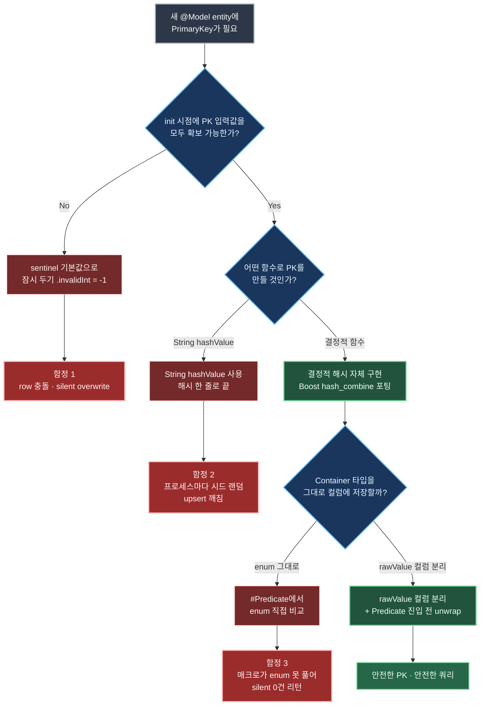
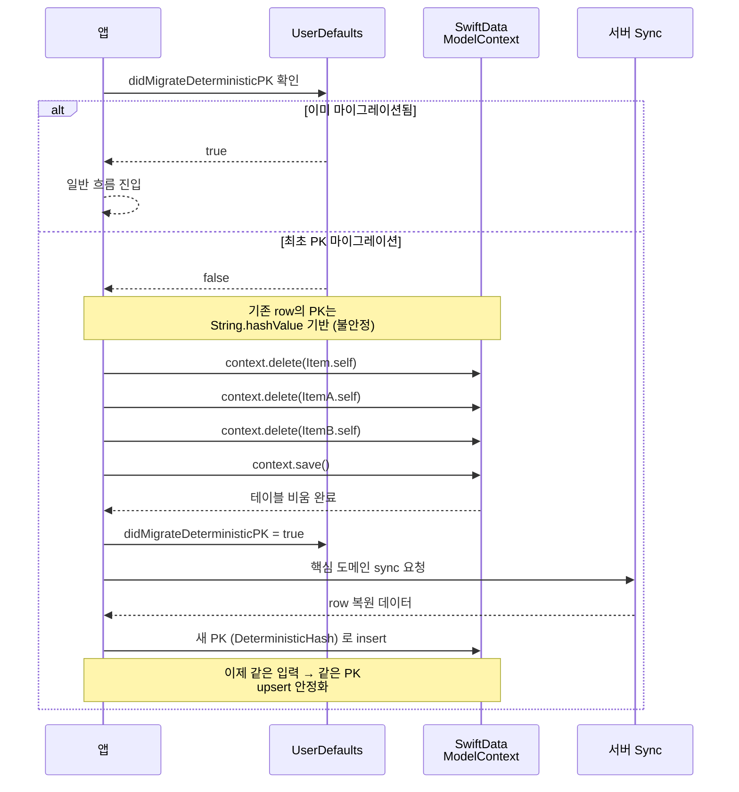

+++
author = "오깅중"
title = "Realm에서 SwiftData로: 42개 모델을 옮기는 전략과 함정 (Part 2 — Primary Key 함정 3가지)"
slug = "realm-to-swiftdata-migration-part-2-primary-key-traps"
date = "2026-05-11T11:00:00+09:00"
description = "SwiftData `@Attribute(.unique)` PK를 쓰다 만난 silent failure 3종 — sentinel 기본값, hashValue 시드 랜덤, Predicate enum 비교. 결정적 해시로 막은 이야기."
categories = [
    "Swift"
]
tags = [
    "SwiftData",
    "PrimaryKey",
    "Predicate",
    "Migration",
    "iOS17",
    "Realm",
    "Swift"
]
image = "cover.png"
+++

> **TL;DR** — SwiftData `@Attribute(.unique)` Primary Key를 쓰다 silent로 무너지는 3가지를 만났다. ① `.invalidInt` 같은 sentinel을 PK 기본값으로 두면 row 충돌이 난다. ② `String.hashValue`는 프로세스 재시작마다 시드가 랜덤이라 PK가 안 맞는다. ③ `#Predicate` 안에서 enum 비교는 silent fail 한다. **결정적 해시(Boost `hash_combine` 포팅) + rawValue 컬럼 분리 + lookup-then-upsert**로 막았다. 총 6편 시리즈의 **2편(Primary Key 함정 편)**.

---

## 시작하며

[Part 1 — 전략편](/p/realm-to-swiftdata-migration-part-1-strategy/)에서 Realm을 떠나기로 한 결정과 일괄 마이그레이션 전략을 정리했다. 결정이 잡힌 다음부터는 코드를 굴리는 일이다. 그런데 코드 굴리자마자, 가장 먼저 발등을 찍은 게 **Primary Key**였다.

SwiftData의 `@Attribute(.unique)`는 보기엔 단순하다. `@Attribute(.unique) var id: Int` 한 줄 박으면 끝나는 것처럼 생겼다. 그런데 이 한 줄이 silent하게 무너지는 시나리오가 셋이나 있더라. 컴파일은 멀쩡히 되고, 런타임에 throw도 안 한다. 그냥 row가 사라지거나, 쿼리가 0건 리턴하거나, lookup이 안 맞는 식이다.

이 글은 그 3가지를 한 편으로 묶어서 정리한다. ~~한 번 호되게 데여서 다시 안 잊으려고 적는 거기도 함.~~

---

## 이 글에서 다룰 3가지 함정

먼저 결론부터. PK를 어떻게 만들지 결정하는 흐름은 이렇게 굴러간다.



세 분기에 빨강 경로 셋이 박혀 있다. 이게 이 글에서 다룰 함정 3종이다. 한 줄 요약은 이렇다.

| 함정 | 증상 | 원인 한 줄 | 해결 한 줄 |
|------|------|-----------|-----------|
| sentinel 기본값 | row 충돌·silent overwrite | sentinel을 PK 기본값으로 둠 | init에서 결정적 해시로 즉시 결정 |
| `String.hashValue` | upsert 깨짐, lookup 실패 | 프로세스마다 시드 랜덤 (Swift 4.2+) | 자체 결정적 해시 함수 |
| `#Predicate` enum | 쿼리 0건, silent fail | 매크로가 enum/rawValue 못 풀음 | rawValue 컬럼 분리 + 진입 전 unwrap |

이제 하나씩 본다.

---

## 함정 1 — `.invalidInt` 스캐폴드가 PK 충돌을 만든다

entity에 default 값으로 sentinel을 두는 관행이 있다. 보통은 "초기화 안 된 상태"를 표시하기 위한 -1 같은 값이다. 이걸 `@Attribute(.unique)` PK에 그대로 박는 게 가장 흔한 함정이다.

```swift
extension Int {
    static let invalidInt: Int = -1
}

@Model
final class BasicSummaryEntityV2 {
    @Attribute(.unique) var id: Int = .invalidInt   // ❌
    var remoteItemID: Int = .invalidInt
    // ...
}
```

문제는 `@Attribute(.unique)` 컬럼에 같은 sentinel 값이 들어간 row 두 개가 동시에 insert되면 **두 번째 insert가 silent로 첫 번째를 덮어쓰거나 throw**한다는 점이다. 마이그레이션 직후 init 흐름에서 id를 잠시 sentinel로 두는 패턴이 있으면, 어디서 사고가 났는지 추적이 진짜 어렵다. 콘솔에 아무것도 안 찍히는 경우도 있다.

### 해결 — init 시점에 PK를 결정해버린다

**id는 init 시점에 반드시 유효한 값으로 결정**한다. sentinel을 PK로 쓰지 않는다. 다른 entity 필드를 조합해 안정적으로 id를 만든다.

```swift
@Model
final class BasicSummaryEntityV2 {
    @Attribute(.unique) var id: Int   // sentinel 없음
    var remoteItemID: Int

    init(remoteItemID: Int, containerRowID: Int, /* ... */) {
        // id 는 항상 유효한 deterministic 해시로 결정
        self.id = Self.makeID(
            remoteItemID: remoteItemID,
            containerRowID: containerRowID
        )
        self.remoteItemID = remoteItemID
        // ...
    }
}
```

핵심은 "잠깐 sentinel이었다가 나중에 채워진다"가 아니라 "처음부터 끝까지 유효한 값만 존재한다"는 점이다. init에서 deterministic 함수로 PK를 만들어버리면 sentinel이 PK 컬럼에 들어갈 일 자체가 없다.

문제는 이 "deterministic 함수"를 어떻게 만들지인데, 이게 다음 함정으로 이어진다.

---

## 함정 2 — `String.hashValue`는 프로세스 재시작마다 랜덤

"deterministic 해시를 만들어야 한다"고 정하면, 가장 먼저 떠오르는 게 `String.hashValue`다. 입력을 문자열로 합쳐서 `.hashValue` 한 줄로 끝내고 싶어진다. 이게 두 번째 함정.

```swift
// ❌ 절대 금지
static func makeID(remoteID: Int, type: String) -> Int {
    return "\(remoteID)-\(type)".hashValue
}
```

Swift 4.2 이상에서 `Hashable.hashValue`는 **각 프로세스 실행마다 다른 시드를 사용**한다. 이건 보안 목적의 의도된 동작이다(hash collision 공격 방어). 그래서 PK 용도로는 **절대 부적합**하다.

위 코드는 앱 첫 실행에서 PK `X`를 만들어 SwiftData에 저장한다. 다음 실행에서 같은 입력으로 호출해도 **다른 PK `Y`**가 나온다. 그래서 upsert 흐름에서 row가 새로 insert되거나(중복) lookup이 실패한다(원래 row를 못 찾음). 두 경우 다 silent failure. 콘솔에 아무 경고도 안 찍힌다. ~~이게 진짜 잡기 까다롭다.~~

### 해결 — 결정적 해시 자체 구현

`hashValue`를 쓸 수 없으니 직접 만든다. Boost의 `hash_combine` 포팅이 짧고 빠르다.

```swift
enum DeterministicHash {
    /// Boost hash_combine 포팅. 시드와 무관하게 같은 입력 → 같은 출력.
    static func combine(_ values: Int...) -> Int {
        var seed: Int = 0
        for value in values {
            seed ^= value &+ Int(bitPattern: 0x9E3779B97F4A7C15) &+ (seed << 6) &+ (seed >> 2)
        }
        return seed
    }

    static func fromString(_ string: String) -> Int {
        // ASCII/UTF-8 결정적 해시 (djb2)
        var hash: Int = 5381
        for byte in string.utf8 {
            hash = ((hash << 5) &+ hash) &+ Int(byte)  // djb2
        }
        return hash
    }
}

extension BasicSummaryEntityV2 {
    static func makeID(remoteItemID: Int, containerRowID: Int) -> Int {
        return DeterministicHash.combine(remoteItemID, containerRowID)
    }
}
```

`combine`은 정수 값들을 받아서 golden ratio 상수(`0x9E3779B97F4A7C15`)와 XOR/shift로 섞는다. 시드가 항상 0으로 시작하니까 같은 입력은 항상 같은 출력. `&+`는 overflow add라서 큰 값을 만나도 trap 안 한다.

문자열 입력이 필요하면 `fromString`(djb2 변형)을 거쳐서 `Int`로 만든 다음 `combine`에 넣으면 된다.

### PK 마이그레이션 — 기존 row 비우기

여기서 한 가지 더. 이미 `String.hashValue` 기반 PK로 저장된 row가 있다면, 새 해시 함수로 바꿔도 그 row들의 PK는 옛날 값 그대로다. lookup이 계속 깨진다. 가장 안전한 방법은 **마이그레이션 시점에 해당 테이블 row 전부 삭제**하고 다음 sync에서 새 PK로 재생성하는 것.

```swift
// SwiftData 부트스트랩 시점, 마이그레이션 플래그 체크 후 1회만
private static func resetSummaryTablesForPKMigration(context: ModelContext) throws {
    try context.delete(model: BasicSummaryEntityV2.self)
    try context.delete(model: SecondarySummaryEntityV2.self)
    try context.delete(model: TertiarySummaryEntityV2.self)
    try context.save()
    UserDefaults.standard.set(true, forKey: "didMigrateDeterministicPK")
}
```

흐름은 이렇다.



이 흐름은 [Part 1 — 전략편](/p/realm-to-swiftdata-migration-part-1-strategy/)에서 정한 "데이터 보존 vs sync 복원" 전략의 연장선이다. 캐시성 데이터는 잃어도 sync로 복원되니까 row를 비워도 안전하다. 진짜 보존해야 하는 로컬 전용 데이터는 별도 백업·복원 흐름으로 처리한다(이 부분도 Part 1에서 정리).

플래그를 `UserDefaults`에 박아서 1회성으로 만드는 게 포인트. 두 번째 부팅부터는 분기를 안 탄다.

---

## 함정 3 — `#Predicate`에서 enum 비교가 silent fail

PK 만들기를 안전하게 해놨다고 끝이 아니다. 데이터를 조회할 때 또 한 번 발등을 찍힌다.

SwiftData의 `#Predicate` 매크로는 컴파일 타임에 NSPredicate-비슷한 쿼리로 변환된다. 이게 일반 Swift 코드처럼 보여도 사실 **제한된 표현식만 풀 수 있다**. 그래서 enum을 직접 비교하면 silent fail한다.

```swift
enum ContainerType: String, Codable {
    case primary, secondary, archived, filtered, /* ... */
}

@Model
final class ContainerEntityV2 {
    var type: ContainerType   // rawRepresentable
    // ...
}

// ❌ silent fail — 0건 리턴 또는 의도와 다른 결과
let predicate = #Predicate<ContainerEntityV2> { container in
    container.type == .primary
}

// ❌ 또 다른 silent fail — type.rawValue 표현이 macro 컨텍스트에서 못 풀림
let predicate2 = #Predicate<ContainerEntityV2> { container in
    container.type.rawValue == "primary"
}
```

두 패턴 다 컴파일은 통과한다. 그런데 런타임에 쿼리가 0건을 리턴하거나 의도와 다른 결과를 준다. 에러 메시지도 없다. ~~또 silent fail이다.~~

### 해결 — Predicate 진입 전에 unwrap, stored property는 primitive로

원칙은 두 개.

1. **`@Model`의 stored property는 SwiftData가 이해하는 primitive 타입으로**(`String`, `Int`, `Date`, ...). enum 변환은 computed property로 분리한다.
2. **`#Predicate` 안에서는 primitive만 쓴다**. enum 비교는 호출자에서 `rawValue`로 풀어둔 다음 closure로 캡처해서 전달한다.

```swift
func containers(type: ContainerType) -> [ContainerEntityV2] {
    let typeRaw = type.rawValue   // ✅ 진입 전 unwrap
    let descriptor = FetchDescriptor<ContainerEntityV2>(
        predicate: #Predicate { container in
            container.typeRaw == typeRaw
        }
    )
    return (try? context.fetch(descriptor)) ?? []
}

@Model
final class ContainerEntityV2 {
    var typeRaw: String   // ✅ enum 대신 rawValue 컬럼

    var type: ContainerType {
        ContainerType(rawValue: typeRaw) ?? .primary
    }
}
```

이렇게 짜면 `#Predicate` 안은 String 비교만 본다. SwiftData가 풀 수 있는 형태다. 외부 API 표면(`type: ContainerType` 인자, computed property)은 그대로 유지되니까 호출하는 쪽 코드도 안 바꿔도 된다.

핵심은 **"매크로 안에서는 풀 수 있는 표현만 쓴다"**다. enum, rawValue, 옵셔널 unwrap, 메서드 호출 같은 건 진입 전에 다 풀어두고 closure 캡처로 넘긴다.

---

## 부수 함정 — `@Attribute(.unique)`의 throw 행동

위 3가지가 메인이고, 마지막으로 작은 함정 하나. `@Attribute(.unique)` 충돌 시 동작은 옵션에 따라 다르다.

| 옵션 | 충돌 시 동작 |
|------|------------|
| `.preserveValueOnDeletion` 등 명시 없음 | 기본은 throw (`SwiftDataError.uniqueConstraintViolation`) |
| `ModelContext.insert` 직후 `save()` | save에서 throw |
| `insert`만 호출 후 save 안 함 | 다음 save까지 누적, save 시점에 throw |

그래서 upsert 패턴을 구현할 때는 **insert 전에 lookup → 있으면 update, 없으면 insert**로 명시적으로 분리한다. `FetchDescriptor` 한 번 더 도는 비용은 받아들이는 게 낫다. silent fail 추적하는 비용보다 훨씬 싸다.

```swift
static func upsert(_ summary: BasicSummaryEntityV2) {
    let id = summary.id
    let descriptor = FetchDescriptor<BasicSummaryEntityV2>(
        predicate: #Predicate { $0.id == id }
    )
    if let existing = try? context.fetch(descriptor).first {
        existing.merge(from: summary)
    } else {
        context.insert(summary)
    }
}
```

여기서도 `let id = summary.id`로 진입 전 unwrap을 해뒀다. closure가 캡처할 값은 항상 closure 진입 전에 풀어두는 게 안전한 패턴이다.

---

## 체크리스트

비슷한 작업 시작하기 전에 점검해 보면 좋을 항목들.

- [ ] PK 필드에 sentinel default가 없는가
- [ ] PK 만드는 함수가 결정적인가 (`String.hashValue`, `Date()` 같은 시드/시간 의존 X)
- [ ] `#Predicate` 안에 enum 직접 비교 없는가
- [ ] `@Model` stored property가 SwiftData primitive 타입인가
- [ ] PK 변경 시 기존 row 비우는 마이그레이션 흐름이 있는가
- [ ] upsert 패턴이 lookup → insert/update로 분리돼 있는가

---

## 회고

이 편을 굴리면서 다시 확인한 게 하나 있다. SwiftData의 **silent failure는 대부분 매크로 경계에서 일어난다**. `@Attribute(.unique)`, `@Model`, `#Predicate` 같은 매크로는 컴파일 타임에 SQL-비슷한 쿼리로 풀리는데, 매크로가 풀 수 있는 표현식 범위가 일반 Swift보다 좁다. 그 경계를 모르고 일반 Swift 감각으로 코드를 박으면, 컴파일은 통과하고 런타임에 조용히 깨진다.

특히 `String.hashValue` 함정은 한 번 박혀서 운영에 나가면 발견이 어렵다. lookup이 실패하는 게 "데이터가 원래 없었던 건지 PK가 안 맞는 건지" 콜드 패스에서 구별이 안 된다. 그래서 PK 만드는 함수는 **처음부터 결정적**이어야 한다. ~~이걸 한 번 데이고 나서야 배움.~~

다음 편(Part 3 — DAO 패턴)에서는 이렇게 만든 entity들을 어떻게 안전하게 다룰지 — class 인스턴스 DAO vs enum + static 메서드 — 를 비교한다. SwiftData에서 라이프사이클을 어떻게 단순화할 수 있는지가 주제다.

---

## 시리즈 목차

- [Part 1 — 전략](/p/realm-to-swiftdata-migration-part-1-strategy/)
- Part 2 — Primary Key 함정 (이 글)
- Part 3 — DAO 패턴 (다음 편 예정)
- Part 4 — Combine 통합 (다음 편 예정)
- Part 5 — Async/Await 통합 (다음 편 예정)
- Part 6 — View 다중 mount 디버깅 (다음 편 예정)
