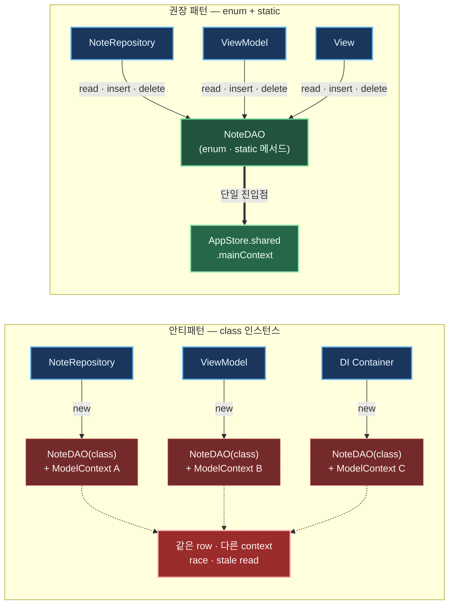
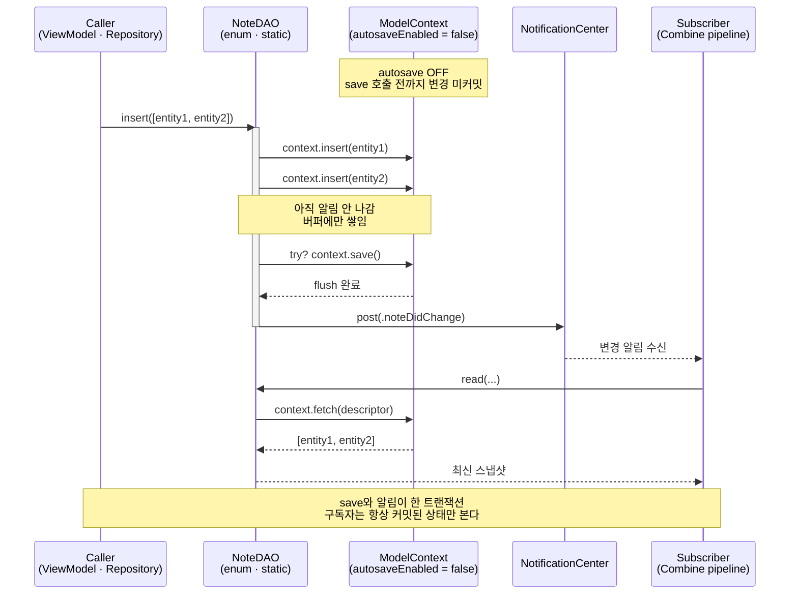

+++
author = "오깅중"
title = "Realm에서 SwiftData로: 42개 모델을 옮기는 전략과 함정 (Part 3 — DAO 패턴)"
slug = "realm-to-swiftdata-migration-part-3-dao-pattern"
date = "2026-05-12T08:50:00+09:00"
description = "SwiftData DAO를 `class` 인스턴스로 만들면 ModelContext 라이프사이클이 흩어진다. `enum` + `static` + 단일 진입점으로 정리한 패턴과, Realm 변환 규칙·hidden state 함정까지."
categories = [
    "Swift"
]
tags = [
    "SwiftData",
    "Realm",
    "iOS17",
    "Migration",
    "DAO",
    "Swift6",
    "Concurrency"
]
image = "cover.png"
+++

> **TL;DR** — SwiftData DAO를 `class` 인스턴스로 만들면 `ModelContext`를 어디서 들고 있을지 결정이 도메인 곳곳으로 분산되고, 결국 같은 row를 다른 컨텍스트로 건드리는 race가 생긴다. **DAO는 `enum` + `static` 메서드, `ModelContext` 접근은 단일 진입점**(`AppStore.shared.mainContext`)으로 강제한다. `autosaveEnabled = false`로 두고 DAO에서 명시적 `save()` + 변경 알림을 직접 발사한다. Realm 시절 `try! Realm()` + `.filter` + `.add(update: .modified)` 3종 세트가 어떻게 enum DAO로 1:1 매핑되는지까지 정리한다. 총 6편 시리즈의 **3편(DAO 패턴 편)**.

---

## 시작하며

이전 편 → [Part 2 — Primary Key 함정 3가지](/p/realm-to-swiftdata-migration-part-2-primary-key-traps/)

[Part 2](/p/realm-to-swiftdata-migration-part-2-primary-key-traps/)에서 SwiftData `@Attribute(.unique)` PK가 silent로 무너지는 3가지를 막아놨다. 이제 entity 자체는 안전한데, 다음 문제는 "이걸 누가 어떻게 다룰지"다. Realm 시절엔 `try! Realm()` 한 줄로 어디서든 인스턴스를 받아 썼는데, SwiftData에선 그 자리를 `ModelContext`가 차지한다. 그리고 이 `ModelContext`를 어디서 만들고 누가 들고 있을지 결정하는 순간, DAO 설계가 통째로 갈린다.

이 글에선 DAO를 `class` 인스턴스로 짰을 때 뭐가 깨지는지 먼저 보고, **`enum` + `static` 메서드 + 단일 진입점**으로 옮긴 패턴을 정리한다. 그다음 Realm 코드를 1:1로 어떻게 옮기는지, 함정은 어디 숨어 있는지까지.

---

## 안티패턴 — DAO를 `class` 인스턴스로 만들기

흔히 보는 패턴부터.

```swift
// class 인스턴스
final class NoteDAO {
    private let context: ModelContext

    init(context: ModelContext) {
        self.context = context
    }

    func read(folderID: Int) -> [NoteEntity] { /* ... */ }
    func insert(_ notes: [NoteEntity]) { /* ... */ }
}

// 호출자 — 인스턴스 어디서 만들지 결정 필요
final class NoteRepository {
    private let noteDAO = NoteDAO(context: ???)   // 문제 시작
}
```

처음엔 그냥 `class`로 짰다. 잘 굴러가는 듯 보이는데 도메인이 늘어나면 이상해지더라. 위 코드의 `context: ???` 한 줄, 거기에 답해야 할 게 사실은 4개다.

1. **`ModelContext` 결정 시점이 분산** — DI Container, Repository, ViewModel 어디서든 `init(context:)`를 호출할 수 있다. 호출자마다 다른 컨텍스트를 들고 들어오면 thread/scope 일관성이 깨진다
2. **인스턴스 보관 책임 모호** — 누가 strong reference를 들고 있을지 결정해야 한다. ViewModel? Repository? DI graph? 도메인마다 다르게 되면 lifetime이 들쭉날쭉
3. **race condition 위험** — 한 컨텍스트로 만든 entity를 다른 컨텍스트가 fetch하면 access 충돌. 같은 row를 두 컨텍스트가 동시에 건드리는 시나리오가 생긴다
4. **테스트 격리 어려움** — 인스턴스 lifetime = 의존성 주입 형태. mock 흐름이 도메인마다 달라져서 테스트 setup이 통일이 안 됨



> *그림 1. 안티패턴은 호출자마다 다른 `ModelContext`를 들고 있는 `class` 인스턴스가 같은 row를 동시에 건드린다. 권장 패턴은 모든 호출자가 `enum DAO`의 static 메서드만 부르고, 진짜 `ModelContext`는 `AppStore.shared.mainContext` 하나로 수렴한다.*

이 패턴이 깨지는 순간 어디서 사고가 났는지 추적이 진짜 어렵다. "어떤 컨텍스트로 fetch했더라"부터 거꾸로 따라 올라가야 하니까... 그 시간이면 enum으로 갈아엎는 게 빠르다.

---

## 권장 패턴 — `enum` + `static` 메서드

```swift
// enum + static
enum NoteDAO {
    /// 단일 진입점에서 ModelContext 접근
    private static var context: ModelContext {
        AppStore.shared.mainContext
    }

    // MARK: - Read

    static func read(folderID: Int) -> [NoteEntity] {
        let descriptor = FetchDescriptor<NoteEntity>(
            predicate: #Predicate { $0.folderID == folderID },
            sortBy: [SortDescriptor(\.sentDate, order: .reverse)]
        )
        return (try? context.fetch(descriptor)) ?? []
    }

    static func readForDataSourceSnapshot(folderID: Int) -> [NoteEntity] {
        // paging 용 snapshot — 변경 알림과 분리해서 호출 의도를 분명히 한다
        // (구독자가 받는 알림 흐름과 분리한 이유는 Part 4 Combine 통합 편에서)
        return read(folderID: folderID)
    }

    // MARK: - Write

    static func insert(_ notes: [NoteEntity]) {
        notes.forEach { context.insert($0) }
        try? context.save()
        NotificationCenter.default.post(name: .noteDidChange, object: nil)
    }

    static func delete(folderID: Int) {
        let descriptor = FetchDescriptor<NoteEntity>(
            predicate: #Predicate { $0.folderID == folderID }
        )
        let rows = (try? context.fetch(descriptor)) ?? []
        rows.forEach { context.delete($0) }
        try? context.save()
        NotificationCenter.default.post(name: .noteDidChange, object: nil)
    }
}
```

`try? context.fetch(...)`의 `try?`는 의도된 swallow다. fetch 실패 시 빈 배열 폴백으로 가는 게 호출자 입장에서 다루기 편해서 그렇게 둔 건데, 로깅이 필요한 자리면 `do/catch`로 감싸도 된다.

솔직히 enum DAO 첫 인상은 `static`이 너무 많아서 어색했음. 그런데 며칠 굴려보니 호출 형태가 항상 똑같아서 머리가 편해지더라.

이 패턴의 장점:

- **`enum`은 인스턴스 생성 불가** — Swift 컴파일러가 강제. 실수로 인스턴스 만드는 코드가 안 들어감
- **호출은 항상 `NoteDAO.read(...)`** — 의존성 0, 어디서든 같은 형태
- **`ModelContext` 진입점이 단 하나** — `context` computed property 한 곳만 보면 됨. 누가 어디서 컨텍스트를 만드는지 고민할 필요 없음
- **테스트 격리** — `AppStore.shared`의 in-memory 변종을 테스트 setup에서 주입하면 DAO 호출 코드는 한 줄도 안 바꿔도 됨

---

## ModelContext 접근 진입점

`AppStore.shared.mainContext`를 단일 진입점으로 둔다. 부트스트랩은 앱 시작 1회.

```swift
final class AppStore {
    static let shared = AppStore()

    let container: ModelContainer
    let mainContext: ModelContext

    private init() {
        do {
            let schema = Schema(AppSchemaV1.models)
            let config = ModelConfiguration(
                schema: schema,
                isStoredInMemoryOnly: false,
                cloudKitDatabase: .none
            )
            self.container = try ModelContainer(for: schema, configurations: [config])
            self.mainContext = ModelContext(container)
            self.mainContext.autosaveEnabled = false   // DAO에서 명시적 save 제어
        } catch {
            fatalError("SwiftData bootstrap failed: \(error)")
        }
    }
}
```

포인트는 `autosaveEnabled = false`다. autosave가 켜져 있으면 변경 알림 발사 타이밍이 컨텍스트 내부 스케줄에 묶여서 예측이 안 된다. 구독자(Combine pipeline, NotificationCenter listener)가 "지금 본 데이터가 커밋된 상태인지" 보장이 안 되는 식. autosave 켜놓고 알림 타이밍 디버깅하다 한참 멍 때리는 일이 생기기 좋다 ㅋㅋㅋ

`autosaveEnabled = false` + DAO에서 명시적 `save()` + `NotificationCenter.post`를 같은 메서드 안에 묶어두면, 알림이 발사되는 시점은 항상 "save가 이미 끝난 직후" 한 곳으로 고정된다.

---

## Realm → SwiftData DAO 변환 패턴

기존 Realm 코드.

```swift
// Realm 시절
class NoteFactory {
    func readNote(folderID: Int) {
        let realm = try! Realm()   // 매번 인스턴스
        let result = realm.objects(NoteObject.self)
            .filter("folderID == %@", folderID)
        // ...
    }

    func insertNote(_ objects: [NoteObject]) {
        let realm = try! Realm()
        try? realm.write {
            realm.add(objects, update: .modified)
        }
    }
}
```

변환 자체는 어렵지 않은데... `try! Realm()` 한 줄을 어디까지 걷어낼지 결정하는 게 진짜 일이었다. Realm은 인스턴스를 가볍게 받아 써도 큰 문제가 없는 API라 호출 코드 곳곳에 흩뿌려져 있다. 이걸 다 단일 진입점 한 곳으로 모으는 게 변환의 절반.

SwiftData enum DAO로 변환.

```swift
// SwiftData 변환 후
enum NoteDAO {
    static func readNote(folderID: Int) -> [NoteEntity] {
        // Realm의 .filter chain → #Predicate
        let descriptor = FetchDescriptor<NoteEntity>(
            predicate: #Predicate { $0.folderID == folderID }
        )
        return (try? context.fetch(descriptor)) ?? []
    }

    static func insertNote(_ entities: [NoteEntity]) {
        // Realm의 .add(update: .modified) → 명시적 upsert (Part 2 참조)
        for entity in entities {
            upsertOne(entity)
        }
        try? context.save()
        NotificationCenter.default.post(name: .noteDidChange, object: nil)
    }

    private static func upsertOne(_ entity: NoteEntity) {
        let id = entity.id
        let descriptor = FetchDescriptor<NoteEntity>(
            predicate: #Predicate { $0.id == id }
        )
        if let existing = try? context.fetch(descriptor).first {
            // merge는 entity가 자체 정의한 필드 복사 헬퍼 (SwiftData 표준 API 아님)
            existing.merge(from: entity)
        } else {
            context.insert(entity)
        }
    }
}
```

[Part 2](/p/realm-to-swiftdata-migration-part-2-primary-key-traps/)에서 정리한 lookup → insert/update upsert 패턴이 여기 그대로 들어간다. PK가 결정적 해시로 안정화돼 있으니 lookup 키는 안전하다.



> *그림 2. `autosaveEnabled = false` 상태에서 `insert` 여러 번 호출 → `try? context.save()` 한 번 → `NotificationCenter.post(...)`가 모두 한 메서드 안에 묶인다. 구독자는 항상 커밋된 스냅샷만 본다.*

표로 정리하면 결국 이 4줄로 줄어든다. 처음 마이그레이션 시작할 땐 더 복잡할 줄 알았는데...

| Realm | SwiftData enum DAO |
|-------|-------------------|
| `try! Realm()` 매번 호출 | `context` computed property 단일 진입점 |
| `realm.objects(T.self).filter(...)` | `FetchDescriptor<T>(predicate: #Predicate { ... })` |
| `realm.write { realm.add(_, update: .modified) }` | 명시적 upsert (lookup → insert/update) + `context.save()` |
| Object 변경 → 자동 알림 | `NotificationCenter.post` 명시 발사 (Part 4 참고) |

---

## DAO 네이밍 컨벤션

호출자 학습 비용을 0에 수렴시키려면 메서드 prefix를 고정한다.

| 동작 | 메서드 prefix | 예시 |
|------|--------------|------|
| 추가/upsert | `insert` | `insertNote(_:)` |
| 조회 (스냅샷) | `read`, `load` | `readNote(folderID:)`, `loadNote()` |
| 수정 | `update` | `updateNote(_:)` |
| 삭제 | `delete` | `deleteNote(rowID:)` |
| 변경 알림 구독 | `subscribe` | `subscribeForDataSource(folderID:)` (Part 4 참고) |

`subscribe` prefix는 다음 편(Part 4 — Combine 통합)에서 본격적으로 다룬다. 이 표에서는 자리만 잡아둔다.

---

## 함정 — `static`으로 위장한 hidden state

`enum` + `static`이라 해도 `static var` 같은 mutable 전역 state가 끼면 의미가 무너진다.

```swift
// enum의 의미 사라짐
enum NoteDAO {
    static var lastFetchedAt: Date?   // hidden state
    static var pendingUpserts: [NoteEntity] = []   // hidden state
}
```

`static var` 박아놓고 enum이라고 우기는 격임 ㅋㅋㅋ — 이게 한 번 들어가는 순간 "DAO는 stateless"라는 전제가 깨지고, 호출 순서가 결과를 바꾸기 시작한다. 결국 `class` 인스턴스 DAO에서 봤던 추적 난이도가 다른 모습으로 돌아온다.

DAO 안에 hidden state는 두지 않는다. 캐시 한 줄만 추가하자... 하면서 시작하는데, 그 한 줄이 결국 도메인 전체를 잡아먹는다. 캐시·큐·인덱스가 진짜로 필요하면 별도 명시적 서비스(`NoteCache`, `NoteUpsertQueue` 같은)로 분리하고, DAO는 fetch/save만 책임지게 둔다.

---

## 체크리스트

비슷한 작업 시작하기 전에 점검해 보면 좋을 항목들.

- [ ] DAO가 `enum`으로 선언됐는가 (`class` 아님)
- [ ] 모든 메서드가 `static`인가
- [ ] `ModelContext` 접근 진입점이 단일한가 (`AppStore.shared.mainContext` 한 곳)
- [ ] `autosaveEnabled`가 의도된 값인가 (보통 `false`로 두고 DAO에서 명시 save)
- [ ] upsert가 lookup → insert/update로 분리됐는가 (Part 2 참조)
- [ ] 변경 알림 발사(`NotificationCenter`)가 `save()` 직후, 같은 메서드 안에 있는가
- [ ] DAO에 `static var` mutable state가 없는가

---

## 회고

Part 2가 "SwiftData 매크로 경계에서 silent failure"를 주제로 했다면, Part 3는 한 단계 위 — **라이프사이클 경계**에서 사고가 어떻게 생기는지에 가깝다. `class` 인스턴스 DAO는 컴파일도 잘 되고 멀쩡히 굴러간다. 그런데 도메인이 늘어나면 컨텍스트 정합성이 슬슬 어긋나기 시작한다. 그게 silent failure처럼 보이는 이유는 사고 시점과 원인 시점이 다르기 때문이다. 컨텍스트는 한참 전에 결정됐고, 깨지는 건 한참 뒤니까.

`enum` + `static` + 단일 진입점 패턴은 솔직히 화려한 게 없다. 그냥 "결정해야 하는 자리를 줄인다"가 전부다. `ModelContext`를 어디서 만들지, 누가 들고 있을지, 인스턴스 lifetime을 누가 책임질지... 이 결정들을 컴파일러가 강제로 막아주니까 호출 코드가 단순해진다. 단순해지면 사고도 단순한 자리에서 난다.

다음 편(Part 4 — Combine 통합)에서는 이 enum DAO가 발사하는 `NotificationCenter` 알림을 Combine pipeline으로 어떻게 잇는지, 여러 알림 소스를 merge할 때 뭐가 깨지는지 다룬다. `subscribeForDataSource(folderID:)`가 그 자리에서 본격적으로 등장한다.

---

## 시리즈 목차

- [Part 1 — 전략](/p/realm-to-swiftdata-migration-part-1-strategy/)
- [Part 2 — Primary Key 함정](/p/realm-to-swiftdata-migration-part-2-primary-key-traps/)
- Part 3 — DAO 패턴 (이 글)
- Part 4 — Combine 통합 (다음 편 예정)
- Part 5 — Async/Await 통합 (다음 편 예정)
- Part 6 — View 다중 mount 디버깅 (다음 편 예정)
