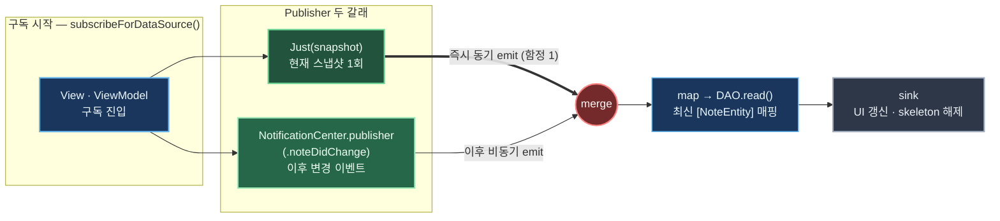
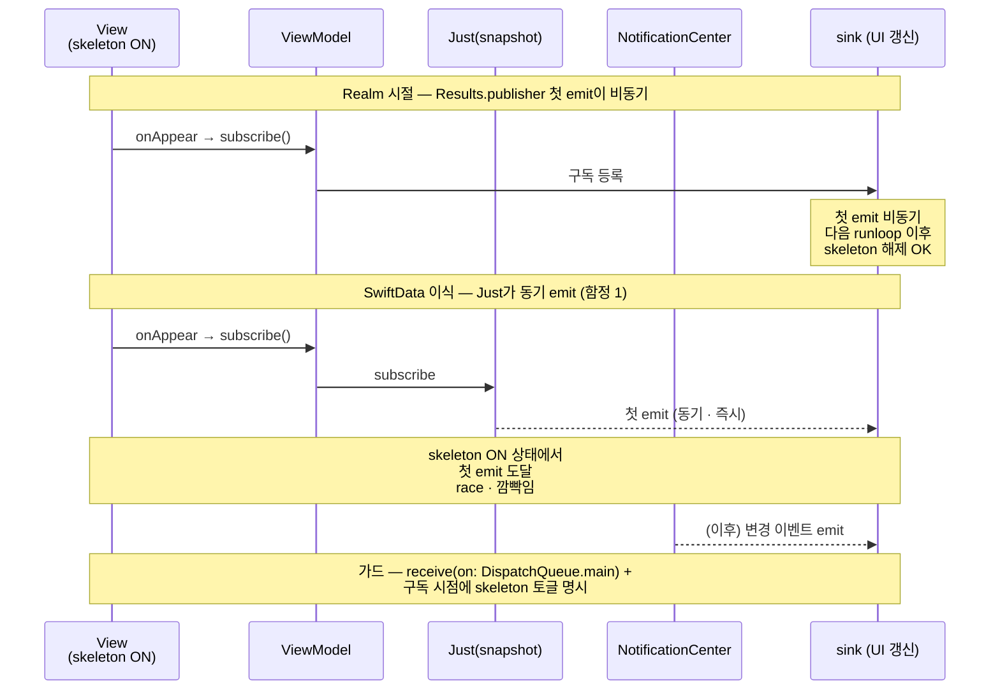

+++
author = "오깅중"
title = "Realm에서 SwiftData로: 42개 모델을 옮기는 전략과 함정 (Part 4 — Combine 통합)"
slug = "realm-to-swiftdata-migration-part-4-combine-integration"
date = "2026-05-12T09:40:00+09:00"
description = "SwiftData에는 Realm Results 같은 자동 Combine publisher가 없다. Just(snapshot) + NotificationCenter merge로 직접 만들고, Just 첫 emit 즉시 흐름·이벤트 누락·잦은 이벤트·스레드 격리 4함정에 가드 거는 패턴."
categories = [
    "Swift"
]
tags = [
    "SwiftData",
    "Realm",
    "iOS17",
    "Migration",
    "Combine",
    "NotificationCenter",
    "Publisher"
]
image = "cover.png"
+++

> **TL;DR** — SwiftData에는 Realm `Results` 같은 **자동 Combine publisher** 가 없다. SwiftUI `@Query` 한 줄을 빼면 UIKit/Combine/Observation 어느 쪽에서도 컬렉션 단위 자동 이벤트는 빌트인이 아니다. `Just(snapshot) + NotificationCenter.publisher`를 `.merge`하는 패턴 하나로 Realm 시절 흐름이 1:1 복원된다. 다만 **`Just` 첫 emit이 즉시 동기로 흘러든다**는 차이를 모르면 hideSkeleton race가 생긴다. 이벤트 책임이 우리 쪽으로 넘어왔다는 건 누락·과다·스레드 미스매치 같은 새 함정 4종이 따라붙는다는 뜻. 각각의 가드 패턴까지 정리한다. 총 6편 시리즈의 **4편(Combine 통합 편)**.

---

## 시작하며

이전 편 → [Part 3 — DAO 패턴](/p/realm-to-swiftdata-migration-part-3-dao-pattern/)

[Part 3](/p/realm-to-swiftdata-migration-part-3-dao-pattern/)에서 `enum NoteDAO` + `static` 메서드 + 단일 진입점으로 라이프사이클 경계를 정리했다. write 메서드 끝마다 `NotificationCenter.default.post(name: .noteDidChange, object: nil)`을 박아둔 것도 거기 회고에서 예고했었다. 이번 편은 그 이벤트를 Combine pipeline으로 어떻게 잇는지... 그리고 Part 3 표(322행)에서 자리만 잡아뒀던 `subscribeForDataSource(folderID:)`가 본격적으로 등장하는 자리다.

이 글에선 먼저 "왜 직접 만들어야 하나"부터 보고, `Just(snapshot) + NotificationCenter.merge` 패턴 하나를 깐 다음, 거기서 따라오는 함정 4종을 카탈로그로 정리한다.

---

## 왜 직접 만들어야 하나

SwiftData의 자동 관찰 메커니즘을 컨텍스트별로 정리하면 이렇다.

| 컨텍스트 | 자동 관찰 | 비고 |
|----------|---------|------|
| SwiftUI `@Query` | O | View body 자동 invalidate. 단, SwiftUI 한정 |
| UIKit | X | 자체 publisher 없음 |
| Combine | X | 빌트인 통합 없음 |
| Observation `@Observable` | O | 객체 단위만. 컬렉션/쿼리 단위는 X |

Realm은 `Results<T>`가 KVO/Combine 양쪽으로 알아서 이벤트를 흘려줬다. 마음 편했지... 근데 SwiftData에선 그 자리가 통째로 비어 있다. UIKit이나 Combine 흐름을 그대로 가져가려면 직접 이벤트를 쏘는 수밖에 없다.

---

## 패턴 — `Just(snapshot) + NotificationCenter.merge`

큰 그림부터.



> *그림 1. 구독 진입 한 번에 `Just(snapshot)`이 즉시 한 번, `NotificationCenter.publisher`가 이후 변경마다 emit한다. 두 갈래를 `merge`로 합치고 `map`에서 다시 DAO.read를 호출해 최신 스냅샷으로 매핑. `Just` 갈래의 "즉시 동기 emit"이 함정 1의 자리다.*

코드로 옮기면 이렇게 된다. Part 3에서 예고한 `subscribeForDataSource(folderID:)` 시그니처가 여기서 본문으로 등장한다.

```swift
extension Notification.Name {
    static let noteDidChange = Notification.Name("NoteDidChange")
}

enum NoteDAO {
    /// snapshot 1회 조회 — 변경 이벤트와 분리
    static func readForDataSourceSnapshot(folderID: Int) -> [NoteEntity] {
        let descriptor = FetchDescriptor<NoteEntity>(
            predicate: #Predicate { $0.folderID == folderID }
        )
        return (try? context.fetch(descriptor)) ?? []
    }

    /// Combine subscribe — 초기 snapshot + 이후 변경 이벤트 merge
    static func subscribeForDataSource(folderID: Int) -> AnyPublisher<[NoteEntity], Error> {
        let initial = Just(readForDataSourceSnapshot(folderID: folderID))
            .setFailureType(to: Error.self)
            .eraseToAnyPublisher()

        let updates = NotificationCenter.default
            .publisher(for: .noteDidChange)
            .map { _ in
                readForDataSourceSnapshot(folderID: folderID)
            }
            .setFailureType(to: Error.self)
            .eraseToAnyPublisher()

        return initial.merge(with: updates).eraseToAnyPublisher()
    }
}
```

처음엔 `Results.publisher` 한 줄을 대체할 게 이 정도일 줄은 몰랐다. snapshot 한 번 + NotificationCenter merge 두 줄이면 끝이라니까... 막상 짜놓고 보면 별 거 없는데 처음엔 막막했음.

post 쪽은 [Part 3](/p/realm-to-swiftdata-migration-part-3-dao-pattern/)에서 잡아둔 그대로 — DAO write 메서드 끝에 `NotificationCenter.default.post`를 박아두면 된다.

```swift
static func insertNote(_ entities: [NoteEntity]) {
    entities.forEach { upsertOne($0) }
    try? context.save()
    NotificationCenter.default.post(name: .noteDidChange, object: nil)   // ← 이벤트 send
}
```

구독 측은 평범한 sink.

```swift
NoteDAO.subscribeForDataSource(folderID: folderID)
    .sink { notes in
        // 초기 snapshot 1회 + 이후 변경 시마다 새 snapshot
        viewModel.updateNotes(notes)
    }
    .store(in: &cancellables)
```

Realm `Results.publisher` 한 줄과 형태만 다르지 의미는 같다. snapshot 1회 + 이후 변경 = 하나의 publisher.

---

## 함정 1 — `Just` 첫 emit이 즉시 흐른다

이거 처음 만났을 때 한참 멍 때렸음 ㅋㅋㅋ Realm 시절엔 첫 emit이 비동기로 왔으니까 자연스럽게 데이터 도착 시점이 한 박자 뒤였는데, `Just`는 그냥 subscribe 호출한 그 줄에서 바로 값이 나온다.

```swift
// Realm 시절
Realm.publisher(realm.objects(NoteObject.self))
    .freeze()
    .sink { /* ... */ }
// 첫 emit이 비동기로 도착 (async)

// SwiftData 변환 후
NoteDAO.subscribeForDataSource(folderID: folderID)
    .sink { /* ... */ }
// 첫 emit이 동기로 즉시 도착 (sync)
```

타임라인으로 비교하면 race가 어디서 끼는지 더 분명히 보인다.



> *그림 2. Realm 시절엔 첫 emit이 다음 runloop 이후 비동기로 도착해서 skeleton 해제 흐름과 자연스럽게 맞물렸다. SwiftData에서 `Just`로 바꾸면 첫 emit이 동기로 즉시 떨어지면서 skeleton ON 상태와 race가 난다.*

첫 emit이 즉시 도착하면 데이터가 비어있는 상태에서 빈 배열이 흘러나가고, 그 시점에 hideSkeleton 분기가 동시 트리거되면 EmptyView가 한 프레임 깜빡인다.

### 해결 — 구독자 측에서 첫 emit 가드

note publisher랑 hideSkeleton publisher의 책임을 분리한다... 한 publisher가 데이터 갱신 + 스켈레톤 종료 + EmptyView 판정까지 다 하면, 첫 emit 빈 배열이 들어왔을 때 EmptyView가 한 프레임 깜빡이는 자리가 그대로 남는다.

```swift
// NoteListStore.bind
presenter.notesPublisher
    .sink(with: self) { owner, notes in
        // SwiftData subscribe 는 진입 즉시 캐시 스냅샷을 첫 emit 으로 내보내므로
        // 여기서 isShowSkeleton 을 끄면 서버 sync 완료 전에 스켈레톤이 사라져 버림.
        // 스켈레톤 종료/EmptyView 결정은 hideSkeletonPublisher (.success/.error) 단일 소스가 담당.
        // 본 구독은 notes 갱신과 멀티선택 동기화만 책임진다.
        owner.state.notes = notes
        if owner.state.isShowSkeleton.not {
            owner.state.isShowEmpty = notes.isEmpty
        }
    }
    .store(in: &cancellables)
```

note publisher는 데이터 갱신만, hideSkeleton publisher는 스켈레톤/EmptyView 결정만. 책임 분리 한 줄로 첫 emit 빈 배열이 EmptyView 깜빡임으로 번지는 길을 끊어둔다.

---

## 함정 2 — 이벤트 누락

DAO write 메서드 중 이벤트가 빠지면 구독자가 변경을 못 감지한다. 흔한 누락 케이스.

- 트랜잭션 안에서 batch update 후 이벤트 1회만 나가야 하는데 매 row마다 쏨
- 백그라운드 sync 시 batch insert 후 이벤트 누락
- `context.save()` 실패 시 이벤트는 쐈는데 데이터는 그대로 → 구독자가 stale 데이터

특히 마지막 케이스는 추적이 늦으면 도메인 곳곳에 stale 캐시가 박히기 좋다.

### 해결 — DAO 메서드 끝에 이벤트 보장 + save 성공 확인

```swift
static func insertNote(_ entities: [NoteEntity]) {
    entities.forEach { upsertOne($0) }
    do {
        try context.save()
        NotificationCenter.default.post(name: .noteDidChange, object: nil)
    } catch {
        Log.error(message: "Note save failed", error: error)
        // 이벤트 안 보냄 — 구독자는 옛 데이터 유지
    }
}
```

save 성공한 자리에서만 이벤트를 쏘면 "구독자가 본 데이터 = 항상 커밋된 상태"가 보장된다. Part 3에서 잡아둔 `autosaveEnabled = false` + 명시 save 패턴이 여기서 한 번 더 값을 한다.

---

## 함정 3 — 이벤트 너무 잦음 (성능)

batch 작업 중 매 row마다 이벤트를 쏘면 구독자가 N번 reload 한다. note 100개 insert 하는데 view가 100번 invalidate 되더라 ㅋㅋㅋ `upsertOne` 안에서 이벤트를 쏘게 짜놓으면 이런 게 너무 쉽게 들어간다. caller-public 메서드 한 번 = 이벤트 한 번으로 박는 게 룰.

### 해결 — 트랜잭션 단위 단일 이벤트

```swift
static func bulkInsert(_ entities: [NoteEntity]) {
    entities.forEach { upsertOne($0) }
    try? context.save()
    NotificationCenter.default.post(name: .noteDidChange, object: nil)  // 1회만
}
```

`upsertOne` ([Part 3](/p/realm-to-swiftdata-migration-part-3-dao-pattern/) 참조) 안에서 이벤트 쏘지 않도록 주의. 한 번의 caller-public 메서드 = 한 번의 이벤트으로 고정.

---

## 함정 4 — 메인 스레드 격리

`ModelContext`는 thread-confined다. 그리고 `NotificationCenter`는 이벤트를 보낸 스레드에서 옵저버를 깨운다. 즉 background에서 이벤트를 쏘면 구독자가 background에서 fetch → main에서 UI 업데이트 시 race가 난다.

### 해결 — 이벤트를 main에서 보장하거나 구독 측에서 `receive(on:)`

```swift
// 보내는 쪽에서 main으로 옮김 (간단)
DispatchQueue.main.async {
    NotificationCenter.default.post(name: .noteDidChange, object: nil)
}

// 또는 구독 측에서 receive(on:)
NoteDAO.subscribeForDataSource(folderID: folderID)
    .receive(on: DispatchQueue.main)
    .sink { /* ... */ }
```

보내는 쪽에서 main을 보장할지, 구독 측에서 `receive(on:)`으로 강제할지... 둘 다 되는데 구독 측이 더 안전하다. 어디서 이벤트가 오든 main으로 정리돼서 들어오니까. DAO 호출자가 늘어날수록 "이 호출 경로가 main이 맞나" 따져야 할 자리가 줄어드는 게 크다.

---

## 함정 카탈로그 한 표

지금까지 정리한 4함정을 한 자리에서 다시 보면.

| 함정 | 증상 | 원인 | 가드 |
|------|------|------|------|
| 1 — `Just` 첫 emit 즉시 흐름 | 진입 직후 EmptyView 한 프레임 깜빡임 | `Just`는 subscribe 시점 동기 emit | note/skeleton publisher 책임 분리 + `receive(on: .main)` |
| 2 — 이벤트 누락 | 구독자가 변경 못 감지, stale 데이터 | save 실패에도 이벤트 / 이벤트 자체 누락 | `do/catch` 안에서 save 성공 시에만 이벤트 |
| 3 — 잦은 이벤트 | view N번 invalidate, 성능 저하 | row마다 이벤트, `upsertOne` 안에서 이벤트 | caller-public 메서드 1회당 이벤트 1회 |
| 4 — 메인 스레드 격리 | UI 업데이트 race, 가끔 크래시 | background에서 이벤트 → 구독자 fetch도 background | 구독 측 `receive(on: DispatchQueue.main)` |

---

## 부수 — `@Query` vs Combine subscribe 비교

| 측면 | SwiftUI `@Query` | Combine `subscribeFor...()` |
|------|----------------|--------------------------|
| 사용처 | SwiftUI body 직접 | UIKit / ViewModel / 비-View 컨텍스트 |
| 자동 invalidate | O | O (수동 이벤트 후) |
| 변경 이벤트 책임 | SwiftData runtime | 우리 DAO |
| 첫 emit 타이밍 | View first render | subscribe 즉시 |
| filter/sort 동적 변경 | 어려움 | publisher 새로 구독해 자유 |
| Combine 연산자 활용 | X | O (map, filter, debounce) |

SwiftUI 한정 흐름이면 `@Query`가 간단. 그 외엔 Combine subscribe 패턴이 일관적이다. 한 도메인을 두 가지 방식으로 동시에 들고 가면 변경 이벤트가 두 채널로 흘러서 추적이 꼬이기 좋으니, 도메인 단위로 한쪽을 정해두는 편을 권한다.

`Subject`(PassthroughSubject/CurrentValueSubject) 대신 `NotificationCenter`를 고른 이유는 단순하다 — Part 3에서 `AppStore.shared.mainContext`를 단일 진입점으로 잡았듯, `NotificationCenter.default`도 프로세스 단일이라 이벤트 보내는 쪽/구독 쪽 모두 같은 채널만 보면 된다는 일관성이 있다.

---

## 체크리스트

비슷한 작업 시작하기 전에 점검해 보면 좋을 항목들.

- [ ] 모든 DAO write 메서드 끝에 `NotificationCenter.post`가 있는가
- [ ] subscribe publisher가 `Just(snapshot) + NotificationCenter.merge` 패턴인가
- [ ] `Just` 첫 emit 이 즉시 흐르는 걸 가정한 race 가드가 있는가 (책임 분리 + `receive(on:)`)
- [ ] batch 작업 시 트랜잭션당 이벤트 1회만 일어나는가
- [ ] 이벤트 보내는 스레드 / 구독 스레드가 명시적인가 (`receive(on:)`)
- [ ] save 실패 시 이벤트 안 보내지는가 (`do/catch`)

---

## 회고

Part 3가 라이프사이클 경계였다면 Part 4는 이벤트 흐름 경계다. 자동 이벤트 책임이 SwiftData 런타임 손에 있다가 우리 손으로 넘어왔다는 것뿐인데... 그 한 줄 차이가 함정 4종을 데리고 온다.

Realm은 `Results<T>`가 이벤트·snapshot·publisher를 한 묶음으로 들고 있어서 사용자는 그냥 `.publisher`만 구독하면 됐다. SwiftData에선 그 묶음을 우리가 풀어서 — snapshot 함수 하나, 이벤트 채널 하나, 이벤트 쏘는 시점 하나, merge publisher 하나 — 따로 박아둬야 한다. 풀어놓으니까 함정이 보이는 자리도 늘어나는 건데, 거꾸로 말하면 어디서 무엇이 깨지는지 우리가 통제 가능한 자리에 다 있다는 뜻이기도 하다.

다음 편([Part 5 — Async/Await 통합](/p/realm-to-swiftdata-migration-part-5-async-await-integration/))에선 Combine 자리 옆에 또 하나 박혀 있는 흐름 — 백그라운드 sync에서 SwiftData를 어떻게 다루는지, 흔히 빠지는 fire-and-forget 안티패턴은 뭔지 다룬다.

---

## 시리즈 목차

- [Part 1 — 전략](/p/realm-to-swiftdata-migration-part-1-strategy/)
- [Part 2 — Primary Key 함정](/p/realm-to-swiftdata-migration-part-2-primary-key-traps/)
- [Part 3 — DAO 패턴](/p/realm-to-swiftdata-migration-part-3-dao-pattern/)
- Part 4 — Combine 통합 (이 글)
- [Part 5 — Async/Await 통합](/p/realm-to-swiftdata-migration-part-5-async-await-integration/)
- [Part 6 — View 다중 mount 디버깅](/p/realm-to-swiftdata-migration-part-6-view-multi-mount-debugging/)
