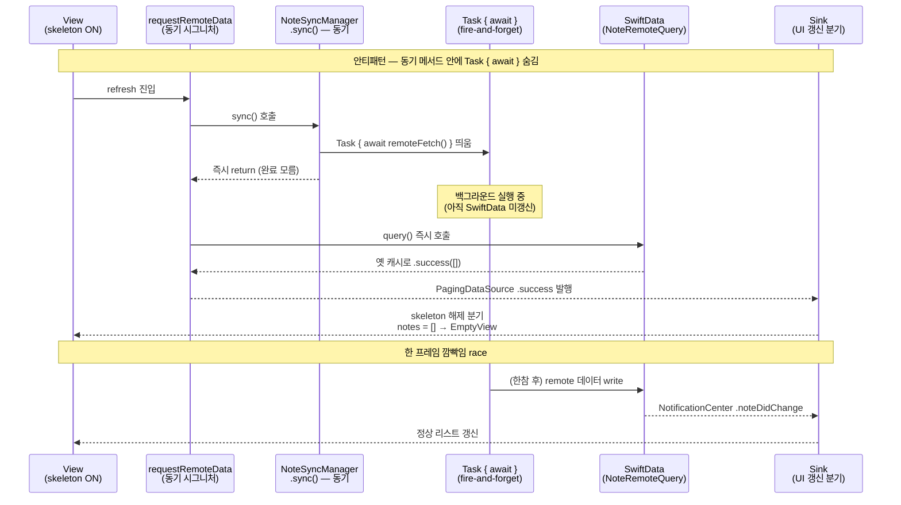
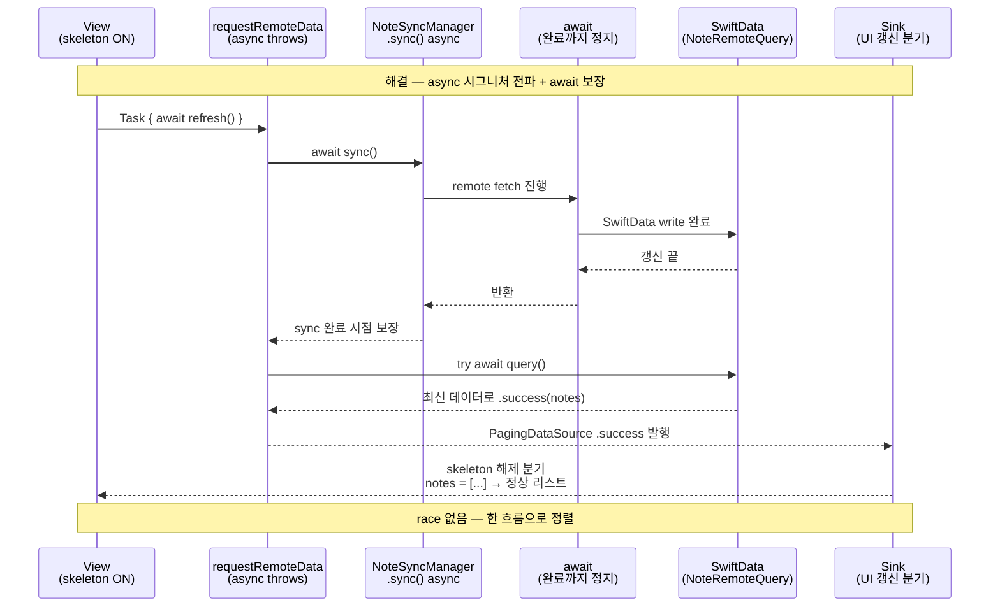

+++
author = "오깅중"
title = "Realm에서 SwiftData로: 42개 모델을 옮기는 전략과 함정 (Part 5 — Async/Await 통합)"
slug = "realm-to-swiftdata-migration-part-5-async-await-integration"
date = "2026-05-12T10:30:00+09:00"
description = "동기 메서드 안에 숨겨둔 Task { await }는 호출자가 sync 완료를 모르는 fire-and-forget 안티패턴이다. SwiftData 갱신 전 옛 캐시 query가 먼저 도착해 EmptyView 한 프레임이 깜빡인 흐름과 async 시그니처 전파로 정직하게 푼 패턴 정리."
categories = [
    "Swift"
]
tags = [
    "SwiftData",
    "Realm",
    "iOS17",
    "Migration",
    "Concurrency",
    "AsyncAwait",
    "Task"
]
image = "cover.png"
+++

> **TL;DR** — 동기 메서드 안의 `Task { await ... }` 는 호출자가 sync 완료를 알 수 없는 fire-and-forget이다. SwiftData 같은 비동기 저장소를 이걸로 갱신하고 바로 query를 돌리면 옛 캐시가 먼저 도착해서 skeleton 해제 직후 EmptyView가 한 프레임 깜빡이는 race가 생긴다. 해결은 `async` 시그니처를 호출 체인 위로 정직하게 전파하고 `await`로 완료를 보장하는 것. 그 과정에서 `async throws` 오버로드 자동 선택 함정, `Task` vs `Task.detached`, Combine sink 안의 `Task` cancellation, Combine ↔ async 다리 패턴까지 같이 정리. 총 6편 시리즈의 **5편(Async/Await 통합 편)**.

---

## 시작하며

이전 편 → [Part 4 — Combine 통합](/p/realm-to-swiftdata-migration-part-4-combine-integration/)

[Part 4](/p/realm-to-swiftdata-migration-part-4-combine-integration/) 회고 끝줄에서 "백그라운드 sync에서 SwiftData를 어떻게 다루는지, 흔히 빠지는 fire-and-forget 안티패턴은 뭔지"를 다음 편 떡밥으로 던져뒀다. 이번 편이 그 자리다.

이상하게도 증상은 Part 4 함정 1과 거의 같은 모양으로 다시 나타났다. 진입 직후 EmptyView 한 프레임 깜빡임. 분명 책임 분리 + `receive(on:)` 가드는 다 들어가 있는데 같은 모양 회귀가 또 보였다... 원인은 더 위쪽이었다. publisher 첫 emit 자체가 아니라 sync를 호출한 그 위 흐름이 거짓말을 하고 있었다.

---

## 안티패턴 — 동기 메서드 안의 `Task { await }`

문제의 sync 매니저는 이런 모양이었다.

```swift
// 안티패턴 — fire-and-forget
class NoteSyncManager {
    func sync(isDelayed: Bool = false) {
        if isDelayed {
            delayedRequester.post(...)
        } else {
            Task {
                await noteQuery.operate(enableRemoteQuery: true)
            }
        }
    }
}
```

호출자는 동기 시그니처라 가정하고 바로 다음 줄에서 query를 돌린다.

```swift
// 안티패턴 호출자 — sync 완료 전에 query 호출
override func requestRemoteData(...) -> Result<QueryOffset, Error> {
    if isRefresh {
        noteSyncManager.sync()   // 즉시 리턴
    }
    let result = NoteRemoteQuery().query(...)   // 옛 캐시로 query
    return result
}
```

`noteSyncManager.sync()` 가 동기 메서드라 호출자는 sync 완료 시점을 모른다. 내부의 `Task` 가 백그라운드에서 돌고 있을 뿐 호출은 즉시 리턴해버려서, 다음 줄 `query()` 가 SwiftData 갱신 전 캐시로 결과를 돌려준다. 시그니처가 비동기성을 거짓말한 자리다.

이 흐름이 만드는 회귀를 시간 순으로 풀면 이렇다.

1. `requestRemoteData` 호출
2. `sync()` 호출 → 내부 Task 시작, 호출은 즉시 리턴
3. `query()` — SwiftData 옛 캐시로 `Result.success(offset)` 반환
4. 페이징 컴포넌트가 `.success` 이벤트를 흘림
5. skeleton 해제 분기를 탐
6. notes 는 아직 `[]` — `isShowEmpty = true`
7. EmptyView 한 프레임 노출
8. 한참 후 Task 완료, SwiftData 갱신, `NotificationCenter` 가 `.noteDidChange` 이벤트를 보냄
9. 구독자가 `notes = [data]` 로 갱신
10. 정상 리스트 표시

사용자 입장에선 진입 → 깜빡 → 리스트. 어디서 뭐가 깨진 건지 한 번에 안 보임 ㅋㅋㅋ



> *그림 1. 회귀 시퀀스. `sync()` 가 즉시 리턴하면서 `query()` 가 옛 캐시로 먼저 도착하고, 한참 뒤에야 백그라운드 Task가 SwiftData를 갱신하면서 정상 리스트가 들어온다. 두 흐름 사이의 한 프레임이 EmptyView 깜빡임 자리.*

Part 4 함정 1과 모양은 비슷하지만 원인 층이 다르다. Part 4는 publisher 첫 emit이 즉시 동기로 흘렀던 거고, Part 5는 sync 호출 자체가 fire-and-forget이라 옛 캐시 query가 먼저 도착한 것. 같은 EmptyView 깜빡임 증상이라도 가드 자리가 publisher 안이냐 호출 시그니처냐가 갈린다.

---

## 해결 — `async` 시그니처 전파 + `await` 보장

해결은 sync 매니저에 `async` 오버로드를 같이 두는 것부터.

```swift
// 해결 — async 메서드도 같이 제공
class NoteSyncManager {
    /// 동기 fire-and-forget — 백그라운드 sync 트리거 용
    func sync(isDelayed: Bool = false) {
        if isDelayed { /* ... */ }
        else {
            Task { await noteQuery.operate(enableRemoteQuery: true) }
        }
    }

    /// async — 호출자가 완료를 await 가능
    func sync() async {
        await noteQuery.operate(enableRemoteQuery: true)
    }
}
```

동기 버전은 "백그라운드 트리거 전용"으로 남기고, 호출자가 sync 완료를 알아야 하는 자리에는 `async` 버전을 쓰게 한다. 호출자도 `async` 로 같이 끌어올린다.

```swift
// 해결 호출자 — await 보장 흐름
override func requestRemoteData(
    offset: Int,
    limit: Int,
    isRefresh: Bool
) async -> Result<QueryOffset, Error> {
    if isRefresh {
        await noteSyncManager.sync()   // SwiftData 갱신 완료까지 대기
    }

    do {
        let queryOffset = try await NoteRemoteQuery().query(...)
        return .success(queryOffset)
    } catch {
        return .failure(error)
    }
}
```

한 자리만 고치고 끝났으면 좋았는데... 시그니처가 호출 체인 위로 자꾸 번져 올라간다. 페이징 컴포넌트 호출 측은 평소 동기 메서드라 `Task` 로 비동기 경계를 만들어 감싼다.

```swift
// 페이징 컴포넌트 — Task로 비동기 경계 잡기
private func request(isRefresh: Bool) {
    Task { [weak self] in
        guard let self else { return }
        let result = await self.requestRemoteData(
            offset: queryOffset.offset,
            limit: queryOffset.limit,
            isRefresh: isRefresh
        )

        switch result {
        case .success(let queryOffset):
            self.onSuccess(queryOffset: queryOffset)
        case .failure:
            self.onError()
        }
    }
}
```

이 흐름을 다시 그림으로 보면 race가 어디서 사라지는지 한눈에 보인다.



> *그림 2. 같은 6 participant lane으로 그린 해결 시퀀스. `await sync()` 가 SwiftData write 완료까지 정지해주니까 그 다음 줄 `try await query()` 는 항상 최신 데이터로 돌아온다. 그림 1과 1번 화살표만 바꿨는데 이후 흐름이 한 줄로 정렬됨.*

---

## `async throws` 오버로드 함정

`async` 로 끌어올리는 도중에 한 번 더 걸렸다. query 메서드가 동기 `Result` 버전과 신규 `async throws` 버전을 둘 다 들고 있는 자리였다.

```swift
class NoteRemoteQuery {
    // 동기 버전 (옛 코드 호환용)
    func query(...) -> Result<QueryOffset, Error> { /* ... */ }

    // 신규 async throws 버전
    func query(...) async throws -> QueryOffset { /* ... */ }
}
```

`await` 컨텍스트 안에서 `query(...)` 를 부르면 컴파일러가 두 번째 시그니처를 자동 선택한다. 그 결과 `try` 키워드가 필요해지고 반환 타입이 `QueryOffset` 이라 기존 `Result` 패턴 그대로 못 쓴다. `try` 안 붙였다고 빨간 줄 떠서 그제야 알았음 ㅋㅋㅋ

해결은 `do { try await ... ; return .success } catch { return .failure }` 로 throws → Result 변환 wrap을 한 자리에서 해주는 것.

```swift
// throws → Result 변환 표준 wrap
override func requestRemoteData(...) async -> Result<QueryOffset, Error> {
    if isRefresh {
        await noteSyncManager.sync()
    }

    do {
        let queryOffset = try await NoteRemoteQuery().query(...)
        return .success(queryOffset)
    } catch {
        return .failure(error)
    }
}
```

이 wrap 패턴이 마이그레이션 중 throws ↔ Result 경계 자리의 표준이 됐다. `Result` 인터페이스를 들고 가야 하는 옛 호출 측과 throws 시그니처가 자연스러운 신규 query 사이를 한 줄짜리 어댑터로 봉합한다.

---

## `Task` vs `Task.detached`

마이그레이션 중 actor isolation 망가지는 자리 색출하면서 정한 룰.

```swift
Task { await self.requestRemoteData(...) }          // 일반적으로 충분
Task.detached { await self.requestRemoteData(...) } // 가능한 한 피함
```

`Task.detached` 는 부모 컨텍스트의 actor isolation 과 priority 를 상속하지 않는다. 대부분의 경우 `Task` 한 줄로 충분하고, `detached` 는 명확한 이유 (예: actor isolation 의도적 우회) 가 있을 때만. 거의 모든 자리에서 `Task` 한 줄로 충분하다... `Task.detached` 는 본 적 없다 정도로 두는 게 안전.

---

## Combine sink 안에서 `Task` 사용

Combine `sink` 클로저는 `@escaping` 이지만 `async` 가 아니다. async 호출이 필요하면 `Task` 로 감싼다.

```swift
publisher
    .sink(with: self) { owner, value in
        Task { [weak owner] in
            await owner?.handle(value)
        }
    }
    .store(in: &cancellables)
```

여기서 한 가지 주의할 게 있다. `Task` 의 cancellation 은 `AnyCancellable` cancel 과 무관하다. publisher 가 종료돼도, `cancellables` 가 해제돼도, 그 안에서 띄운 Task 는 별도로 계속 실행된다. `AnyCancellable` cancel 하면 안의 Task 도 같이 죽을 줄 알았는데... 별도다. 필요하면 `Task` reference 를 직접 들고 있다가 끄는 식으로 관리한다.

---

## 패턴 — Combine + async 다리 놓기

마이그레이션 중 한동안 Combine 쪽 흐름과 async 쪽 흐름이 공존하는 구간이 있다. 두 세계 사이를 오갈 수 있는 어댑터 두 개를 표준 도구로 박아뒀다.

먼저 `AnyPublisher` 를 `async` 컨텍스트에서 한 값만 await 하는 쪽.

```swift
extension Publisher where Failure == Never {
    func firstValue() async -> Output {
        await withCheckedContinuation { continuation in
            var cancellable: AnyCancellable?
            cancellable = self.first()
                .sink { value in
                    continuation.resume(returning: value)
                    cancellable?.cancel()
                }
        }
    }
}

// 사용
let firstNotes = await NoteDAO
    .subscribeForDataSource(folderID: folderID)
    .firstValue()
```

반대로 async 결과를 publisher 로 흘려보내는 쪽.

```swift
extension Task where Failure == Never {
    var publisher: AnyPublisher<Success, Never> {
        Deferred {
            Future { promise in
                Task { [self] in
                    let value = await self.value
                    promise(.success(value))
                }
            }
        }
        .eraseToAnyPublisher()
    }
}
```

두 어댑터 모두 마이그레이션 과정에서 두 세계 공존 구간 봉합용으로 갖고 있는 참고 패턴이다. 모든 자리에 강요하는 룰은 아니고, 두 흐름을 한 자리에서 이어야 할 때 표준 모양으로 꺼내쓰는 정도.

---

## 안티패턴 회상 — 동기 메서드 안에 숨겨진 비동기

이번 편 안티패턴을 시리즈의 다른 안티패턴들과 같이 묶어 놓고 보면 같은 모양이 보인다.

| 안티패턴 | 결과 |
|---------|------|
| 동기 메서드 안의 `Task { await }` (Part 5) | 호출자가 완료 못 앎 → race |
| 동기 method 안에서 `DispatchQueue.global().async` + send (Part 5 변형) | 동일 — 동기 시그니처 거짓말 |
| Publisher 가 캐시 즉시 emit (Part 4) | 첫 emit 가드 빠지면 race |
| 동기 method 안의 SwiftData 자동 갱신 가정 (Part 3) | autosave 타이밍 race |

Part 3·4·5 안티패턴이 다 같은 모양이었다는 게 글 다 쓰고 나서야 보였다... 표층 증상은 다 다르지만 ("autosave 타이밍 race", "publisher 첫 emit race", "fire-and-forget race") 한 단계 위로 추상화하면 전부 **"동기 시그니처 안에 비동기를 숨겨둔" 거짓말**의 변형이다.

그래서 한 줄 규칙으로 도출됐다.

> **호출자가 알아야 하는 비동기 결과가 있으면, 메서드 시그니처가 `async` / `throws` / completion 으로 그 비동기를 정직하게 드러내야 한다.**

이번 시리즈 전체의 thesis 한 줄.

---

## 체크리스트

비슷한 마이그레이션 시작하기 전에 점검해 보면 좋을 항목.

- [ ] 동기 메서드 안에 `Task { await }` 가 있다면 `async` 시그니처도 같이 제공하는가
- [ ] sync 완료가 호출자에게 필요한 흐름에서 fire-and-forget 안 쓰는가
- [ ] `async throws` 오버로드 호출 시 `try await` + Result wrap 패턴이 일관적인가
- [ ] Combine `sink` 안의 `Task` 가 cancellation 관리되는가 (`AnyCancellable` 과 별도)
- [ ] `Task.detached` 사용 시 의도적 이유가 명확한가
- [ ] 스레드 격리 (`@MainActor` 등) 가 sync 완료 흐름과 일관되는가

---

## 회고

Part 4가 이벤트 흐름 경계였다면 Part 5는 호출 시그니처 경계다. SwiftData가 Realm과 다르게 비동기 저장소라는 사실이 호출 체인 모든 자리에 영향을 준다. 한 메서드 시그니처를 `async` 로 바꾸면 그 호출자도, 그 호출자의 호출자도 `async` 가 따라온다. 한 자리만 고치고 끝나면 좋겠지만 그렇게 안 됐다.

회귀가 처음 어떻게 발견됐는지, 시그니처 전파가 정확히 어디까지 번졌는지 같은 구체 정황은 노트에 남겨두지 않아 회상으로 다 적기는 어렵다. 다만 그 과정에서 분명한 건 — 동기 시그니처로 비동기를 숨기는 자리가 보일 때마다 어디선가 race가 한 발 뒤에 따라온다는 것. Part 3 autosave 타이밍, Part 4 publisher 첫 emit, Part 5 fire-and-forget이 다 같은 거짓말의 다른 모양이었다.

마이그레이션이 끝났다고 안심한 자리에서 또 다른 race가 나왔다 — View 가 두 번 mount 되는 경로. 다음 편(Part 6)에서 다룬다.

---

## 시리즈 목차

- [Part 1 — 전략](/p/realm-to-swiftdata-migration-part-1-strategy/)
- [Part 2 — Primary Key 함정](/p/realm-to-swiftdata-migration-part-2-primary-key-traps/)
- [Part 3 — DAO 패턴](/p/realm-to-swiftdata-migration-part-3-dao-pattern/)
- [Part 4 — Combine 통합](/p/realm-to-swiftdata-migration-part-4-combine-integration/)
- Part 5 — Async/Await 통합 (이 글)
- Part 6 — View 다중 mount 디버깅 (다음 편 예정)
