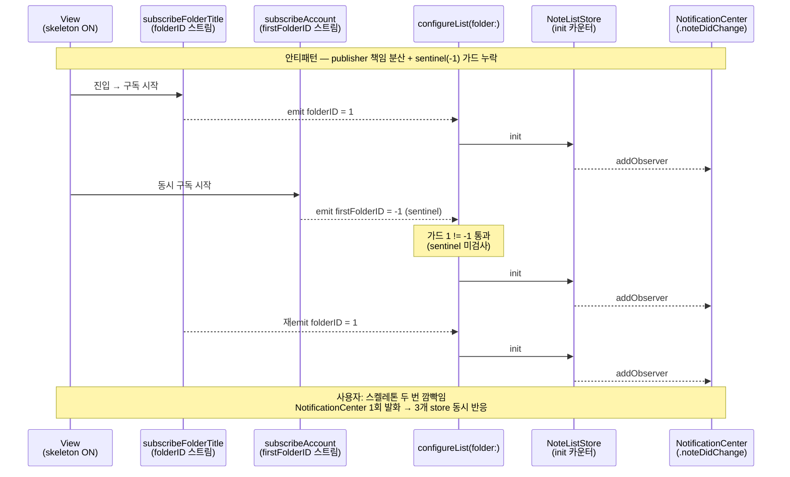
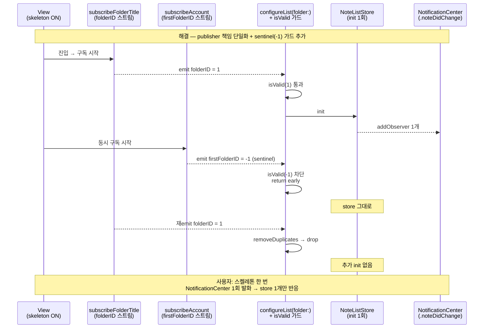

+++
author = "오깅중"
title = "Realm에서 SwiftData로: 42개 모델을 옮기는 전략과 함정 (Part 6 — View 다중 mount 디버깅)"
slug = "realm-to-swiftdata-migration-part-6-view-multi-mount-debugging"
date = "2026-05-12T11:25:00+09:00"
description = "마이그레이션 후 리스트 화면 진입 시 스켈레톤이 두 번 깜빡이는 회귀를 가설 5개로 못 잡고, ObjectIdentifier 진단 로그 한 줄로 Store가 3번 init되는 걸 5분 만에 잡았다. Publisher 다중 trigger + invalid sentinel 합작이었고, isValid 가드 + attach 책임 단일화 + attachedFolderID latch 3중으로 막은 흐름. 시리즈 6편을 닫으며 측정이 추측을 이긴다는 thesis 정리."
categories = [
    "Swift"
]
tags = [
    "SwiftData",
    "Realm",
    "iOS17",
    "Migration",
    "Debugging",
    "RaceCondition",
    "Combine",
    "ViewLifecycle"
]
image = "cover.png"
+++

> **TL;DR** — 마이그레이션 후 리스트 진입 시 스켈레톤이 두 번 깜빡이는 회귀가 보였다. 가설 5개를 짜서 누적 패치를 시도했는데 진짜 원인은 그 5개에 없었다. `ObjectIdentifier(self).hashValue` 진단 로그 한 줄로 `NoteListStore`가 **3번 init**되는 걸 5분 만에 확인. 원인은 `subscribeAccount`가 `loadFirstFolder()` 결과로 받아온 `.invalidInt(-1)` sentinel을 첫 emit으로 흘렸고, 기존 가드 `1 != -1`이 그대로 통과하면서 가짜 folder로 attach가 한 번 더 일어났던 것. `accountFirstFolder.folderID.isValid` 가드 한 줄 + attach 책임 단일화 + `attachedFolderID` latch 3중으로 구조적으로 막았다. 총 6편 시리즈의 **마지막, 6편(View 다중 mount 디버깅 편)**.

---

## 시작하며

이전 편 → [Part 5 — Async/Await 통합](/p/realm-to-swiftdata-migration-part-5-async-await-integration/)

[Part 5](/p/realm-to-swiftdata-migration-part-5-async-await-integration/) 회고 끝줄에서 "마이그레이션 끝났다고 안심한 자리에서 또 다른 race가 나왔다 — View가 두 번 mount되는 경로"를 다음 편 떡밥으로 던져뒀다. 이번 편이 그 자리다.

증상은 단순했다. 진입 시 스켈레톤이 두 번 깜빡임. 그런데 이번엔 publisher 안도, 호출 시그니처도 아니고 — View가 통째로 두 번(정확히는 세 번) 살아나고 있었다... 마이그레이션 끝났다고 안심한 자리에서 또 다른 race가 나왔다. 이번엔 UI lifecycle 쪽이다.

---

## 증상 — 스켈레톤이 두 번 깜빡임

리스트 화면 진입 시 사용자 인지 흐름:

```
1. 진입
2. EmptyView 또는 placeholder 잠깐 노출
3. 스켈레톤 UI 표시
4. 스켈레톤 사라짐
5. 또 스켈레톤이 나타남
6. 데이터 표시
```

핵심은 한 줄 가정이다 — **스켈레톤 N번 깜빡임 = State 인스턴스 N+1개 이상 생성**. `ObservableObject`의 `isShowSkeleton` 초기값이 `true`라면, 새 인스턴스가 살아날 때마다 스켈레톤이 다시 표시된다. 그러니까 깜빡임을 잡고 싶으면 인스턴스 개수부터 잡아야 한다.

---

## 진단 — `ObjectIdentifier`로 mount 횟수 측정

여기서 하지 말아야 할 일이 가설 누적이었다. 그런데 처음엔 그걸 했다. publisher 첫 emit이 두 번 흘러서 그런가, `@StateObject`가 재생성되나, 부모 뷰가 다시 그려지나, `onAppear`가 두 번 불리나, 뷰 식별자가 깨졌나... 5개를 누적했는데 진짜 원인은 그 5개에 없었다 ㅋㅋㅋ

추측 그만하고 측정으로 넘어갔다. Store/ViewModel `init`/`deinit`에 인스턴스 식별자를 박는다.

```swift
final class NoteListStore: ObservableObject {
    init(presenter: NoteListEvents) {
        self.presenter = presenter
        self.state = State(/* ... */)
        print("[mount] Store init ptr=\(ObjectIdentifier(self).hashValue) " +
              "isShowSkeleton=\(state.isShowSkeleton)")
        bind()
    }

    deinit {
        print("[mount] Store deinit ptr=\(ObjectIdentifier(self).hashValue)")
    }
}
```

attach/detach 함수와 publisher sink 진입에도 같이 박아둔다. 호출자가 누군지도 같이 봐야 하니까 `Thread.callStackSymbols` 까지 끌고 온다.

```swift
// configureList 진입
print("[attach] requested=\(folder.folderID) " +
      "attached=\(String(describing: attachedFolderID)) " +
      "bypass=\(attachedFolderID == folder.folderID) " +
      "caller=\(Thread.callStackSymbols.dropFirst().prefix(3).joined(separator: " | "))")
```

Xcode console에서 `[mount]` 필터를 걸고 한 번 진입.

```
[mount] Store init ptr=-4241383073414229073   ← #1
[mount] Store init ptr=810623052023089279     ← #2
[mount] Store init ptr=-2943669789172097750   ← #3
```

3번. 사용자 인지의 깜빡임 2번 뒤에 mount는 3번이었다... measurement와 사용자 인지가 다르다는 것도 하나의 발견이었다. 첫 번째 init이 너무 빨리 지나가서 사용자 눈에는 깜빡임이 두 번으로 보였을 뿐, 실제 살아난 store는 셋이었다.

이쯤에서 가설 5개가 다 의미 없어졌다. mount가 3번이라는 사실 하나로 후보가 좁혀진다 — publisher든 child VC attach든, 어딘가에서 같은 함수가 세 번 호출되고 있다.

---

## 원인 — Publisher 다중 trigger + invalid sentinel

`[attach]` 로그에서 잡힌 호출자를 따라가니 attach 함수가 **두 publisher**에서 각자 호출되고 있었다.

```swift
// 안티패턴 — subscribe 두 곳이 각자 attach 트리거
private func subscribeFolderTitle() {
    useCases.subscribeFolders.execute
        .sink(with: self) { owner, folders in
            guard let folder = owner.preferredFolder(from: folders) else { return }
            if owner.currentFolder?.folderID != folder.folderID {
                owner.configureList(folder: folder)   // attach 트리거 A
            }
        }.store(in: &cancellable)
}

private func subscribeAccount() {
    useCases.subscribeAccountData(...)
        .sink(with: self) { owner, _ in
            let firstFolder = owner.loadFirstFolder()
            if owner.currentFolder?.folderID != firstFolder.folderID {
                owner.configureList(folder: firstFolder)   // attach 트리거 B
            }
        }.store(in: &cancellable)
}
```

진단 로그에서 잡힌 실제 시퀀스:

```
[publisher] titleEmit folderID=1 currentFolderID=nil
[attach] requested=1 attached=nil → bypass=false  ← attach #1 (정상)
[publisher] accountEmit firstFolderID=-1          ← invalidInt!!
[attach] requested=-1 attached=1 → bypass=false   ← attach #2 (가짜 folder)
[publisher] titleEmit folderID=1 currentFolderID=-1
[attach] requested=1 attached=-1 → bypass=false   ← attach #3 (다시 정상)
```

`subscribeAccount`가 흘려보낸 `loadFirstFolder()` 값이 **`.invalidInt(-1)`**. 기존 가드 `currentFolderID != firstFolderID`는 `1 != -1`이라 그대로 통과한다... silent로 가짜 folder에 attach해버리고, 그 다음에 다시 진짜 folder로 attach. **mount 3번**이 그렇게 만들어진 것.

`.invalidInt`가 어디서 새어나왔는지는 시리즈 다른 편에서 본 모양이다. Realm → SwiftData 마이그레이션 직후 캐시가 비어있는 시점에 `loadFirstFolder()`가 entity의 `initEmpty()` sentinel을 그대로 흘렸다. [Part 2의 `.invalidInt` 함정](/p/realm-to-swiftdata-migration-part-2-primary-key-traps/)이 UI lifecycle 자리까지 따라온 셈이다.

이 흐름을 한눈에 보려고 시퀀스로 그렸다.



> *그림 1. 안티패턴 시퀀스. 두 publisher가 같은 attach 함수를 따로 호출하고, sentinel(-1)이 가드를 통과해버려서 store가 3번 살아난다. observer도 같이 셋이 되니까 이후 `NotificationCenter` 한 번 쏠 때마다 store 3개가 동시 반응하는 구조가 된다.*

---

## 해결 1 — Invalid sentinel 가드

먼저 sentinel을 `subscribeAccount` 안에서 잡았다. 한 줄이면 끝난다.

```swift
private func subscribeAccount() {
    useCases.subscribeAccountData(...)
        .removeDuplicates(by: { $0.email == $1.email && $0.isConnectingAccount == $1.isConnectingAccount })
        .filter({ $0.isConnectingAccount })
        .sink(with: self) { owner, _ in
            guard let currentFolderID = owner.currentFolder?.folderID else { return }
            let accountFirstFolder = owner.loadFirstFolder()

            // invalid sentinel 가드 — 캐시 비어있는 시점 race 차단
            guard accountFirstFolder.folderID.isValid else { return }

            guard currentFolderID != accountFirstFolder.folderID else { return }
            owner.currentFolder = accountFirstFolder
            owner.configureList(folder: accountFirstFolder)
        }.store(in: &cancellable)
}
```

핵심은 `accountFirstFolder.folderID.isValid` 한 줄... 진짜 한 줄이다. `removeDuplicates`로 중복 emit 잡고, `filter`로 비활성 계정 차단하고, sentinel 가드로 캐시 빈 시점 차단. 이 셋이 publisher 입구에서 잡아둔 안전망이다.

---

## 해결 2 — Attach 책임 단일화

가드 한 줄로 표층 race는 잡혔지만 구조 문제는 그대로다. **두 publisher가 같은 attach 함수를 부른다**는 것 자체가 race 자리다. 그래서 attach 트리거 권한을 한쪽으로 정한다.

`subscribeFolderTitle`이 진입 시 state 결정 권한을 갖는다. `subscribeAccount`는 진짜 계정 전환에만 반응. `currentFolderID`가 nil이면 아직 결정되지 않은 시점이니까 손대지 않는다.

```swift
private func subscribeAccount() {
    useCases.subscribeAccountData(...)
        .sink(with: self) { owner, _ in
            // currentFolderID가 nil이면 아직 결정 안 됨 — subscribeFolderTitle이 할 일
            guard let currentFolderID = owner.currentFolder?.folderID else { return }

            let firstFolder = owner.loadFirstFolder()
            guard firstFolder.folderID.isValid else { return }
            guard currentFolderID != firstFolder.folderID else { return }

            // 진짜 계정 전환 시에만 reattach
            owner.configureList(folder: firstFolder)
        }.store(in: &cancellable)
}
```

이 가드가 들어가면 진입 직후 `subscribeAccount`가 흘리는 첫 emit은 무조건 `currentFolderID == nil` 분기에서 잡힌다. 첫 결정은 항상 `subscribeFolderTitle`이 하고, `subscribeAccount`는 사용자가 계정을 바꿨을 때에만 끼어든다.

---

## 해결 3 — `attachedFolderID` 추적

마지막 안전망은 attach 함수 자체에 latch를 두는 것이다. 이미 같은 folder에 attach돼 있다면 다시 attach하지 않는다.

```swift
private var attachedFolderID: Int?

private func configureList(folder: FolderItem) {
    guard attachedFolderID != folder.folderID else { return }
    attachedFolderID = folder.folderID

    DispatchQueue.main.async { [weak self] in
        guard let self else { return }
        self.controllable?.detachListChild {
            self.controllable?.attachListChild(/* ... */)
        }
    }
}
```

세 가드를 합치면 — invalid sentinel 차단 + attach 책임 단일화 + `attachedFolderID` latch — mount 다중화는 구조적으로 불가능해진다. 한 자리만 막으면 다른 자리에서 또 새는 race도 같이 닫힌다.

해결 흐름을 같은 6 lane으로 다시 그렸다.



> *그림 2. 그림 1과 같은 6 lane으로 그린 해결 시퀀스. sentinel(-1)을 publisher 입구에서 잡고, 같은 folderID 재emit은 `removeDuplicates`로 떨어뜨린다. store 1개만 살고 observer도 1개만 남으니까 `NotificationCenter` 한 번 쏠 때 store 1개만 반응하는 모양이 된다.*

---

## 부산물 1 — 잉여 컨테이너 단순화

디버깅하다 보니 컨테이너 자체가 실질적으로 잉여였다 ㅋㅋㅋ 페이지 컨트롤러 + 커스텀 탭 뷰 컨테이너로 감싸고 있었는데, 실제로는 모든 폴더가 단일 페이지였고 (탭 height를 0으로 강제 숨김), 특정 종류의 폴더도 별개 entity로 분리돼 있어서 탭이라는 추상이 의미 없었다. 결국 단일 컨테이너 뷰 한 장으로 충분했다.

```swift
// Before — 약 300줄
private let pageViewController = UIPageViewController(...)
private let tabView = ...
private var viewControllers = [UIViewController]()
// ... + UIPageViewControllerDelegate / UIPageViewControllerDataSource
//     + UIScrollViewDelegate

// After — 약 240줄
private let listContainerView: UIView = {
    let view = UIView()
    view.backgroundColor = .clear
    return view
}()
private weak var currentListViewController: UIViewController?
```

깜빡임의 직접 원인은 아니었다. 다만 mount가 일어날 수 있는 surface 자체가 줄어들면 이후 비슷한 race를 또 만났을 때 디버깅 표면이 좁아진다. 잉여 컨테이너를 들어내는 건 여기서는 부산물이지만, 단순화 자체가 다음 race의 비용을 낮춰준다.

---

## 부산물 2 — 스켈레톤 최소 노출 시간 안전망

근본 race를 잡았어도 미세한 race가 다시 생길 가능성은 남는다. 사용자 인지 일관성 보장용 안전망으로 스켈레톤 최소 노출 시간 가드를 같이 박아뒀다. 결정 근거(왜 500ms인지)는 별도 측정 없이 보조 가드 수치로 정한 값이다.

```swift
private var initialAppearAt: Date?
private let minimumSkeletonDuration: TimeInterval = 0.5

// onAppear 시점 기록
case .onAppear:
    initialAppearAt = Date()
    // ...

// skeleton 해제 신호 도착해도 최소 500ms 보장
presenter.hideSkeletonSignal
    .sink(with: self) { owner, _ in
        let appearAt = owner.initialAppearAt ?? Date()
        let elapsed = Date().timeIntervalSince(appearAt)
        let delay = max(0, owner.minimumSkeletonDuration - elapsed)

        let apply: (NoteListStore) -> Void = { store in
            store.state.isShowSkeleton = false
            store.state.isShowEmpty = store.state.items.isEmpty
        }

        if delay > 0 {
            DispatchQueue.main.asyncAfter(deadline: .now() + delay) { [weak owner] in
                guard let owner else { return }
                apply(owner)
            }
        } else {
            apply(owner)
        }
    }
```

근본 race는 위 3중 가드로 잡았으니 이 안전망은 사용자 인지 안정 자리에서 미세 race용 보조 가드 정도다. 이게 없어도 동작은 정상이지만, 스켈레톤이 너무 빨리 사라졌다 다시 나타나는 마지막 1 프레임짜리 race를 위쪽에서 미리 흡수해준다.

---

## Mount 다중화 디버깅 체크리스트

비슷한 증상을 만났을 때 순서대로 점검할 항목이다.

1. **인스턴스 ID 측정 먼저** — `ObjectIdentifier(self).hashValue`로 init 횟수부터 확인. 추측 누적 전에 측정.
2. **Attach 함수 호출처 grep** — publisher sink 안에서 호출되는 attach 함수가 둘 이상이면 다중 trigger 의심.
3. **Invalid sentinel 가드** — publisher가 캐시 비어있는 시점에 `.invalidInt`, `-1`, `0`, 빈 문자열 같은 값을 첫 emit으로 흘릴 수 있는지.
4. **Attach 책임 단일화** — state 결정 권한을 한 publisher만 가지게.
5. **Attached state 추적** — `attachedFolderID` 같은 latch.
6. **`CurrentValueSubject` 초기값** — subscribe 즉시 흘리는 첫 emit이 의도와 맞는지 ([Part 4 참고](/p/realm-to-swiftdata-migration-part-4-combine-integration/)).
7. **`Task { await }` fire-and-forget** — sync 완료 알림이 필요한 흐름이라면 async 시그니처로 ([Part 5 참고](/p/realm-to-swiftdata-migration-part-5-async-await-integration/)).
8. **최소 노출 시간 안전망** — 사용자 인지 일관성 보장용 보조 가드.

---

## 디버깅 비용 비교

| 접근 | 시간 | 결과 |
|------|------|------|
| 가설 기반 패치 누적 | 수 시간 | race 일부 잡힘, 진짜 원인 못 잡음 |
| 진단 로그 + console 필터링 | 5분 | mount 횟수 정확히 측정, 원인 즉시 식별 |

**측정 비용은 가설 검증 비용보다 거의 항상 싸다.** `print` 한 줄 박는 게 새 가설 짜는 것보다 빠르다... 알면서도 또 가설부터 짠다. 그래서 체크리스트 1번에 측정을 박아둔다.

---

## 회고 — 시리즈를 닫으며

이번 시리즈는 Realm → SwiftData 마이그레이션 중에 마주친 함정들을 정리한 묶음이었다. 한 줄로 다시 늘어놓으면 이렇다.

- **[Part 1 — 전략](/p/realm-to-swiftdata-migration-part-1-strategy/)** — iOS 17 + 일괄 + sync 복원
- **[Part 2 — Primary Key 함정](/p/realm-to-swiftdata-migration-part-2-primary-key-traps/)** — sentinel, hashValue 랜덤, Predicate enum
- **[Part 3 — DAO 패턴](/p/realm-to-swiftdata-migration-part-3-dao-pattern/)** — enum + static
- **[Part 4 — Combine 통합](/p/realm-to-swiftdata-migration-part-4-combine-integration/)** — NotificationCenter merge
- **[Part 5 — Async/Await 통합](/p/realm-to-swiftdata-migration-part-5-async-await-integration/)** — fire-and-forget 제거
- **Part 6 — View 다중 mount 디버깅** (이 글)

Part 3·4·5·6 안티패턴이 다 같은 모양이었다... 글 다 쓰고 나서야 보였다. autosave 타이밍, publisher 첫 emit, fire-and-forget, 그리고 sentinel을 흘리는 publisher까지 — 표층 증상은 다 다르지만 한 단계 위에서 보면 전부 **신호가 거짓말하는 자리**다. 동기 시그니처가 비동기를 숨기든, publisher가 캐시 비어있는 시점에 sentinel을 흘리든, layer 사이에 정직하게 드러나야 할 신호가 한 발 늦거나 가짜 값으로 새어나오면 그 자리마다 race가 따라온다.

3대 공통 교훈으로 묶으면 이렇게 되더라.

1. **마이그레이션은 layer 한 곳만 바꾸는 게 아니다** — Storage(Part 2·3), Reactive Pattern(Part 4), Concurrency(Part 5), UI lifecycle(Part 6) 전부 영향을 받는다. SwiftData 한 줄을 바꾸면 그 위 호출 체인 전체가 같이 흔들린다.
2. **silent failure가 가장 위험하다** — `.invalidInt` 가드, `hashValue` 랜덤, `#Predicate` enum, fire-and-forget. 모두 빌드는 통과하지만 런타임에서 silent로 새어나온다. Part 6 마지막 자리에서 `.invalidInt(-1)`이 다시 등장한 게 시리즈 thesis를 닫아주는 우연이었다.
3. **측정이 추측을 이긴다** — `ObjectIdentifier` 한 줄, console 필터 5분이 가설 5개를 이긴다. 이번 편 디버깅이 이 thesis가 도구로 박힌 자리고, 시리즈 전체로 보면 Part 2의 sentinel 측정, Part 3의 캐시 횟수 측정, Part 4의 emit 시점 측정, Part 5의 sync 완료 시점 측정이 다 같은 결의 동작이었다.

비슷한 마이그레이션을 시작하는 분이 있다면 이 시리즈가 시간을 아껴드렸기를. 마이그레이션은 끝났다고 안심한 자리에서 race가 한 번 더 나오기 마련이고, 그때마다 가설부터 짜지 말고 측정부터 박는 쪽이 거의 항상 이긴다.

---

## 시리즈 목차

- [Part 1 — 전략](/p/realm-to-swiftdata-migration-part-1-strategy/)
- [Part 2 — Primary Key 함정](/p/realm-to-swiftdata-migration-part-2-primary-key-traps/)
- [Part 3 — DAO 패턴](/p/realm-to-swiftdata-migration-part-3-dao-pattern/)
- [Part 4 — Combine 통합](/p/realm-to-swiftdata-migration-part-4-combine-integration/)
- [Part 5 — Async/Await 통합](/p/realm-to-swiftdata-migration-part-5-async-await-integration/)
- Part 6 — View 다중 mount 디버깅 (이 글)
