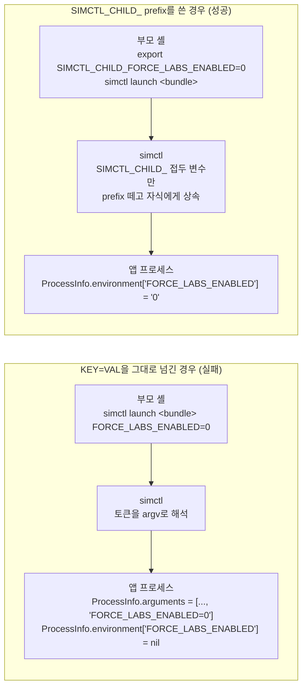

+++
author = "오깅중"
title = "xcrun simctl launch에 환경변수 안 먹던 이야기"
slug = "simctl-launch-env-vars"
date = 2026-05-18
description = "simctl launch 뒤에 KEY=VAL 적어줬는데 ProcessInfo.environment가 계속 nil이었던 이유, 그리고 SIMCTL_CHILD_ prefix."
categories = ["ios"]
tags = ["xcrun", "simctl", "iOS Simulator", "ProcessInfo", "환경변수", "QA 자동화", "SIMCTL_CHILD"]
image = ""
+++

## 도입

QA 시나리오 캡처 자동화를 짜다가 막혔다.

서버 응답에 따라 분기되는 화면 3종을 캡처하고 싶어서, 디버그 빌드에 환경변수
`FORCE_LABS_ENABLED` 로 서버 응답을 덮어쓰는 분기를 넣어뒀다. 그리고 시뮬레이터를
이렇게 띄웠다.

```bash
xcrun simctl launch <UDID> <bundle> FORCE_LABS_ENABLED=0
```

앱은 정상 실행됐다. 그런데 분기가 안 탔다.
`ProcessInfo.processInfo.environment["FORCE_LABS_ENABLED"]` 가 항상 `nil` 이었다.

분명히 Xcode Scheme 의 Arguments 탭에서 Environment Variables 에 같은 값을 적어줬을
때는 잘 동작했다. simctl 로 띄울 때만 안 먹었다.

## 원인 — argv였다

`xcrun simctl launch` 의 시그니처를 다시 보자.

```
simctl launch <device> <bundle id> [<launch arg>...]
```

bundle id 뒤에 오는 토큰은 전부 **launch arguments**, 즉 `argv` 다.
`ProcessInfo.processInfo.arguments` 에 들어가지, `environment` 에는 들어가지 않는다.

내가 적어준 `FORCE_LABS_ENABLED=0` 은 모양만 환경변수처럼 생긴 스트링 하나가
`argv[1]` 로 전달됐을 뿐이었다. 앱에서 환경변수로 읽을 길이 없다.

## 흐름 비교

부모 셸에서 시뮬레이터 안 앱 프로세스까지, 두 경우에 환경변수가 어떻게 흐르는지
한눈에 비교하면 이렇다.



## 해결 — SIMCTL_CHILD_ prefix

`xcrun simctl` 은 부모 셸의 환경변수를 자식 프로세스(시뮬레이터 안의 앱)에
그대로 상속하지 않는다. 대신 약속된 prefix 가 있다.

부모 셸에서 `SIMCTL_CHILD_<VARNAME>=value` 로 export 해두면, simctl 이
prefix 를 떼고 자식 프로세스의 환경변수로 넘겨준다.

```bash
SIMCTL_CHILD_FORCE_LABS_ENABLED=0 \
SIMCTL_CHILD_FORCE_LABS_AI_SUMMARY=0 \
  xcrun simctl launch <UDID> <bundle>
```

위 예시처럼 변수 여러 개를 동시에 주입할 수도 있다. 앞에 prefix 만 똑같이 붙여
나열하면 끝.

이렇게 띄우면 앱 안에서:

```swift
ProcessInfo.processInfo.environment["FORCE_LABS_ENABLED"]  // "0"
```

정상 수신된다.

## 왜 그렇게 설계됐는가

시뮬레이터 안의 앱 프로세스는 `simctl` 의 자식이지만, 셸 환경 전체를 그대로
넘겨주면 호스트 macOS 환경(`PATH`, `HOME`, `TMPDIR` 등)이 통째로 시뮬 안으로
들어가 동작이 꼬일 수 있다. 그래서 화이트리스트 방식으로, 명시적으로 prefix 를
단 변수만 넘기게 해둔 것이다.

같은 패턴이 `xcrun simctl spawn` 에도 있고, Xcode 의 Scheme Environment
Variables 도 내부적으로는 비슷한 방식으로 자식 프로세스에 주입한다.

## 교훈 / 점검 순서

- `xcrun simctl launch <bundle> KEY=VAL` 은 **환경변수가 아니라 argv 다.**
- 환경변수를 주입하려면 **부모 셸에서 `SIMCTL_CHILD_<NAME>` prefix 로 export.**
- CI 스크립트, QA 자동화, 시나리오 캡처 다 동일하게 적용된다.

안 먹을 때 점검 순서는 이렇게 잡아두면 편하다.

1. Xcode Scheme 에서 같은 환경변수를 적어두고 직접 실행 → 코드 분기 자체는 정상인지 확인
2. simctl 명령어 앞에 `SIMCTL_CHILD_` prefix 가 제대로 붙어있는지 확인
3. 자식 프로세스의 실제 환경을 직접 확인:

```bash
xcrun simctl spawn <UDID> launchctl getenv <NAME>
```

이 순서대로 한 번씩 짚어보면 십중팔구 2번에서 잡힌다. 한 번 알고 나면 다시는
안 막히는 종류의 함정이라, 메모 하나 남겨두고 다음에 똑같이 헤매지 않는 게 최고다.
