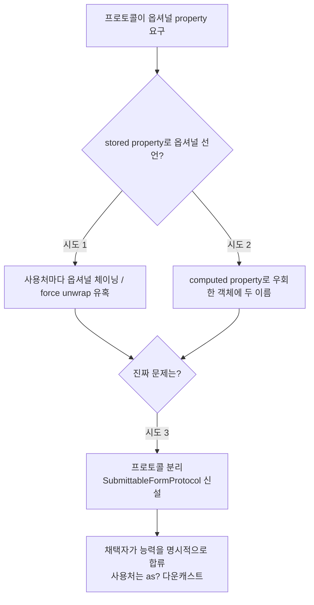

+++
author = "오깅중"
title = "Swift 프로토콜에 옵셔널 property 넣을 뻔한 이야기"
date = "2026-05-14"
description = "옵셔널 요구사항을 만들고 싶어지면 멈춰라. 십중팔구 프로토콜이 두 개여야 한다."
categories = [
    "Swift"
]
tags = [
    "Swift",
    "Protocol",
    "Optional",
    "ProtocolHierarchy",
    "iOS"
]
+++

## 도입

프로토콜 하나 추가하다가 컴파일러가 손사래쳤다. 한 줄짜리 일이라고 생각했는데 그 아래에 설계 얘기가 깔려 있었다.

폼 화면이 여러 종류 있어서 공통 프로토콜로 묶고 싶었다. 일부 폼은 첨부 섹션이 있고 일부는 없어서 그냥 옵셔널로 적어 두면 되겠지 했다.

```swift
protocol MyFormProtocol {
    var uploadSection: UploadSectionView? { get }
}

class FormA: MyFormProtocol {
    let uploadSection = UploadSectionView()  // non-optional
}
```

직관적으로는 통할 것 같은데 안 통한다.

## 증상

```text
FormA does not conform to MyFormProtocol
```

프로토콜이 요구하는 타입과 채택 클래스가 제공하는 타입이 **정확히 같아야** 한다. `UploadSectionView`와 `UploadSectionView?`는 Swift 타입 시스템에서 다른 타입이다. 공변(covariance) 처리 안 된다.

stored property는 한 가지 타입만 가질 수 있다. 옵셔널로 선언하면 사용처에서 매번 옵셔널을 풀어야 하고, non-optional로 선언하면 프로토콜을 만족 못 한다. 어느 쪽으로 가도 어색해진다.

## 원인 추적

세 가지 시도를 거쳤다. 흐름은 이렇다.



### 시도 1 — stored property 옵셔널

```swift
class FormA: MyFormProtocol {
    let uploadSection: UploadSectionView? = UploadSectionView()
}
```

된다. 컴파일은 통과한다. 단 사용처가 죄다 옵셔널 처리해야 한다.

```swift
uploadSection?.update(...)  // 매번 옵셔널 체이닝
containerStackView.arrangedSubviews.firstIndex(of: uploadSection!)  // force unwrap 유혹
```

Form 내부에서 `uploadSection`을 빈번하게 쓰는데 매번 `if let`은 거슬리고, `!` force unwrap은 코딩 룰 위반이다. 분명히 값이 들어 있는데 옵셔널이라는 이유로 매번 풀어야 하는 게 영 못마땅하다.

### 시도 2 — computed property 우회

```swift
class FormA: MyFormProtocol {
    private let _uploadSection = UploadSectionView()
    var uploadSection: UploadSectionView? { _uploadSection }
}
```

이름이 두 개가 된다. 내부에서는 `_uploadSection`을 쓰고 외부에서는 `uploadSection`을 쓴다. 한 객체에 같은 걸 가리키는 두 이름. 누가 봐도 어색하다. 컴파일은 통과하지만 코드 리뷰에서 "이거 왜 둘이에요?" 소리 100% 듣는다.

## 해결

여기서 한 번 멈췄다. 두 시도 다 어딘가 찝찝한 이유가 분명히 있는데 그게 뭘까.

진짜 문제는 **"이 프로토콜이 옵셔널 요구사항을 가져야 하는가"** 였다. 사실 첨부 섹션이 **없는 폼**(읽기 전용 폼 같은 것)도 같은 프로토콜을 만족해야 한다고 가정한 게 잘못이었다.

### 시도 3 — 프로토콜 분리

```swift
protocol FormProtocol { ... }

protocol SubmittableFormProtocol: FormProtocol {
    var uploadSection: UploadSectionView { get }  // non-optional
}

class FormA: SubmittableFormProtocol {
    let uploadSection = UploadSectionView()
}

class ReadOnlyForm: FormProtocol {  // 첨부 없음
}
```

옵셔널이 사라졌다. 첨부가 있는 폼만 명시적으로 `SubmittableFormProtocol`에 합류한다. 사용처는 다운캐스트로 분기.

```swift
if let form = formView as? SubmittableFormProtocol {
    form.uploadSection.update(uploads: items)
}
```

이건 깔끔하다. "첨부를 가진 폼인가?"라는 질문이 코드에 그대로 적혀 있다. 옵셔널 체이닝도, 두 이름 가진 객체도 없다.

## 회고

옵셔널 요구사항을 프로토콜에 넣는 순간, 그 프로토콜은 "어떤 채택자는 이걸 가지고 있고 어떤 채택자는 안 가지고 있다"는 의미가 된다. 그건 프로토콜의 본질에서 어긋난다. 프로토콜은 채택자들이 공통으로 가진 능력을 정의해야 한다.

"가질 수도 있고 없을 수도 있다"는 능력이 아니다. 그건 두 가지 능력이다. 프로토콜을 분리해야 한다.

정리하면:

- Swift 프로토콜은 stored property를 옵셔널로 요구하면 채택 시 거의 항상 어색해진다. 컴파일러가 막아도 우회할 수 있지만, 우회한 코드는 읽기 힘들다.
- 옵셔널 요구사항을 만들고 싶어지면 멈춰라. 십중팔구 프로토콜이 두 개여야 한다.
- 프로토콜 계층(상속)은 "공통점 → 더 세부 능력" 방향으로 가져가라. 반대로 "공통점 → 일부만 가진 능력을 옵셔널로" 가면 사용처가 옵셔널 체이닝 지옥에 빠진다.
- 채택자가 능력을 가지면 명시적으로 프로토콜에 합류시키고, 사용처는 다운캐스트로 분기해라. Swift는 다운캐스트가 안전한 언어다.

다음에 또 "이걸 옵셔널로 요구할까?" 손이 가면, 그 손을 잡고 프로토콜 두 개로 쪼개는 쪽으로 끌고 갈 거다.
