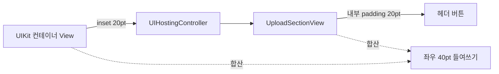

+++
author = "오깅중"
title = "공용 SwiftUI 컴포넌트의 마진, 누구 책임이지?"
slug = "swiftui-shared-component-margin-policy"
date = "2026-05-14"
description = "padding 두 번 먹이면 안쪽으로 두 배 들어간다. 공용 컴포넌트 마진 정책을 정하자."
categories = [
    "Swift"
]
tags = [
    "SwiftUI",
    "UIKit",
    "UIHostingController",
    "Padding",
    "DesignSystem"
]
+++

## 도입

디자인 검토에서 한 마디 들었다. "첨부 섹션만 안쪽으로 더 들어가 있는데요?"

다른 폼 컴포넌트는 좌우 20pt 들여쓰기인데, 첨부 섹션만 두 배쯤 들어가 보였다. 화면 캡처에 자를 대보니 정말 정확히 두 배, 40pt. 원인은 단순했는데, 단순해서 더 자주 일어나는 종류였다.

## 증상

`UploadSectionView`라는 공용 SwiftUI 컴포넌트가 다른 화면들(다른 폼이 들어가는 여러 화면)에서는 멀쩡한데, 한 화면에서만 두 배로 들어가 있었다. 원래 좌우 20pt가 어울리는 자리인데 40pt가 떠 있는 상태.

## 원인 추적

코드를 뜯어보니 범인이 두 곳에 있었다.

먼저 공용 컴포넌트 자체가 내부에 좌우 padding 20pt를 넣어두고 있었다.

```swift
struct UploadSectionView: View {
    var body: some View {
        VStack {
            headerButton.padding(.horizontal, 20)
            expandedContent
        }
    }
}
```

그리고 이걸 UIKit 화면에 임베드하는 쪽에서, 컨테이너 View에 또 inset 20을 먹이고 있었다.

```swift
hostingController.view.snp.makeConstraints { make in
    make.horizontalEdges.equalToSuperview().inset(20)
}
```

20 + 20 = 40. 자로 잰 그대로다. 흐름을 그려보면 이렇다.



## 이런 실수가 흔한 이유

생각해보면 공용 컴포넌트의 마진 정책에 "정답"이 없어서다. 보통 두 가지 중 하나를 고른다.

**A. 컴포넌트가 자기 마진을 책임진다**
- 장점: 사용처가 그냥 갖다 쓰면 끝. 일관된 디자인이 자동으로 따라온다.
- 단점: 화면마다 마진을 다르게 주고 싶을 때 빼낼 방법이 없다. 사용처가 "컨테이너 inset은 0이어야 한다"는 사실을 기억해야 한다.

**B. 컴포넌트는 marginless. 사용처가 책임진다**
- 장점: 화면별로 자유롭게 마진을 줄 수 있다.
- 단점: 사용처가 매번 padding을 까먹지 말고 챙겨야 한다.

이번 화면은 A 정책으로 만들어져 있었는데, 사용처는 B인 줄 알고 inset을 또 넣은 게 사고의 본질이었다. A든 B든 어느 쪽이든 좋다. 다만 한 컴포넌트는 한 가지 약속만 따라야 한다.

## 해결 — 사용처가 양보

`UploadSectionView`는 이미 다른 여러 화면에서 같은 정책(A안)으로 잘 쓰이고 있었다. 여기서 컴포넌트 자체를 marginless로 바꾸면 멀쩡한 화면들이 다 깨진다. 그래서 사용처 쪽이 양보했다. 컨테이너 inset을 제거.

```swift
hostingController.view.snp.makeConstraints { make in
    make.edges.equalToSuperview()
}
```

그리고 같은 SwiftUI 트리 안에서 `UploadSectionView` 밖에 있던 빈 라벨, "+ 파일 추가" 버튼 같은 형제 요소들에는 좌우 20pt를 직접 넣어줬다. 이러면 섹션 내부 요소와 섹션 밖 요소의 좌우 정렬이 똑같이 맞는다.

## 같이 잡힌 문제 — 디바이더

같은 디자인 검토에서 디바이더 3개(헤더 아래 / "더보기" 위 / "더보기" 아래)가 새 시안에는 없다는 게 발견됐다. 그런데 이 컴포넌트를 쓰는 다른 화면들은 여전히 디바이더가 있어야 한다.

옵션으로 받게 했다. 기본값을 `true`로 둬서 기존 사용처는 한 줄도 안 바꾸고 그대로 살아남게.

```swift
UploadSectionView(
    uploads: items,
    showsDividers: false,
    onToggleHeader: ...,
    onDelete: ...
)
```

새 호출처만 `false`를 명시한다. 디자인 시스템이 바뀌었다고 default를 뒤집으면 다른 화면이 다 깨진다.

## 회고

이번에 남긴 메모는 다음 정도다.

- 공용 컴포넌트의 padding/margin 정책은 **코드 주석으로 명시**하자. 정책이 없으면 사용처가 추측한다. 추측은 두 배로 들어간다.
- 새 옵션을 추가할 때 default는 **기존 사용처가 무수정으로 살아남을 값**으로. 디자인이 바뀌었다고 default를 뒤집지 말 것.
- "이상하게 안쪽으로 들어가 있어요"라는 캡처가 오면 일단 **padding을 두 번 먹였는지부터 의심**하자. 자 대고 보면 보통 정확히 두 배다.
- 디자인 시스템과 컴포넌트 라이브러리가 둘 다 마진을 쥐면 한쪽이 양보해야 한다. 컴포넌트가 자기 마진을 안 쥐면 디자인 일관성이 깨지고, 다 쥐면 사용처가 빼는 방법을 모른다. **한 컴포넌트, 한 약속.**

다음에 누가 비슷한 컴포넌트를 새로 짤 때 이 글을 다시 펼쳐볼 것 같다.
