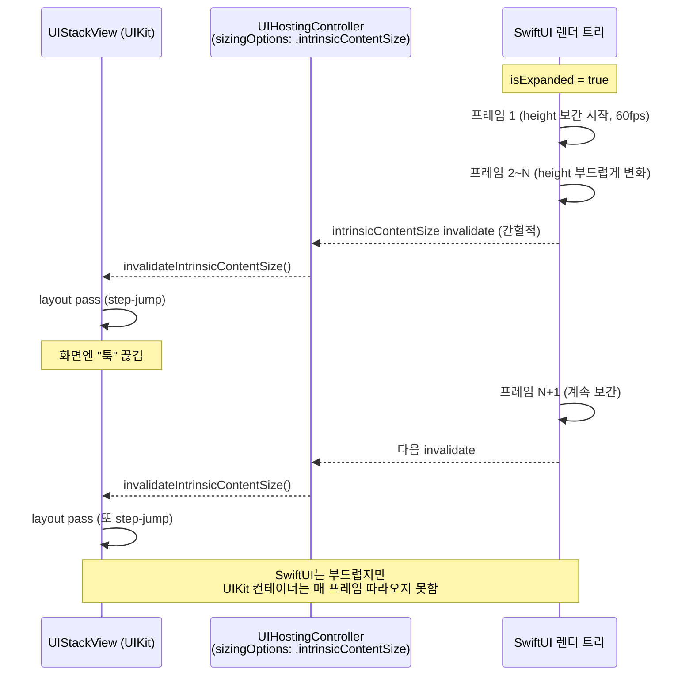

+++
author = "오깅중"
title = "SwiftUI 펼침/접힘 애니메이션에 대한 나의 생각"
date = "2026-05-14"
description = "UIHostingController 너머의 SwiftUI 애니메이션, 만져봐야 결국 step-jump가 이긴다."
slug = "swiftui-uihostingcontroller-animation-jank"
categories = [
    "Swift",
    "iOS"
]
tags = [
    "SwiftUI",
    "UIKit",
    "UIHostingController",
    "Animation",
    "Transition",
    "UIStackView"
]
image = "thumbnail.jpg"
+++

## 도입

UIKit 화면 안에 SwiftUI로 만든 첨부 섹션을 붙였다. `UIHostingController`로 임베드하고, 첨부 리스트를 더보기/접기 토글로 펼쳤다 접도록 만들었다. 디자인도 평범하고 기능도 멀쩡한데, 딱 하나가 거슬렸다. 토글이 자연스럽지가 않았다.

처음엔 implicit animation 하나만 붙이면 끝날 줄 알았다. 그게 그렇게 안 됐다. 네 번 시도해보고 결국 그냥 빼버렸는데, 왜 그랬는지 정리해본다. 환경은 Xcode 26.4 / iOS 17+.

## 증상

토글을 누르면 "위에서 아래로 펼쳐지는" 느낌이 들어야 하는데, 실제로는 "가운데가 사라지면서 접히는" 인상이 났다. row가 슬라이드해서 내려오는 게 아니라, 그 자리에서 사라지고 컨테이너 높이만 툭툭 점프하는 느낌.

## 1차 시도 — `.animation(_:value:)`

가장 가벼운 방법부터. 뷰 외곽에 implicit animation을 걸었다.

```swift
.animation(.easeInOut(duration: 0.2), value: state.isExpanded)
.animation(.easeInOut(duration: 0.2), value: state.isMoreExpanded)
```

뭔가 부드러워지긴 했다. 근데 토글할 때마다 가운데 row가 fade되며 사라지는 인상은 그대로였다.

이유를 추정해보면, `@Published` 변경이 SwiftUI 렌더 트리에 전달되는 시점과 `.animation(_:value:)`가 그 변화를 캐치하는 시점이 미묘하게 어긋난다. 게다가 default transition이 opacity라서, height가 바뀌는 동안 row 본체는 그냥 fade out돼버린다.

## 2차 시도 — `withAnimation` + 명시 `.transition`

콜백 진입점인 `update(...)` 안에서 트랜잭션으로 감싸봤다. (참고로 `viewState`는 `ObservableObject` 패턴으로 만든 상태 객체다.)

```swift
withAnimation(.easeInOut(duration: 0.25)) {
    viewState.uploads = uploads
    viewState.isExpanded = isExpanded
    viewState.isMoreExpanded = isMoreExpanded
}
```

그리고 각 row에 명시적 transition도 줬다.

```swift
ForEach(visibleUploads, id: \.id) { row in
    UploadRowView(row, onDelete: ...)
        .transition(.move(edge: .top).combined(with: .opacity))
}
.clipped()
```

기대: 더보기 누르면 추가 row가 위에서 슬라이드해서 내려온다. 접으면 위로 사라진다.

실제: 여전히 가운데에서 잘리는 느낌. row는 자기 자리에서 fade out되고, 그 동안 컨테이너 height가 step-jump했다. 좋아진 게 거의 없었다.

## 진짜 원인 — UIHostingController의 intrinsicContentSize

여기서 한참 헤맸다. 결국 호스팅 경계 자체가 문제였다.



SwiftUI 내부는 60fps로 height를 보간하면서 잘 변한다. 그런데 `UIHostingController.sizingOptions = .intrinsicContentSize`는 SwiftUI 애니메이션과 매 프레임 동기화되지 않는다. UIKit 측은 SwiftUI가 "이제 height가 변했다"고 알려준 시점에만 invalidate하고, 그 사이 부모 `UIStackView`가 layout pass를 step-wise로 받는다.

결과적으로 SwiftUI 안쪽은 부드러운데 그 SwiftUI를 담은 UIView의 크기는 툭툭 점프한다. 사용자 눈에는 "가운데가 사라지면서 접히는" 인상으로 보일 수밖에 없었다.

## 3차 시도 — 명시 height는 패스

이론적으로는 `row 개수 × 행 높이`로 명시 height를 계산해서 `.frame(height:)`에 implicit animation을 걸면 UIKit 쪽도 부드럽게 따라올 수 있다. 단 행 높이가 가변이면(파일명 길이, 폰트 메트릭에 따라 달라짐) 정확한 계산이 어렵다.

`GeometryReader`로 측정하고 다시 그리는 우회도 가능은 한데, 한 화면의 부분 컴포넌트 하나에 그 정도 복잡도를 들이는 건 비용 대비 보상이 너무 작아 보였다. 머릿속에서만 시뮬레이션해보고 접었다.

## 4차 시도 — 그냥 제거

```swift
func update(...) {
    // 끊김 발생 → 즉시 갱신으로 통일
    viewState.uploads = uploads
    if let isExpanded { viewState.isExpanded = isExpanded }
    if let isMoreExpanded { viewState.isMoreExpanded = isMoreExpanded }
}
```

`.transition`도 `.clipped()`도 다 들어냈다. 결과는 즉시 갱신. 정직한 "툭"이 어색한 fade보다 깔끔하다는 결론. 실기기에서 토글을 여러 번 눌러보니, 어색하다는 느낌 자체가 사라졌다. 애니메이션이 있을 때보다 더 자연스럽게 보이는 게 의외였다.

## 교훈

- SwiftUI 애니메이션은 SwiftUI 완전체에서만 부드럽다. UIKit 호스팅 경계가 끼면 보통 어딘가에서 step-jump가 생긴다.
- `.animation(_:value:)`, `withAnimation`, `.transition` 셋은 같은 일을 하는 것 같지만 트리거 타이밍이 다르다. 섞어 쓰면 더 어색해진다.
- 부드러운 펼침/접힘이 진짜로 필요하면 SwiftUI 내부에서 height를 명시적으로 통제해야 한다. 못 할 거면 빼라. 어색한 애니메이션은 없음만 못하다.
- "이 정도면 충분히 자연스럽겠지"라는 추정은 SwiftUI에서 자주 틀린다. 실제 디바이스에서 보지 않으면 모른다.
