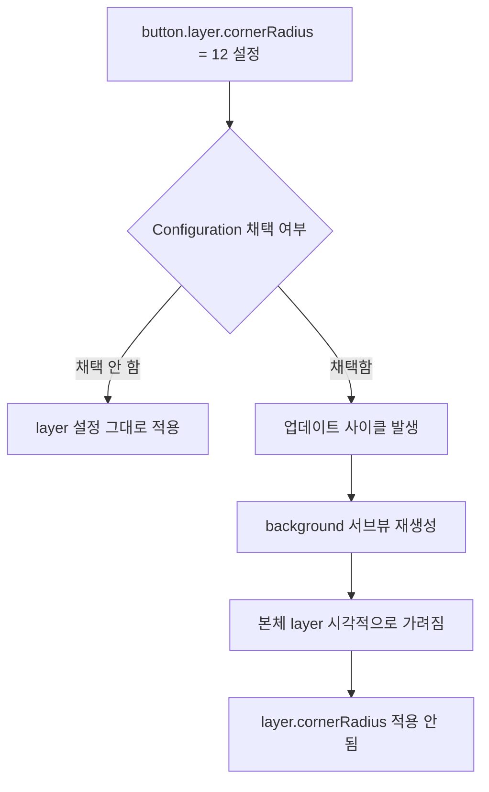

+++
author = "오깅중"
title = "UIButton.Configuration 쓸 땐 layer.cornerRadius 건드리지 말자"
date = "2026-05-19"
description = "layer.cornerRadius 줬는데 안 먹는다면 Configuration이 범인이다"
categories = ["iOS", "UIKit"]
tags = ["UIButton", "UIButton.Configuration", "UIKit", "iOS15", "디버깅"]
slug = "uibutton-configuration-layer-cornerradius-trap"
image = ""
+++

iOS 15+ 신규 화면을 만들다가 새 API인 `UIButton.Configuration.filled()`로 버튼을 찍었다. 둥글게 + 빨간 보더 1pt만 주면 되는 단순한 작업인데, 한 시간을 날렸다. 같은 함정에 빠진 분이 있으면 이 글 한 편으로 빠르게 빠져나오길 바라며 정리한다.

## 증상

처음 짠 코드는 이렇게 생겼다.

```swift
var config = UIButton.Configuration.filled()
config.title = "확인"
config.baseBackgroundColor = .systemBlue
let button = UIButton(configuration: config)

// 둥글게 + 보더
button.layer.cornerRadius = 12
button.layer.borderWidth = 1
button.layer.borderColor = UIColor.red.cgColor
button.layer.masksToBounds = true
```

결과는 두 가지가 모두 어긋났다. 빨간 보더는 아예 보이지 않고, 코너는 내가 준 12가 아니라 Configuration 기본값에 가까운 둥근 모양으로 렌더링됐다.

처음엔 `masksToBounds`를 빼먹었나 싶었고, 그다음엔 레이아웃 타이밍 문제인가 했다. 둘 다 아니었다.

## 원인 — 두 시스템이 겹친다

`UIButton.Configuration`을 채택하면 버튼의 시각 표현은 UIKit이 별도 `UIBackgroundConfiguration` 객체로 관리한다. 코너, 스트로크, 배경색 모두 `configuration.background` 쪽에서 결정된다.

내가 손댄 `button.layer.*`는 버튼 본체 레이어다. Configuration이 업데이트 사이클마다 background 서브뷰를 다시 그리고, 그 서브뷰가 본체 레이어 위에 깔리면서 내가 설정한 layer 속성은 시각적으로 가려진다. layer 값 자체가 지워지는 것은 아니지만, 화면에는 반영되지 않는 셈이다.



정리하면 Configuration을 채택한 순간, 시각 속성의 권한은 `config.background.*` 쪽으로 넘어간다.

## 해결 — config.background로 옮기기

코너와 보더를 모두 `config.background`로 옮겼더니 의도대로 동작했다.

```swift
var config = UIButton.Configuration.filled()
config.title = "확인"
config.baseBackgroundColor = .systemBlue

// 코너/보더는 background 에서
config.background.cornerRadius = 12
config.background.strokeColor = .red
config.background.strokeWidth = 1

let button = UIButton(configuration: config)
```

cornerRadius 12, 빨간 보더 1pt. 끝.

## 함께 알아 두면 좋은 것

- `config.baseBackgroundColor`와 `config.background.backgroundColor`는 다르다. 전자는 스타일(`filled`/`tinted`/`gray`/`plain`)에 맞춰 톤이 조정되고, 후자는 지정한 색이 그대로 들어간다.
- 상태별로 코너나 색을 바꾸고 싶다면 `configurationUpdateHandler`에서 `button.state`를 보고 분기한다. `traitCollectionDidChange` 같은 옛 콜백에서 시각 속성을 직접 호출하지 말 것.
- 텍스트도 마찬가지다. Configuration을 쓰면서 `setTitle(_:for:)` / `titleLabel?.font` / `setTitleColor(_:for:)`를 호출하면 적용되지 않거나, 한 번 적용됐다가 다음 업데이트 사이클에 사라진다. `config.title`, `config.attributedTitle`, `config.image`로 가야 한다.

## 교훈 — all-in or none

한 버튼 안에서 옛 layer API, 옛 setter, Configuration을 섞으면 우선순위가 헷갈리고 디버깅이 꼬인다. Configuration을 채택했으면 시각 속성은 무조건 config 쪽으로 통일한다.

반대로 디자인 시안이 Configuration의 표현 범위를 벗어난다면(그라데이션, 다중 보더, 비대칭 코너 등 기본 API로는 다루기 어려운 형태) Configuration을 빼고 옛 방식으로 일관되게 가는 편이 낫다. 어중간하게 두 시스템을 섞는 게 가장 나쁜 선택이다.

## 환경

- Xcode 26.4 / iOS 17+ (본인 환경 기준 확인)
- `UIButton.Configuration` 자체는 iOS 15부터 사용 가능
