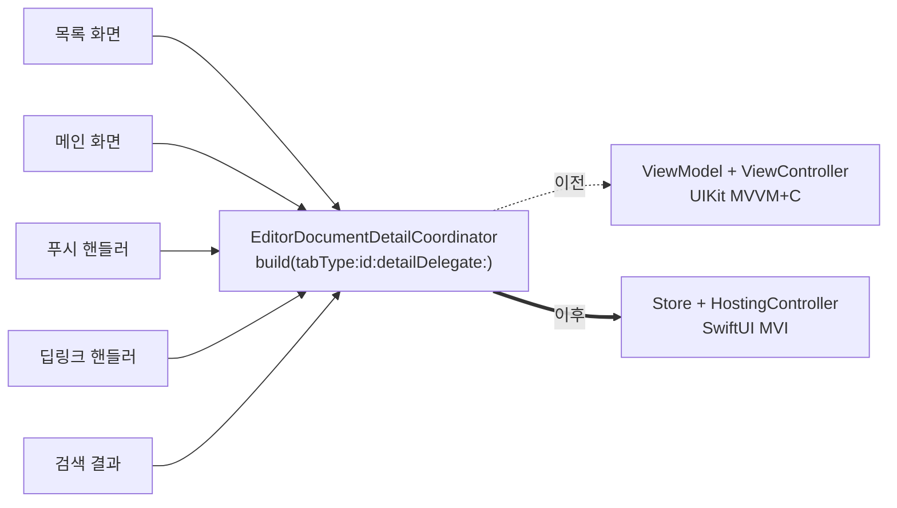

+++
author = "오깅중"
title = "Coordinator 시그니처 안 깨고 UIKit MVVM+C → SwiftUI MVI 갈아끼우기"
slug = "uikit-mvvmc-to-swiftui-mvi-keep-coordinator-signature"
date = "2026-05-14T16:26:17+09:00"
description = "상세 화면을 UIKit MVVM+C에서 SwiftUI MVI(Store)로 갈아엎으면서 Coordinator 외부 시그니처는 한 글자도 안 바꾼 이유와 방법 정리."
categories = ["Swift"]
tags = ["Coordinator", "UIKit", "SwiftUI", "MVI", "Migration", "Architecture"]
image = "thumbnail.jpg"
+++

## 도입

UIKit으로 만들어 둔 상세 화면 하나를 SwiftUI로 통째로 옮기는 작업을 받았다. 디자인도 바뀌고, 상태 관리도 MVVM에서 MVI(Store 패턴)로 바뀐다. 화면 내부는 거의 새로 짜는 수준이다. 환경은 Xcode 26.4 / iOS 17+.

쉽게 시작하는 방법은 두 가지였다.

1. Coordinator도 같이 새로 짠다. `start(...)` 메서드 시그니처를 SwiftUI에 맞게 바꾼다.
2. Coordinator는 그대로 둔다. 내부 구현만 SwiftUI로 갈아끼운다.

1번을 고르는 순간 호출처가 전부 깨진다. 그래서 2번으로 갔다. 그 결정 과정을 정리해 둔다.

## Coordinator는 진입처와의 계약

상세 화면을 누가 띄우는지 보면 보통 한두 곳이 아니다. 목록 화면, 메인 화면, 푸시 알림 핸들러, 딥링크 핸들러, 검색 결과 등등. 각자가 `detailCoordinator.build(id:)` 같은 호출을 들고 있다.

이 시그니처를 바꾸면 호출처 N곳을 다 같이 고쳐야 한다. 각 호출처의 context가 다르기 때문에 단순 grep-replace로 끝나지 않는다. PR이 폭발한다.



호출처는 Coordinator 시그니처만 본다. 안쪽이 UIKit인지 SwiftUI인지 알 필요가 없다.

## 내부만 갈아끼우기

코드로 보면 결국 한 줄 차이다.

```swift
final class EditorDocumentDetailCoordinator: BaseCoordinator {
    func build(tabType: TabType, id: Int, detailDelegate: DetailDelegate?) {
        // 외부 호출 시그니처 유지

        // 내부적으로 SwiftUI Store + HostingController로 진입
        let store = Container.shared.editor.editorDocumentDetailStore(
            (self, self, parameter)
        )

        // 기존엔 viewController = EditorDocumentDetailViewController(viewModel:)
        viewController = EditorDocumentDetailHostingController(store: store)
    }
}
```

`build(...)` 시그니처는 한 글자도 안 바꿨다. 안에서 ViewModel을 만들던 자리에서 Store를 만들고, ViewController 자리에 HostingController를 넣었다. 호출처는 이 화면이 SwiftUI인지 UIKit인지 모른다. 알 필요도 없다.

## delegate forwarding

Coordinator가 자식에게 delegate를 넘겨야 할 때도 시그니처를 안 바꾼다. Store가 새 delegate(`EditorDocumentDetailStoreDelegate`)를 노출하면, Coordinator가 그걸 채택해서 기존 외부 delegate(`EditorDocumentDetailDelegate`)로 그대로 넘긴다.

```swift
extension EditorDocumentDetailCoordinator: EditorDocumentDetailStoreDelegate {
    func detachDocumentDetail(isRefresh: Bool) {
        detailDelegate?.detachDocumentDetail(isRefresh: isRefresh)
    }
}
```

내부 delegate가 변해도 외부는 안 바뀐다. 호출처는 여전히 `EditorDocumentDetailDelegate`만 안다.

## 얻은 것

- 호출처 PR이 폭발하지 않는다. 마이그레이션 PR이 한 화면 디렉토리 안에서 끝난다.
- 점진적 마이그레이션이 가능하다. 한 화면씩 SwiftUI로 옮기면서 다른 화면은 UIKit으로 둘 수 있다.
- 롤백이 쉽다. Coordinator 내부에서 HostingController 만들던 줄을 ViewController로 다시 바꾸면 끝.

## 함정 — DI factory 정리 보류

새 Store factory를 Container에 등록하면서 기존 ViewModel factory를 같이 지우고 싶어진다. 참아라. 레거시 화면이 완전히 제거되기 전에는 두 factory가 공존한다. ViewModel factory를 지우면 어딘가 호출처가 남아 있다가 빌드가 깨진다. grep으로 호출처 0개를 확인한 다음, 마이그레이션 마지막 PR에서 한꺼번에 지운다.

## 결국 쓴 코드

본문에 흩어진 조각을 한 군데로 모아두면 이런 모양이다. `build(...)` 외부 시그니처는 그대로, 내부에서 Store + HostingController로 진입하고, Store delegate는 Coordinator가 받아서 기존 외부 delegate로 forwarding한다.

```swift
final class EditorDocumentDetailCoordinator: BaseCoordinator {

    // 외부 호출 시그니처는 한 글자도 안 바꾼다
    func build(tabType: TabType, id: Int, detailDelegate: DetailDelegate?) {
        self.detailDelegate = detailDelegate

        // 내부에서만 SwiftUI Store로 진입
        let store = Container.shared.editor.editorDocumentDetailStore(
            (self, self, parameter)
        )

        // ViewController 자리에 HostingController
        viewController = EditorDocumentDetailHostingController(store: store)
    }
}

// Store delegate를 받아서 외부 delegate로 그대로 넘긴다
extension EditorDocumentDetailCoordinator: EditorDocumentDetailStoreDelegate {
    func detachDocumentDetail(isRefresh: Bool) {
        detailDelegate?.detachDocumentDetail(isRefresh: isRefresh)
    }
}
```

핵심은 두 줄이다. ViewModel 만들던 자리에서 Store를 만들고, ViewController 자리에 HostingController를 넣는다. 그 외 시그니처는 전부 그대로 둔다. 호출처 N곳은 아무것도 모른 채로 계속 굴러간다.

## 교훈

- 외부 인터페이스와 내부 구현을 분리해라. UIKit이든 SwiftUI든 그건 화면 안쪽 사정이다.
- Coordinator 시그니처는 호출처와의 계약이다. 마이그레이션 비용을 결정하는 게 이 한 줄이다.
- 새 시그니처가 더 깔끔해 보여도 참아라. 한 화면 정리한 대가가 다른 화면 N개를 깨는 거면 손해다.
- 점진적 마이그레이션을 가능하게 만드는 건 결국 인터페이스의 안정성이다.
